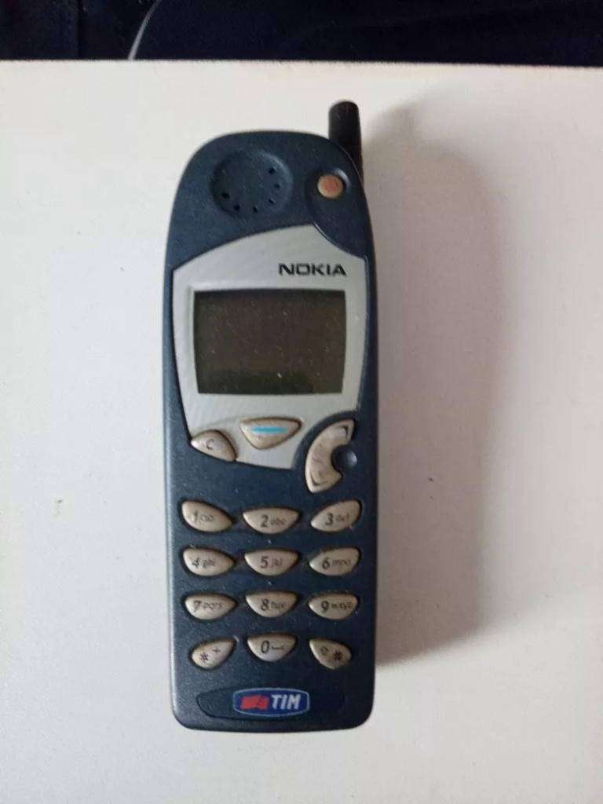

# Tecnologia e Classe de 01/08/24

### Notícias rápidas

#### Segurança

**Vulnerabilidade no WhatsApp para Windows permite execução de arquivos Python e PHP maliciosos sem aviso prévio:**  a falha foi relatada à Meta, mas a empresa alega que não considera isso  um problema de sua responsabilidade e que não há planos para uma  correção, apenas orientando usuários a não abrirem arquivos de fontes  desconhecidas. A adição das extensões.pyz e .pyzw à lista de bloqueio do  aplicativo poderia ajudar a prevenir possíveis explorações. As  informações são do site BleepingComputer.

<https://www-bleepingcomputer-com.translate.goog/news/security/whatsapp-for-windows-lets-python-php-scripts-execute-with-no-warning/?_x_tr_sl=en&_x_tr_tl=pt&_x_tr_hl=pt-BR&_x_tr_pto=wapp>

**Pesquisa revela que repositórios removidos do GitHub não são excluídos definitivamente:**  o método "Cross Fork Object Reference" permite que o fork de um  repositório consiga acessar dados de outro, incluindo informações  sensíveis como chaves de API, a partir de commits pendentes que  permanecem na base de dados mesmo após a remoção de sua referência. Em  resposta, o GitHub alega que o comportamento observado é intencional e  documentado, não sendo uma falha. As informações são do site The  Register.

**Hackers exploram falha no Google Workspace e afetam “algumas milhares” de contas, segundo a empresa:**  a vulnerabilidade permite que invasores utilizem endereços de e-mail de  outras pessoas para registrar e verificar contas, conseguindo se passar  por empresas e acessar serviços de terceiros que usam a opção “Sign in  with Google” para autenticação. Engenheiros corrigiram a falha dentro de  72 horas após sua descoberta, afirmando que sua exploração começou no  final de junho, embora sugira-se que a vulnerabilidade estivesse  presente há mais tempo. As informações são do site TechRadar.

### Boas notícias

**Startup britânica Briefly Bio arrecada 1,2 milhão de dólares para criar “GitHub” dos experimentos científicos:**  o objetivo é permitir que os resultados sejam replicados de forma  consistente. A plataforma utiliza modelos de linguagem para transformar  documentação de laboratório complexa em um formato mais organizado,  facilitando o uso por outros cientistas, podendo também ser utilizada  por profissionais que trabalham com automação, permitindo descrever  fluxos de trabalho antes de programar robôs. As informações são do site  VentureBeat.

#### Crise da Reprodutibilidade Científica

{{#embed https://www.youtube.com/watch?v=42QuXLucH3Q }}

**Suíça exigirá que todo software utilizado pelo governo seja de código aberto:**  a lei EMBAG determina que todos os órgãos públicos divulguem o  código-fonte do software desenvolvido por ou para eles, a menos que  direitos de terceiros ou preocupações de segurança impeçam, com o  objetivo de aumentar a transparência e segurança das operações  governamentais, reduzir a dependência de fornecedores e diminuir os  custos de TI. As informações são do site ZDNET.

<https://www-tomshardware-com.translate.goog/software/switzerland-mandates-government-agencies-use-open-source-software?_x_tr_sl=en&_x_tr_tl=pt&_x_tr_hl=pt-BR&_x_tr_pto=wapp>

**Formato inédito de arquivo permitirá enviar sensações táteis pela internet da mesma forma que arquivos de vídeo:**  atualmente, são utilizados 4 mil pacotes de dados por segundo para  transmitir feedbacks de toques, como em operações de braços robóticos,  por exemplo. A nova solução, denominada “Haptic Codecs for the Tactile  Internet” (HCTI), consegue reduzir essa taxa para apenas 100 pacotes,  podendo transformar áreas como telemedicina, realidade virtual e  controle remoto de dispositivos. As informações são do site Live  Science.

### Netflix multada em Minas

<https://www.tecmundo.com.br/mercado/286985-netflix-multada-procon-11-milhoes-cobrar-taxa-extra-domicilios.htm?preview=true>

**Data centers poderão consumir cerca de 32% da energia total da Irlanda até 2026:**  atualmente, o país abriga 82 unidades, com 14 em construção e 40  planejadas para os próximos anos, consumindo 21% de sua capacidade  energética e superando áreas urbanas (18%) e rurais (10%). Desde 2015, o  uso de energia pelo setor aumentou de 290 para 1.661 (473%)  gigawatts-hora. A Irlanda é considerada um importante pólo tecnológico  para empresas globais. As informações são do site TechSpot.

### IA... eu sei

<https://www.tecmundo.com.br/software/287358-fim-politicos-pre-candidato-vereador-sp-tem-chapa-junto-ia.htm>

**Google Brasil disputa para fornecer inteligência artificial ao Supremo Tribunal Federal:**  o objetivo é utilizar a tecnologia para criar sumários automatizados de  processos judiciais, a fim de reduzir o tempo necessário para realizar  análises e tramitações. No total, 39 pessoas jurídicas foram habilitadas  a apresentar soluções, com 22 companhias enviando os resumos gerados  para avaliação. As informações são do site Convergência Digital.

**OpenAI anuncia lançamento do seu próprio motor de busca:**  o SearchGPT retorna resultados em uma lista organizada e resumida, com  links nomeados para melhor identificação da origem do conteúdo. Usuários  também podem fazer perguntas relacionadas às respostas e acessar  páginas relevantes a partir da barra lateral. Inicialmente, o recurso  estará disponível apenas para 10 mil pessoas de forma gratuita, sem data  prevista para lançamento global. Interessados podem se inscrever na  lista de espera pelo site oficial. As informações são do site The Verge.

**KnowBe4,  empresa de treinamento em segurança cibernética, contrata por engano  funcionário remoto de TI norte-coreano que se passava por cidadão dos  EUA:** o engenheiro de software utilizou credenciais roubadas e  uma foto manipulada por IA, passando por verificações de antecedentes e  quatro entrevistas de videoconferência. A fraude foi descoberta após uma  detecção de malware, na qual o notebook do funcionário foi sinalizado. A  KnowBe4 afirma que realizará avaliações mais rigorosas de identidade e  treinará sua equipe para reconhecer sinais comuns desse tipo de ameaça.  As informações são do site CyberScoop.

<https://blog-knowbe4-com.translate.goog/how-a-north-korean-fake-it-worker-tried-to-infiltrate-us?_x_tr_sl=en&_x_tr_tl=pt&_x_tr_hl=pt-BR&_x_tr_pto=wapp>

**“Celular mais chato do mundo” é homologado pela Anatel:**  o Boring Phone faz parte de uma campanha de marketing da Heineken, que  visa incentivar as pessoas a evitarem o uso de smartphones em ambientes  sociais. O dispositivo possui um visual retrô, câmera de 0,3 megapixel e  funções básicas como chamadas, envio de SMS, alarme e lanterna, além de  conectividade 4G, Bluetooth e dois slots para SIM cards, sem incluir  aplicativos populares como WhatsApp. As informações são do site  Tecnoblog.

<https://tecnoblog.net/noticias/este-e-o-telefone-mais-chato-de-todos-os-tempos/>

