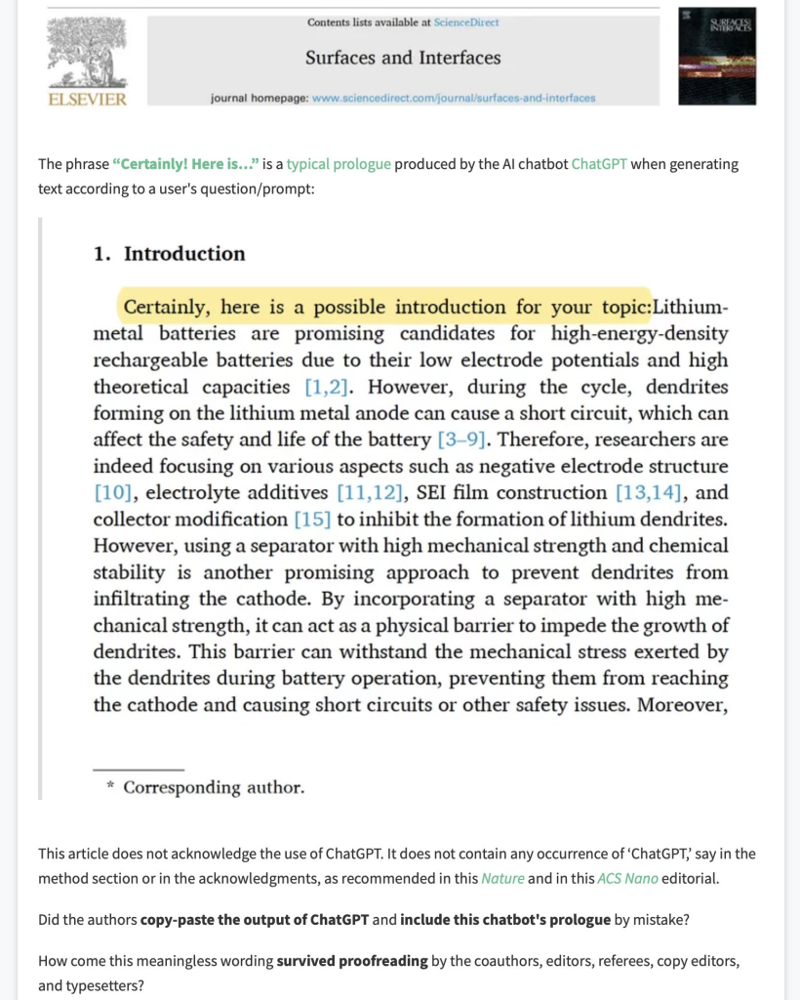
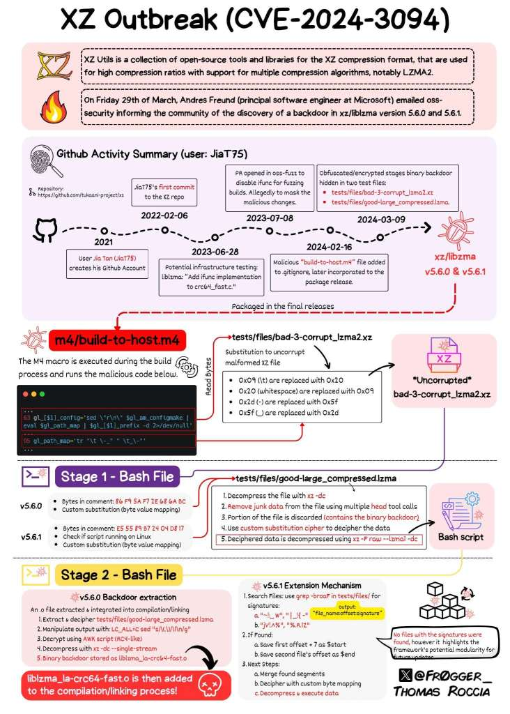
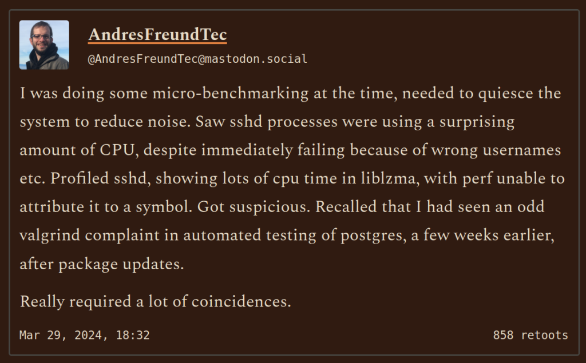
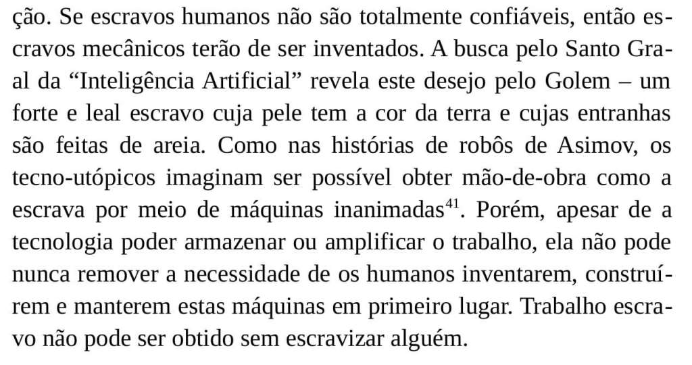

# Tecnologia e Classe de 04/04/24

# O dia da Mentira

<https://www-theverge-com.translate.goog/2024/4/1/24118011/april-fools-day-2024-pranks-jokes-best-worst?_x_tr_sl=en&_x_tr_tl=pt&_x_tr_hl=en&_x_tr_pto=wapp&_x_tr_hist=true>

<https://mashable-com.translate.goog/article/worst-company-april-fools-tweets-2024?_x_tr_sl=en&_x_tr_tl=pt&_x_tr_hl=en&_x_tr_pto=wapp>

<https://mashable-com.translate.goog/article/discord-loot-boxes-april-fools-youtube-video-record-breaking?_x_tr_sl=en&_x_tr_tl=pt&_x_tr_hl=en&_x_tr_pto=wapp>

### LLM e artigos científicos

<https://www.sciencedirect.com/science/article/pii/S1930043324001298>

<https://www.sciencedirect.com/science/article/abs/pii/S2468023024002402>

<https://scholarlykitchen.sspnet.org/2024/03/20/the-latest-crisis-is-the-research-literature-overrun-with-chatgpt-and-llm-generated-articles/>

> A [search for “Certainly, here is”](https://app.dimensions.ai/discover/publication?search_mode=content&search_text=%E2%80%9CCertainly%20here%20is%E2%80%9D&search_type=kws&search_field=full_search&or_facet_year=2022&or_facet_year=2023&or_facet_year=2024&and_facet_publication_type=article) brings up a total of ten articles published over that time period. Of those ten articles, eight are about ChatGPT, so the inclusion of the phrase is likely not suspect. A [search for “as of my last knowledge update”](https://app.dimensions.ai/discover/publication?search_mode=content&search_text=%E2%80%9Cas%20of%20my%20last%20knowledge%20update%E2%80%9D&search_type=kws&search_field=full_search&and_facet_document_type=RESEARCH_ARTICLE&and_facet_publication_type=article) gives a total of six articles, again with four of those articles focused on ChatGPT itself. A [search for “I don’t have access to real-time data”](https://app.dimensions.ai/discover/publication?search_mode=content&search_text=%E2%80%9Ci%20don%27t%20have%20access%20to%20real-time%20data%E2%80%9D&search_type=kws&search_field=full_search&and_facet_publication_type=article) brings up only three articles, all of which cover ChatGPT or AI. During this same period, Dimensions lists nearly 5.7M research articles and review articles published, putting the error rate for these three phrases to slip through into publications at 0.00007%.

<https://retractionwatch.com/papers-and-peer-reviews-with-evidence-of-chatgpt-writing/>

<http://www.bruno-latour.fr/sites/default/files/89-CRITICAL-INQUIRY-GB.pdf>

### Backdoor do XZ/libzma e do SSH

- Novamente um ataque de supply chain em um projeto open source mantindo por apenas uma pessoa
- Biblioteca xz usada em todos **Linux** e talvez **macOS.** Versões afetadas são **5\.6.0** e **5\.6.1**. Pode-se atualizar ou voltar para uma versão antiga para evitar a versão com backdoor.
- Entretanto parece ter sido um ataque coordenado e não um erro. Diferente de **heartbleed**, **shellshock**, **meltdown/spectre** e **log4j**
- O alvo aparentemente era o **sshd** e o que chama atenção é o uso de engenharia social e a persistência (começou em 2021)
- Descoberto por uma 'cagada' pelo desenvolvedor do PostgreSQL, Andres Freund que trabalha pra Microsoft. Os benchmarks do ssh dele demoraram 'demais'

  

- Foi um ataque muito sofisticado que usou arquivos binários obfuscados para rodar um payload. Código estava na distribuição do programa ('tarball') e não no Github
- O open source falhou novamente (?)

<https://thehackernews.com/2024/03/urgent-secret-backdoor-found-in-xz.html>

<https://boehs.org/node/everything-i-know-about-the-xz-backdoor>

{{#embed https://www.youtube.com/watch?v=0pT-dWpmwhA }}

<https://tukaani.org/xz-backdoor/>

<https://robmensching-com.translate.goog/blog/posts/2024/03/30/a-microcosm-of-the-interactions-in-open-source-projects/?_x_tr_sl=en&_x_tr_tl=pt&_x_tr_hl=en&_x_tr_pto=wapp>

## Exemplos

<https://lemmy.ca/post/18648367>

## Amazon em: Achei que era IA, mas era só escravidão

<https://gizmodo.com/amazon-reportedly-ditches-just-walk-out-grocery-stores-1851381116>

<https://gizmodo-com.translate.goog/amazon-reportedly-ditches-just-walk-out-grocery-stores-1851381116?_x_tr_sl=en&_x_tr_tl=pt&_x_tr_hl=en&_x_tr_pto=wapp>

### Do "Ideologia Californiana"

### Referências

<https://www.mturk.com/>

<https://pt.wikipedia.org/wiki/O_Turco>

{{#embed https://www.youtube.com/watch?v=aFsfJYWpqII }}

### A internet

<https://retrododo.com/google-is-killing-retro-dodo/>

### Redis

<https://www.reddit.com/r/selfhosted/comments/1bkhky1/fyi_redis_is_no_longer_open_source_as_of_yesterday/>
