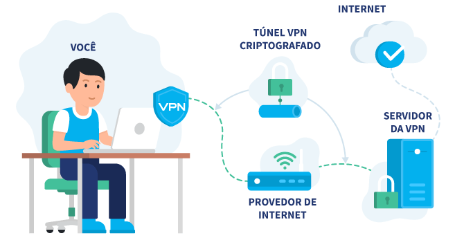

# Tecnologia e Classe de 05/09/24

### Como foi feito o bloqueio do Twitter no Brasil

{{#embed https://www.youtube.com/watch?v=k-8QRzf7D_g}}

{{#embed https://www.youtube.com/watch?v=pHLJ_ypFluo}}

### Melhor análise

{{#embed https://www.youtube.com/watch?v=ChXQhlIn5B0}}

<https://www.agrandeguerra.com.br/p/musk-o-queijo-e-os-vermes-parte-i-stf-alexandre-de-moraes-twitter-bloqueio-starlink>

### VPNs

**Bloqueio do X no Brasil leva a aumento de 1600% no uso de VPNs:**  horas após a suspensão da rede social, já houve um crescimento de 469%  no uso da ferramenta, apesar da possível multa diária de 50 mil reais  para pessoas físicas e jurídicas imposta pelo STF. As informações são do  site Convergência Digital.       

##### Como funciona uma VPN?

Fonte: <https://vpnoverview.com/pt/informacoes-sobre-vpn/vpn-explicada/>

- **Vantagens**
- **Perigos**

### Sobre o Starlink

- Xandão bloqueou valores financeiros até que o X quite suas multas com a justiça.
- Starlink está oferecendo seu serviço de graça
- Starlink se recusou a fazer o bloqueio do X

#### Repercussões

<https://bsky.social/about/blog/09-04-2024-bem-vindos>

<https://github.com/mastodon/mastodon>

<https://ursal.zone/about>

### Em suma:

- Eu quero muito que o Xwitter não volte e morra
- Porém quero ouvir os relatos de vocês que trabalham com Twitter
- Cada dia que passa o Twitter sangra mais, os gringos tinham que nos ajudar
- Porém eu acho que vai voltar (Nunes Marques) <https://noticias.uol.com.br/politica/ultimas-noticias/2024/09/05/nunes-marques-pede-manifestacao-da-pgr-e-agu-sobre-suspensao-do-x.htm>

### Eleições

<https://www.404media.co/kamala-harris-campaign-experiments-with-ads-for-an-audience-with-brain-rot/>

#### Transparência da Meta

<https://www.facebook.com/ads/library/?active_status=active&ad_type=political_and_issue_ads&country=BR&media_type=all&q=Pablo%20Mar%C3%A7al&search_type=keyword_unordered>

<https://www.intercept.com.br/2024/08/31/pablo-marcal-e-elon-musk-nao-estao-acima-da-lei/>

<https://www.intercept.com.br/tag/pablo-marcal/>

### Inteligência Artifical, cara de pau natural

**OpenAI alega ser impossível treinar seus modelos de linguagem sem ter acesso a materiais protegidos por direitos autorais:**  de acordo com a empresa, limitar os dados a “livros e desenhos do  domínio público criados há mais de um século pode resultar em um  experimento interessante, mas não produzirá sistemas de IA que atendam  às necessidades dos cidadãos de hoje", visto que os direitos autorais  abrangem praticamente todos os tipos de expressão humana, como postagens  em blogs e fóruns, fotos, fragmentos de código e documentos  governamentais. As informações são do site Futurism.   

**Empresa de marketing é criticada por utilizar tecnologia para coletar dados de voz de usuários pelo microfone do celular:**  a ferramenta de “active listening”, desenvolvida pela Cox Media Group,  processa informações coletadas de mais de 470 fontes, incluindo Google,  Facebook, Amazon e LinkedIn para fornecê-las a anunciantes, a fim de  direcionar propagandas a consumidores em um raio de até 32 quilômetros. A  Amazon informa que seu setor de publicidade “nunca trabalhou com a  CMG”, enquanto o Google removeu a empresa do seu programa Partners. Em  paralelo, a Meta iniciou uma revisão para investigar possíveis violações  dos seus termos de serviço. As informações são do site It’s FOSS.

{{#embed https://www.youtube.com/watch?v=7yiohSMwfZQ}}

<https://www.terra.com.br/byte/empresa-parceira-de-amazon-google-e-meta-e-acusada-de-escutar-conversas-em-celulares-de-usuarios,5a340aeace5a408a6ad12154da3dd5bb0zk8geyu.html>

**Microsoft confirma que Recall não poderá ser desinstalado do Windows 11:**  a opção de remoção da ferramenta foi identificada no painel de recursos  do sistema, na atualização mais recente da versão 24H2. No entanto, a  empresa afirma que trata-se de um bug que será corrigido futuramente. A  Microsoft planeja lançar uma versão de preview do Recall no programa  Windows Insiders para PCs Copilot Plus em outubro. As informações são do  site The Verge.

<https://www-windowscentral-com.translate.goog/software-apps/google-drive-is-finally-coming-to-windows-on-arm?_x_tr_sl=es&_x_tr_tl=pt&_x_tr_hl=pt-BR&_x_tr_pto=wapp>

**Após suspensão, Autoridade Nacional de Proteção de Dados autoriza Meta a coletar dados de usuários para treinar seus modelos:**  a empresa deverá comunicar de maneira clara a ação, utilizando  notificações via e-mail, avisos de privacidade e banners específicos nos  aplicativos, além de incluir um processo simplificado permitindo que as  pessoas desativem o uso de seus dados. As informações são do site  Tecnoblog.

<https://g1.globo.com/politica/noticia/2024/08/30/anpd-acata-plano-de-conformidade-da-meta-e-libera-uso-de-dados-de-brasileiros-para-treinar-ia-usuario-podera-negar-acesso.ghtml>

###

**Moxie Marlinspike, criador do Signal, argumenta que metodologia Ágil compromete inovação no desenvolvimento de software:**  segundo ele, a abordagem cria “camadas de abstração” que afastam os  programadores de um entendimento profundo do que estão construindo,  limitando a capacidade de serem criativos e inovadores. Marlinspike  também traça um paralelo entre desenvolvedores e pesquisadores de  segurança, alegando que o segundo se preocupa em entender como “as  coisas realmente funcionam”. Além disso, ele utiliza uma metáfora do  mundo de Harry Potter, comparando o entendimento profundo do software à  “magia”, capaz de “mudar o mundo”. As informações são do site The  Register.

[https://www-theregister-com.translate.goog/2024/08/09/marlinspike/?\_x_tr_sl=es&\_x_tr_tl=pt&\_x_tr_hl=pt-BR&\_x_tr_pto=wapphttps://www-theregister-com.translate.goog/2024/08/09/marlinspike/?\_x_tr_sl=es&\_x_tr_tl=pt&\_x_tr_hl=pt-BR&\_x_tr_pto=wapp](https://www-theregister-com.translate.goog/2024/08/09/marlinspike/?_x_tr_sl=es&_x_tr_tl=pt&_x_tr_hl=pt-BR&_x_tr_pto=wapp)    

**Ferramenta utilizada por desenvolvedores e pesquisadores de segurança é removida do Docker Hub a pedido da Apple:**  com 750 mil downloads, o “Docker-OSX” possibilitava a virtualização do  macOS em sistemas Linux e Windows, podendo ser usado para testar  softwares ou encontrar vulnerabilidades. O código-fonte do projeto ainda  está disponível no repositório “sickcodes/Docker-OSX” do GitHub, mas  sem conter os binários de instalação do macOS, o que poderia evitar  futuros pedidos de remoção. As informações são do site BleepingComputer.

**Canva Teams pode enfrentar aumento de até 300% no valor da assinatura a partir do próximo ano:**  algumas pessoas relatam que o custo anual para até cinco usuários  aumentou de 120 para 500 dólares. A companhia justifica a decisão devido  ao lançamento de recursos de IA na plataforma. Outros planos, como Pro e  Enterprise, aparentemente não foram afetados. Usuários insatisfeitos  manifestaram a intenção de cancelar suas assinaturas e migrar para  aplicativos da Adobe. As informações são do site The Verge.
