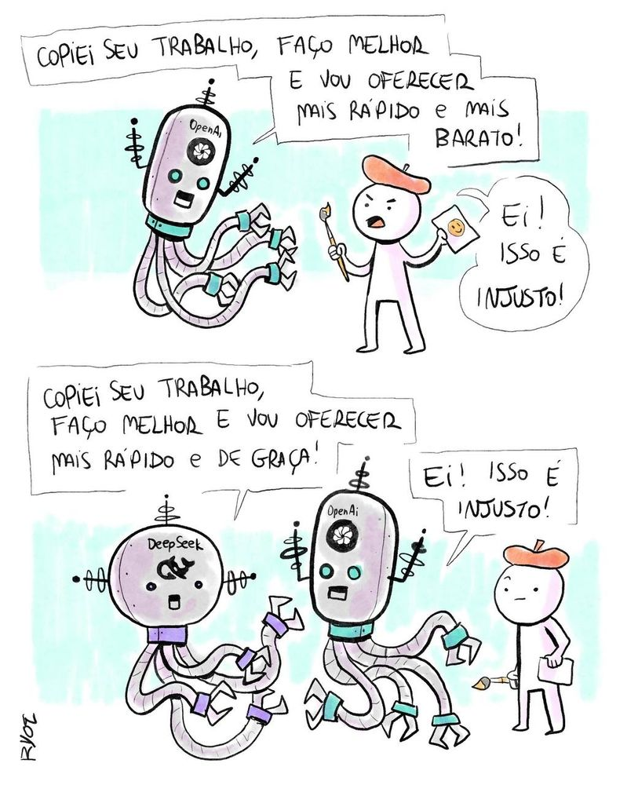
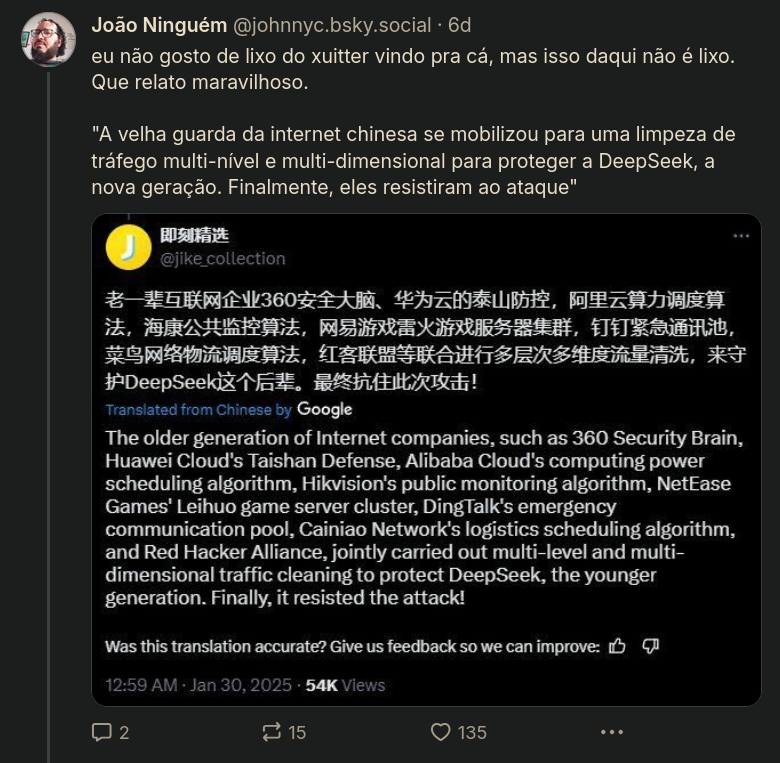
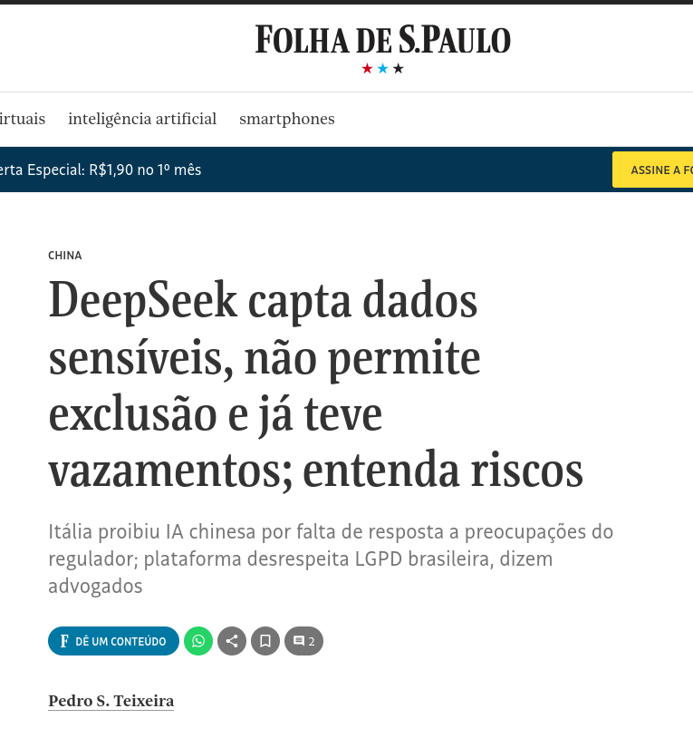

# Tecnologia e Classe de 06/02/25

### As repercussões  e ataques à deepseek

<https://forbes.com.br/escolhas-do-editor/2025/01/deepseek-conheca-a-jovem-de-29-anos-por-tras-do-chatbot-de-ia/>

### A Deepseek copiou a OpenAI ???

- Piada né? Precisa explicar?

#### Ataques DDOS

<https://www.abranet.org.br/publicacoes/noticias/5404>

<https://fastnetmon.com/2025/02/05/deepseek-ddos-attacks-explained-what-really-happened/>

#### A "regulamentação" do Deepseek

[https://www.404media.co/senator-hawley-proposes-jail-time-for-people-who-download-deepseek/](https://www-404media-co.translate.goog/senator-hawley-proposes-jail-time-for-people-who-download-deepseek/?_x_tr_sl=en&_x_tr_tl=pt&_x_tr_hl=en&_x_tr_pto=wapp)

<https://www.itsecurity.pt/news/threats/italia-bloqueia-acesso-ao-deepseek-apos-duvidas-sobre-privacidade-de-dados>

#### Tenham medo da China

### Por que o Akita on Rails é assim?

<https://www.instagram.com/p/DFoXu5tMEfH/>

### Uma conversa com o Distro Hopper

{{#embed https://www.youtube.com/watch?v=Gl9ay7Gn5oU}}
