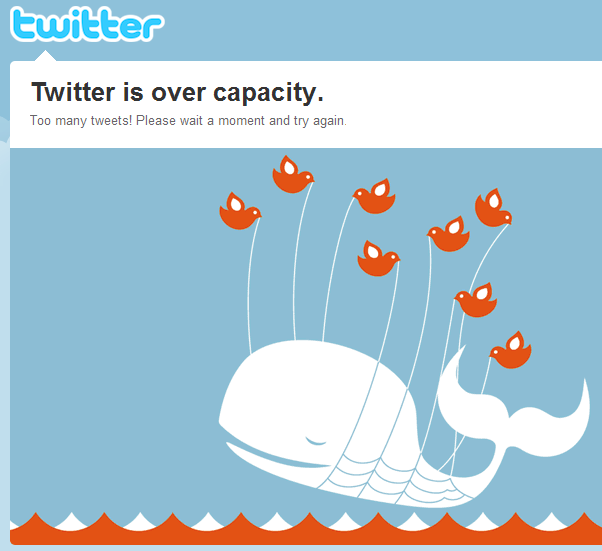

# Tecnologia e Classe de 11/04/24

### Notícias Rápidas

**Threads, concorrente do X, possui várias dívidas técnicas após sua produção de apenas 5 meses:**  os engenheiros da Meta  reutilizaram a arquitetura monolítica do  Instagram para agilizar o processo de desenvolvimento. A equipe agora  está trabalhando para separar gradualmente as duas redes, à medida que o  Threads ganha novas funcionalidades.. As informações são do site InfoQ.

**Backdoor atinge mais de 92 mil dispositivos NAS antigos da D-Link:**  a vulnerabilidade – rastreada como CVE-2024-3273 – permite a execução  de códigos arbitrários no sistema, abrindo acesso a informações  confidenciais e modificação de configurações no dispositivo de  armazenamento. Entre os equipamentos afetados está o DNS-320L, lançado  no Brasil em 2012. As informações são dos sites Ciso Advisor e Techenet.

**Instagram gera mais receita com publicidade do que o YouTube:**  documentos judiciais disponíveis recentemente, mostram que a rede  social arrecadou 32,4 bilhões de dólares com anúncios, contra os 28,8  bilhões do YouTube – os dados são de 2021. A diferença pode estar ligada  ao fato do YouTube distribuir 55% da sua receita para criadores de  conteúdo. As informações são do site The Verge.

**Eclipse solar total na América do Norte tem efeito significativo no tráfego da internet:**  com milhões de pessoas acompanhando o fenômeno, estados nos EUA  registraram uma queda de até 60% no tráfego durante as poucas horas do  evento. Situação similar também foi registrada no Canadá e México, onde  também era possível ver o eclipse. As informações são do blog da  Cloudflare.

**Apple libera inclusão de emuladores de jogos na App Store, após mudanças nas suas diretrizes:**  os títulos poderão ser baixados diretamente desses aplicativos, e os  desenvolvedores precisam garantir que eles estejam em conformidade com  as leis de direitos autorais. As informações são do site 9to5Mac.

**Matrix  Foundation, mantenedora do protocolo para comunicações  descentralizadas, sugere modelo de financiamento público para projetos  de código aberto:** os ataques direcionados à infraestrutura open  source, como o recente descoberto backdoor no projeto liblzma (XZ  Utils) e  que atingiria boa parte do ecossistema Linux, evidenciaria a  precariedade do modelo atual. A solução proposta seria no financiamento  governamental não atrelado ao desenvolvimento de recursos específicos,  mas apenas para garantir a segurança e viabilidade de projetos de  infraestrutura digital. As informações são do blog da Matrix.

<https://matrix.org/blog/2024/04/open-source-publicly-funded-service/>

#### Avibras

<https://www.cartacapital.com.br/politica/os-riscos-na-venda-da-avibras-icone-belico-do-brasil-para-uma-rival-australiana/>

{{#embed https://www.youtube.com/watch?v=PzsGzmWHi14}}

### CEEE Equatorial

<https://www.estado.rs.gov.br/grupo-equatorial-e-o-vencedor-de-leilao-de-privatizacao-da-ceee-d>

> “Estamos vivendo uma data histórica para o Rio Grande do Sul. Abrimos  um processo de privatizações com a venda da CEEE-D, logo em seguida  teremos a venda da CEEE-G e da CEEE-T, da Sulgás, e no segundo semestre  teremos concessões de estradas, já com modelagens sendo feitas também  com apoio importante do Banco Nacional de Desenvolvimento Econômico e  Social (BNDES). Essa venda por R$ 100 mil vem com um conjunto de  obrigações que é levado pela iniciativa privada, a começar pelos  próprios investimentos que são exigidos em um contrato de concessão e  que a companhia estatal não conseguia fazer. Estamos garantindo  investimentos para a população em energia elétrica e também transferindo  pelo menos R$ 4,4 bilhões em passivo acumulado pela companhia só em  ICMS, que serão assumidos pela Equatorial”, destacou o governador  Eduardo Leite.
>
> O Grupo Equatorial atende quase 10% do total de consumidores  brasileiros e responde por 6,5% do mercado de distribuição do país. O  grupo apresentou proposta de R$ 100 mil. Não houve disputa, uma vez que  essa foi a única empresa participante. O processo de transição para o  novo acionista deve levar de 60 a 90 dias.

<https://sintrajufe.org.br/privada-de-energia-no-rs-deixa-milhoes-de-gauchos-no-escuro-mas-acoes-da-empresa-dobraram-de-valor-na-bolsa-em-cinco-anos-veja-os-deputados-que-votaram-pela-privatizacao-da-ceee/>

> ###### **Equatorial reduziu quase metade quadro de pessoal, mas valor na bolsa mais do que dobrou em cinco anos**
>
> O  leilão que vendeu a CEEE í  Equatorial aconteceu em março de 2021, com o  valor de apenas R$ 100 mil. Logo a seguir, a empresa deu iní­cio a uma  onda de demissões que levou embora quase metade do quadro de  funcionários. Dos cerca de 2,5 mil funcionários, 998 aderiram ao plano  de demissões voluntárias (PDV) lançado pela Equatorial, e a empresa  demitiu outros tantos. Conforme o presidente do Sindicato dos  Eletricitários do Rio Grande do Sul (Senergisul), Antonio Silveira,  há  muita precarização e hoje mais de 90% das atividades da Equatorial são  terceirizadas , apontou. Segundo Antônio,  é mão de obra barata, com  pouca qualificação técnica e, desta forma, não conseguem atender  qualquer evento fora da normalidade, além da precariedade da manutenção  de suas instalações, que refletem negativamente no seu desempenho  operacional .

<https://gauchazh.clicrbs.com.br/ultimas-noticias/tag/ceee-equatorial/>

<https://gauchazh.clicrbs.com.br/geral/noticia/2024/04/ceee-equatorial-nao-tinha-equipes-carros-e-planejamento-para-tempestade-de-16-de-janeiro-diz-relatorio-de-fiscalizacao-cluk9m0z1017y0124h6ho0o3l.html>

<https://epocanegocios.globo.com/ciencia-e-saude/noticia/2024/02/apagao-em-universidade-federal-da-prejuizo-de-milhoes-em-pesquisas-todas-as-plantas-morreram.ghtml>

> "A CPFL informa que, durante escavações para a obra de expansão da subestação Porto Alegre 6, houve a ruptura acidental de cabos, o que ocasionou a interrupção no fornecimento de energia para uma das linhas de transmissão da rede da distribuidora CEEE Equatorial".

<https://g1.globo.com/economia/negocios/noticia/2024/04/17/eletrobras-quer-permitir-demissoes-em-massa-e-cortar-salarios-de-funcionarios-em-125percent.ghtml>

### Google/Amazon e Israel

<https://time-com.translate.goog/6964364/exclusive-no-tech-for-apartheid-google-workers-protest-project-nimbus-1-2-billion-contract-with-israel/?_x_tr_sl=auto&_x_tr_tl=pt&_x_tr_hl=en&_x_tr_pto=wapp&_x_tr_hist=true>

<https://www-theguardian-com.translate.goog/commentisfree/2021/oct/12/google-amazon-workers-condemn-project-nimbus-israeli-military-contract?_x_tr_sl=auto&_x_tr_tl=pt&_x_tr_hl=en&_x_tr_pto=wapp>

<https://www.haaretz.com/israel-news/tech-news/2021-04-21/ty-article/israel-picks-google-amazon-for-official-state-cloud/0000017f-e896-dc91-a17f-fc9fd1ce0000>

<https://www-theverge-com.translate.goog/2024/3/8/24094687/google-israel-project-nimbus-employee-fired?_x_tr_sl=auto&_x_tr_tl=pt&_x_tr_hl=en&_x_tr_pto=wapp>

<https://theintercept.com/2022/07/24/google-israel-artificial-intelligence-project-nimbus/>

> De acordo com uma série de documentos e vídeos de treinamento obtidos pelo The Intercept por meio de um portal educacional de acesso público destinado a usuários do Nimbus, o Google está fornecendo ao governo israelense o conjunto completo de ferramentas de aprendizado de máquina e IA disponíveis através do Google Cloud Platform. Embora não forneçam detalhes sobre como o Nimbus será usado, os documentos indicam que a nova nuvem daria a Israel capacidades para detecção facial, categorização automatizada de imagens, rastreamento de objetos e até mesmo análise de sentimento que afirma avaliar o conteúdo emocional de imagens, fala e escrevendo. Os materiais da Nimbus faziam referência a treinamentos específicos de agências disponíveis para funcionários do governo por meio do serviço de aprendizagem on-line Coursera, citando o Ministério da Defesa como exemplo.

### Elon Musk VS O Brasil

- A gente não morre de amores pelo Xandão, mas...
- Esse é o modus operandi do Elon, vamos relemebrar:
  - \#bitcoin no perfil do twitter e 'Tesla vai aceitar bitcoin'
  - tweets sobre dogecoin e depois logo do X
  - tweets sobre a Tesla privando o capital (2018)
  - tweets sobre o valor da Tesla estar muito alto em 2020
  - tweets sobre o etsy e gamestop
- A compra do Twitter deu ao Elon muito poder de manipular narrativas

### A preocupação do Elon com A VERDADE

- Diversas acusações silenciadas de funcionários da Tesla
- Acusando aquele mergulhador britânico que salvou as crianças da caverna de 'pedofilo' (2018)
- Tentou destruir a vida do whistleblower da Tesla (2019)
- Negação da Covid, tanto em palavras quanto desrespeitando ordens sanitárias (2020/2021)
- Banindo contas de jornalistas que falavam do seu avião no twitter (2022)
- Teorias de conspiração antissemitas (2023)
- A moderação negativa que existe no Twitter hoje

**Elon Musk diz que precisará de 100 mil GPUs H100 da Nvidia para treinar o Grok 3:**  um datacenter com essa capacidade consumiria 100 megawatts de energia,  equivalente a uma cidade pequena. Em comparação, o Grok 2 – ainda em  fase de desenvolvimento – exigiu 20 mil GPUs H100 para ser treinado. As  informações são do site Tom’s Hardware.

**BYD, fabricante chinesa de veículos elétricos, estuda adquirir a maior mineradora de lítio do Brasil:**  a Sigma Lithium também já esteve no radar da Tesla. A empresa está  avaliada em 2,9 bilhões de dólares. As informações são do site  Canaltech.

**Elon Musk afirma que escritório do X/Twitter no Brasil pode ser fechado, após restrições impostas pelo STF:**  nas palavras do CEO, o Supremo realiza uma “censura agressiva” que  viola “a lei e a vontade do povo”, citando, inclusive, funcionários da  rede social ameaçados de prisão e que planeja reabrir contas suspensas  pela justiça brasileira. As informações são do site Canaltech.

<https://www.intercept.com.br/2024/04/08/seguimos-o-dinheiro-que-movimenta-os-ataques-de-elon-musk-a-alexandre-de-moraes/>
