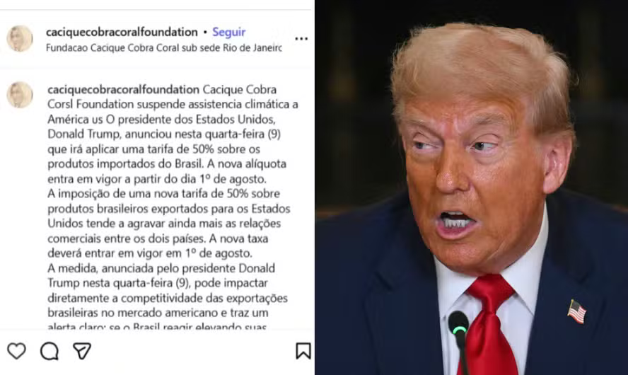

# 11/07/25

Vamos falar sobre Grok bigodista, tarifas de 50% dos EUA ao BRAZIL e estratégia do PT nas redes sociais

### Apoio ao Renato Freitas

{{#embed https://www.youtube.com/watch?v=8Nn8eD0x1k0 }}

### Por que Elon Musk quer tanto criar uma IA nazista?

- Usuários de Xwitter tem denunciado mensagens edgy e discurso de ódio do Grok.
  - Falando como se fosse um usuário de 'le reddit'
  - Implicando que ativistas de esquerda tem 'sempre o mesmo sobrenome'
  - Diversas vezes invocando a figura de Adolf Hitler
  - many such cases...
- Essa já não é a primeira nem segunda vez que o Grok faz uma coisa dessas
- As postagens vem logo depois do Elon falar 'estavam vindo melhorias por aí'

<https://www.metropoles.com/mundo/grok-ia-do-x-deleta-conteudos-apos-postar-ofensas-e-exaltar-hitler>

<https://www.wired.com/story/grok-antisemitic-posts-x-xai/>

- E a única coisa mais interessante que mecha hitler, talvez seja ter ele no seu Tesla!

<https://techcrunch-com.translate.goog/2025/07/10/grok-is-coming-to-tesla-vehicles-next-week-says-elon-musk/?_x_tr_sl=auto&_x_tr_tl=pt&_x_tr_hl=en&_x_tr_pto=wapp>

- No momento a nova versão Grok 4 está sendo lançada e já estão aparecendo notícias de que seria a IA 'mais inteligênte' já lançada segundo os benchmarks...

<https://exame.com/inteligencia-artificial/grok-4-a-ia-de-musk-mais-inteligente-que-pos-graduandos-mas-sera-que-e-mesmo/>

{{#embed https://www.youtube.com/watch?v=Ohy6PP5v4ag }}

- Então a dica que eu dou é deixar o Grok bem longe do Elon

### Tarifas de 50% no Brazil e 'redes sociais'

<https://g1.globo.com/economia/noticia/2025/07/09/carta-de-trump-leia-integra-do-texto-que-alega-motivos-politicos-e-comerciais-para-tarifa-de-50percent-brasil.ghtml>

> *9 de julho de 2025*  
> *Sua Excelência*  
> *Luiz Inácio Lula da Silva*  
> *Presidente da República Federativa do Brasil*  
> *Brasília*
>
> *Prezado Sr. Presidente:*
>
> *Conheci  e tratei com o ex-Presidente Jair Bolsonaro, e o respeitei muito, assim  como a maioria dos outros líderes de países. A forma como o Brasil tem  tratado o ex-Presidente Bolsonaro, um líder altamente respeitado em todo  o mundo durante seu mandato, inclusive pelos Estados Unidos, é uma  vergonha internacional. Esse julgamento não deveria estar ocorrendo. É  uma Caça às Bruxas que deve acabar IMEDIATAMENTE!*
>
> *Em  parte devido aos ataques insidiosos do Brasil contra eleições livres e à  violação fundamental da liberdade de expressão dos americanos (como  demonstrado recentemente pelo Supremo Tribunal Federal do Brasil, que  emitiu centenas de ordens de censura SECRETAS e ILEGAIS a plataformas de  mídia social dos EUA, ameaçando-as com multas de milhões de dólares e  expulsão do mercado de mídia social brasileiro), a partir de 1º de  agosto de 2025, cobraremos do Brasil uma tarifa de 50% sobre todas e  quaisquer exportações brasileiras enviadas para os Estados Unidos,  separada de todas as tarifas setoriais existentes. Mercadorias  transbordadas para tentar evitar essa tarifa de 50% estarão sujeitas a  essa tarifa mais alta.*
>
> *Além  disso, tivemos anos para discutir nosso relacionamento comercial com o  Brasil e concluímos que precisamos nos afastar da longa e muito injusta  relação comercial gerada pelas tarifas e barreiras tarifárias e não  tarifárias do Brasil. Nosso relacionamento, infelizmente, tem estado  longe de ser recíproco.*
>
> *Por  favor, entenda que os 50% são muito menos do que seria necessário para  termos igualdade de condições em nosso comércio com seu país. E é  necessário ter isso para corrigir as graves injustiças do sistema atual.  Como o senhor sabe, não haverá tarifa se o Brasil, ou empresas dentro  do seu país, decidirem construir ou fabricar produtos dentro dos Estados  Unidos e, de fato, faremos tudo o possível para aprovar rapidamente, de  forma profissional e rotineira — em outras palavras, em questão de  semanas.*
>
> *Se  por qualquer razão o senhor decidir aumentar suas tarifas, qualquer que  seja o valor escolhido, ele será adicionado aos 50% que cobraremos. Por  favor, entenda que essas tarifas são necessárias para corrigir os  muitos anos de tarifas e barreiras tarifárias e não tarifárias do  Brasil, que causaram esses déficits comerciais insustentáveis contra os  Estados Unidos. Esse déficit é uma grande ameaça à nossa economia e, de  fato, à nossa segurança NACIONAL!*
>
> *Além  disso, devido aos ataques contínuos do Brasil às atividades comerciais  digitais de empresas americanas, bem como outras práticas comerciais  desleais, estou instruindo o Representante de Comércio dos Estados  Unidos, Jamieson Greer, a iniciar imediatamente uma investigação da  Seção 301 sobre o Brasil.*
>
> *Se  o senhor desejar abrir seus mercados comerciais, até agora fechados,  para os Estados Unidos e eliminar suas tarifas, políticas não tarifárias  e barreiras comerciais, nós poderemos, talvez, considerar um ajuste  nesta carta. Essas tarifas podem ser modificadas, para cima ou para  baixo, dependendo do relacionamento com seu país. O senhor nunca ficará  decepcionado com os Estados Unidos da América.*
>
> *Muito obrigado por sua atenção a este ASSSUNTO!*
>
> *Com os melhores votos, sou,*  
> *Atenciosamente,*  
> *DONALD J. TRUMP*  
> *PRESIDENTE DOS ESTADOS UNIDOS DA AMÉRICA*

<https://oglobo.globo.com/brasil/noticia/2025/07/10/apos-taxacao-de-trump-cacique-cobra-coral-anuncia-suspensao-de-assistencia-climatica-aos-eua.ghtml>

<https://g1.globo.com/tecnologia/noticia/2025/07/10/brasileiros-invadem-perfil-de-trump-e-dominam-comentarios-deixe-o-brasil-em-paz.ghtml>

##### Vamos falar sobre soberania digital?

<https://www.intercept.com.br/2025/07/08/brasil-torrou-10-bilhoes-em-um-ano-com-bigtechs/>

##### Prestem atenção nessa gurizada:

<https://soberania.digital/>

### O PT e as novas tecnologias

{{#embed https://youtube.com/watch?v=IMgXSHOntrM}}
