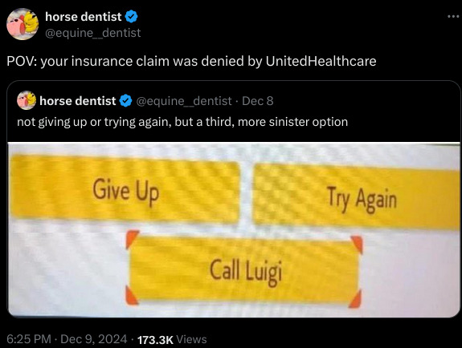
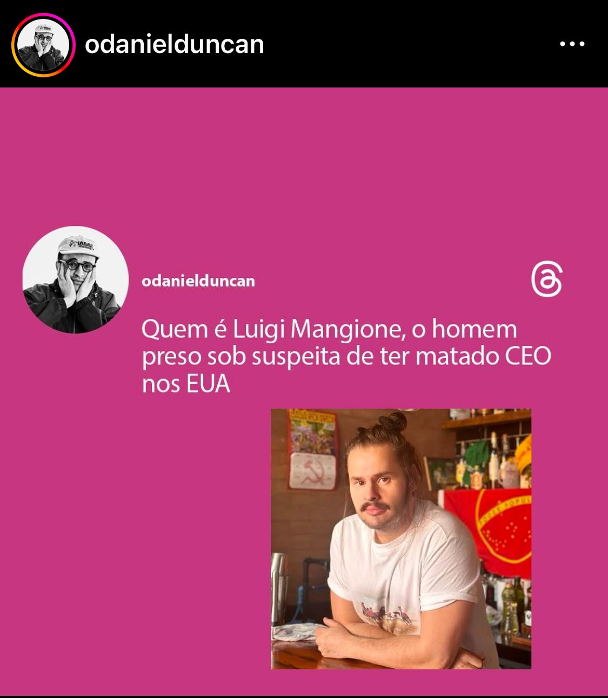
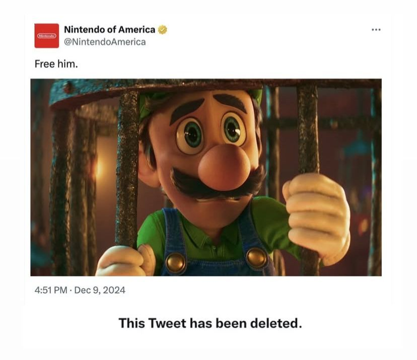
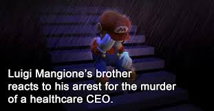
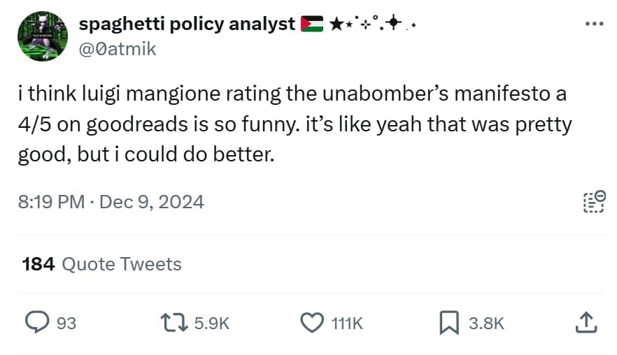

# Tecnologia e Classe de 12/12/24

### Denúncia de 10x1 no Zaffari

<https://www.brasildefato.com.br/2024/12/05/escala-de-10x1-e-denunciada-por-trabalhadores-da-rede-de-supermercados-zaffari-no-rio-grande-do-sul>

#### Bourbon condenado por racismo

<https://g1.globo.com/sp/sao-paulo/noticia/2023/04/18/justica-de-sp-condena-shopping-a-pagar-r-10-mil-de-indenizacao-a-menino-negro-que-foi-impedido-de-entrar-no-estabelecimento.ghtml>

#### Casos de racismo e morte no Carrefour

<https://www.brasildefato.com.br/2020/11/21/racismo-e-morte-no-carrefour-sao-a-ponta-de-um-iceberg-envolvendo-multinacionais>

<https://oglobo.globo.com/brasil/noticia/2023/05/relembre-outros-casos-em-que-o-grupo-carrefour-foi-cenario-de-acoes-violentas-e-racismo.ghtml>

### Notícias rápidas

**Califórnia pode tornar-se primeiro estado do mundo a exigir rótulos de advertência em redes sociais:**  o projeto de lei visa alertar sobre os riscos potenciais dessas  plataformas para crianças e adolescentes. Caso aprovado, as empresas  serão obrigadas a exibir um “aviso em caixa preta” durante os primeiros  90 segundos de uso inicial para qualquer usuário, independentemente da  idade, devendo ser reapresentado pelo menos uma vez por semana. O  procurador-geral da Califórnia critica essas companhias por promoverem  “recursos viciantes” e conteúdo prejudicial. As informações são do site  The Verge.

- A proibição das redes sociais para crianças e adolescentes na Australia
- Brasil e outros países exigindo que redes sociais não tenham um feed 'sem login' para garantir a identidade e idade dos usuários
- Proibição de filtros em plataformas como o TikTok
- Pergunta: será que não é um pouco tarde para isso agora?

<https://www.theverge.com/2024/12/10/24317835/california-social-media-warning-labels-bill>

**Devin, primeiro engenheiro de software de IA, é disponibilizado ao público geral:**  o modelo está disponível por meio de uma assinatura mensal de 500  dólares, direcionada a equipes de desenvolvedores, a qual inclui acesso  ilimitado, integração com o Slack, e ferramentas como IDE e API. A  Cognition, empresa responsável, destaca que a tecnologia pode ser  aplicada em diversas áreas, e recomenda seu uso para resolver bugs de  frontend e realizar refatorações de código. O Devin também interage de  forma automática em comentários de Pull Requests no GitHub. As  informações são do blog da Cognition.       

{{#embed https://www.youtube.com/watch?v=oU3H581uCsA }}

<https://www.cursor.com/>

**65% dos funcionários ignoram políticas de segurança cibernética em prol da eficiência:**  segundo um estudo com cerca de 14 mil trabalhadores de diversos países,  muitos deles consideram os protocolos incômodos e uma barreira à  produtividade, como a exigência de senhas complexas, logins frequentes e  autenticação multifator. Como resultado, muitos reutilizam e  compartilham credenciais, por exemplo. Recomenda-se que empresas  invistam em treinamentos para conscientizar os colaboradores sobre a  importância da segurança digital. As informações são da Forbes e do site  Help Net Security.

**54% dos textos longos no LinkedIn são gerados por IA, segundo estudo:**  ao todo, foram analisados mais de 8,7 mil postagens entre janeiro de  2018 e outubro de 2024, que continham 100 palavras ou mais. Foi  identificado um aumento significativo no uso de modelos após o  lançamento do ChatGPT em 2022, com um crescimento de 189% entre janeiro e  fevereiro de 2023. Em resposta, o LinkedIn afirma que busca limitar a  visibilidade de postagens de baixa qualidade, e que o conteúdo  identificado no estudo era “assistido por IA”, e não inteiramente criado  por essas ferramentas. As informações são do site The Register.

<https://www.theregister.com/2024/11/28/linkedin_ai_posts/>

**API do Bluesky permite extrair postagens de usuários para treinar modelos de linguagem:**  Daniel van Strien, especialista em curadoria de machine learning da  Hugging Face, conseguiu utilizar a API Firehose da própria plataforma  para extrair um milhão de posts públicos, a fim de viabilizar pesquisas e  estudos relacionados ao aprendizado de máquina. O Bluesky afirma que  está explorando formas de permitir que os usuários expressem  externamente suas preferências de consentimento quanto ao uso de  informações, e promete divulgar mais detalhes “em breve”. As informações  são do site TechCrunch.

{{#embed https://www.youtube.com/watch?v=i1NlQixGW2I }}

### Memes do Luigi

{{#embed https://www.youtube.com/watch?v=1b7Jo2u5Qfs}}

### O que é relevante sobre Luigi Mangione

- No dia 04/12 ele assassinou o CEO da United Healthcare Group, Brain Thompson, com 3 tiros no momento que ele saía do hotel Hilton no centro de Manhattan.
- Aparentemente ele é formado em Ciência da Computação e Engenharia por uma Ivy League (universidade de bacana)
- O que não me surpreende porque ele parece alguns colegas mais 'amostradinhos' que eu tive
- Politicamente é muito mais interessante o que **ele representa** do que as postagens nas redes sociais.
- O pessoal raspou tudo nas redes e encontrou admiração por Elon Musk (babaca) e Peter Thiel (vampiro babaca), um review do manifesto do Unabomber e um manifesto dele mesmo (bem simples)
  - O hábito de procurar a presença de uma pessoa na internet para 'entender como ela pensa' é hoje quase um reflexo. Mas pense, por exemplo, o que isso diria sobre você hoje? Seria preciso?

    

- Algumas mídias tem tentado pintar a situação como 'um lunático' radicalizado, mas uma análise do que temos até agora mostra um sujeito bastante inteligente e com um senso de justiça, que provavelmente teve problemas de saúde e experiências negativas com seguradoras. Ou até mesmo está apenas tendo empatia pelas pessoas que sofrem com isso.
- Também falaram que ele jogava o jogo de assassinato 'Among Us' kkkkkkk
- Muita gente se 'surpreendeu' com o apoio quase unânime do seu ato. Porém, esses são **sintomas da luta de classes** e não existe polarização quando os interesses dos trabalhadores ficam claros. O necessário é a consciência de como usar essa raiva.
- Vídeo da 404 Media tocou em diversos desses assuntos em mais detalhes e o resumo do mimimidias também ficou ótimo

{{#embed https://www.youtube.com/watch?v=HuyJp3QDTbk }}

{{#embed https://www.youtube.com/watch?v=ulSsOBRyyTA }}

- A UHG aparentemente estava usando uma inteligência artificial para cortar custos e negar o máximo de pedidos de cobertura
- Logo após o assassinato diversas empresas de seguros de saúde removeram de seus sites e redes as informações públicos sobre seus CEOs
- A arma usada para o crime era uma 'arma fantasma', sem registro e trilha de documentos. Por que ela foi feita com impressão 3D e peças compradas avulsas. Talvez seja o primeiro assassinato desse **calibre** feito com uma arma de impressora 3D
- A UHG já foi dona do Grupo Amil no brasil de 2012 a 2023
- O apoio majoritário que o assassinato recebeu na internet veio junto com diversos relatos de pessoas que tiveram seus entes queridos 'assassinados' lentamente por planos de saúde nos EUA.
- Diversas dessas manifestações foram censuradas pelas plataformas de redes sociais **e eu peço encarecidamente que me encontrem alguém falando que o acontecimento é uma censura em massa**?
- Em resumo: não é uma questão de elogiar esse ato e nem achar que esse tipo de ato pode resolver qualquer coisa. A UHG continua lá.
- Porém temos que usar esses momentos para conscientizar sobre a luta de classes, incentivar o ódio à burguesia e a esse sistema doente. Um exemplo é a discussão que isso abriu nos EUA e no mundo e a queda nas ações da empresa.
- CEOs são representantes políticos da burguesia e não podem andar tranquilos pelas ruas.

<https://www.cnnbrasil.com.br/economia/negocios/unitedhealth-group-perdeu-us-45-bi-em-valor-desde-assassinato-de-ceo/>
