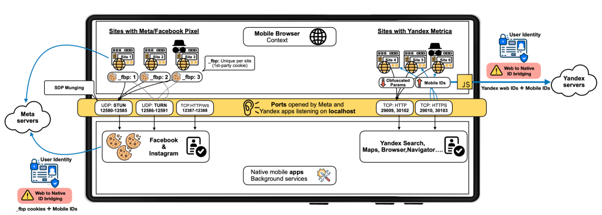

# 13/06/25

### Meta e Yandex inventam maneira inovadora de te espionar

<https://localmess.github.io/>

- Grupo revelou maneira 'inovadora' de espionar os usuários usada por diversos aplicativos, principalmente da Meta e Yandex.
- Uso de aplicações rodando no localhost (no seu celular) em portas específicas que são acessadas por scripts baixados das páginas
- Esse método evita proteções comuns como modo incognito, VPNs e limpeza de cookies e faz a 'desanonimização' do tráfego dos usuários
- Isso é uma maneira tão suja de fazer a coisa que poderíamos chamar de 'malware'
- Facebook deixou misteriosamente de fazer no dia da publicação da pesquisa
- Sabe quando a gente fala das empresas ouvirem nosso microfone? Então, essa é mais uma das "provas" de que elas não precisam...

### Mas que p\*\*ra é essa?

###

<https://g1.globo.com/tecnologia/noticia/2025/04/29/governo-revela-projeto-para-brasileiros-venderem-dados-para-empresas-entenda.ghtml>

<https://restofworld.org/2025/brazil-dwallet-user-data-pilot/>

> A monetização de dados também pode pressionar pessoas vulneráveis ​​a abrir mão de sua privacidade em troca de um pagamento rápido, assim como a World (anteriormente Worldcoin) fez em dezenas de países, de acordo com Bastos. Cofundada por Sam Altman, da OpenAI, a World escaneou as íris de mais de 400.000 pessoas no Brasil antes de o governo suspender suas operações em janeiro por coletar dados sem mecanismos de opt-out suficientes.
>
> “Ao tratar os dados como um ativo econômico, você está subvertendo a lógica por trás da proteção de dados pessoais”, disse Bastos. O ecossistema de dados “não será mais definido por quem consegue criar mais confiança e integridade em seus relacionamentos, mas sim por quem é o mais rico”.

### Bora bater um pratão de IA?

<https://nucleo.jor.br/garimpo/imagens-ia-ifood/>

#### Home office...

<https://www.terra.com.br/noticias/educacao/carreira/pesquisadores-passaram-quatro-anos-estudando-o-home-office-para-descobrir-o-que-os-millennials-ja-sabem-ha-muito-tempo,75d8e4e099b20a124596bc2070e75ea650l9qyfu.html>

<https://www.nbcnews.com/business/business-news/google-forcing-remote-workers-come-back-3-days-week-lose-jobs-rcna202664>

#### Música de IAAAAAAA

##### Por que o Spotify é tão BURRO?

<https://www.qobuz.com/no-en/label/sickbay-recordings/download-streaming-albums/7776722>

#### O negócio é tirar o humano da jogada

<https://rollingstone.com.br/musica/timbaland-lanca-empresa-de-musica-feita-com-ia-e-anuncia-artista-digital/>

<https://nucleo.jor.br/garimpo/marisa-maio/>

### Midijourney processada pela disney

<https://www.omelete.com.br/filmes/disney-universal-processal-midjourney-ia>

#### Vocês já sabem né?

##### Prompts

<https://aistudio.google.com/app/prompts?state=%7B%22ids%22:%5B%221ue8_mU5c0HacHMxwnDYXn7mBE35Go4X1%22%5D,%22action%22:%22open%22,%22userId%22:%22116597329914438288956%22,%22resourceKeys%22:%7B%7D%7D&usp=sharing>

#### React 1

{{#embed https://youtu.be/GXay1jfDhGY?feature=shared }}
