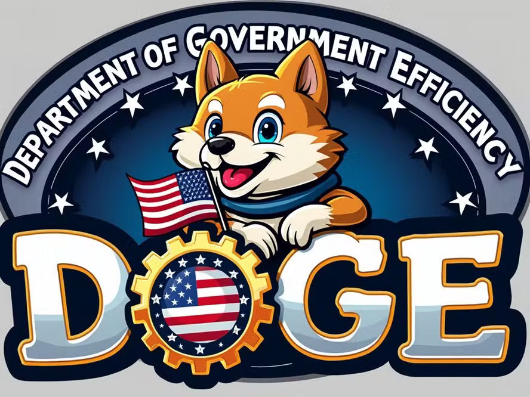

# Tecnologia e Classe de 14/11/24

### Escala 6x1 e a plataformização

- Todo apoio aos protestos pelo fim da escala 6x1
- Vamos conversar sobre a aproximação dessa luta com a uberização da economia

- Negocie com seu patrão

<https://noticias.uol.com.br/politica/ultimas-noticias/2024/11/11/governo-lula-pec-escala-6x1.htm>

{{#embed https://www.youtube.com/watch?v=g54NWjtNcaU }}

- Marinho voltou atrás?

<https://oglobo.globo.com/economia/noticia/2024/11/14/ministro-do-trabalho-defende-fim-da-jornada-6x1-e-que-governo-tem-simpatia-pela-proposta.ghtml>

### DOGE

Elon Musk irá integrar o governo de Donald Trump no 'departamento de corte de gastos'

#### **BTC chega a 90k**

#### O dólar do google

<https://www.reuters.com/fact-check/portugues/HU5MOXRQEJJCJJLAJGFWWZSBUE-2024-11-08/>

#### Hackers norte coreanos

<https://www.bleepingcomputer.com/news/security/north-korean-hackers-create-flutter-apps-to-bypass-macos-security/>

**World, projeto controverso de identificação e de moeda digital de Sam Altman, CEO da OpenAI, é lançado no Brasil:** a startup já está usando o Orb – esfera metálica do tamanho de uma bola de basquete – para escanear a íris de pessoas e realizar a verificação de prova de humanidade em dez pontos da cidade de São Paulo. Como incentivo, os participantes recebem 25 tokens Worldcoin, que valem cerca de 300 reais na cotação de hoje. A Autoridade Nacional de Proteção de Dados já abriu um processo de fiscalização sobre o funcionamento do projeto no país. As informações são do site Convergência Digital.

**Senha “123456” é a mais usada no mundo pelo segundo ano consecutivo:**  os dados são da lista anual de palavras-chave mais populares  globalmente, da NordPass. A credencial ocupou o topo em cinco das seis  edições da pesquisa, sendo desbancada apenas pela “password” em 2022. A  empresa afirma que utilizou um banco de dados de 2,5 TB proveniente de  fontes publicamente disponíveis, incluindo algumas obtidas na dark web. A  companhia destaca que muitas dessas senhas podem ser descobertas por  hackers em milissegundos. Uma lista com as 10 credenciais mais  utilizadas pode ser conferida no TabNews.

**Participação do Google no mercado de anúncios em buscas nos EUA pode cair abaixo de 50% pela primeira vez em mais de uma década:**  de acordo com um estudo, as gerações mais jovens estão adotando  ferramentas de IA para fazer buscas. As empresas estariam aproveitando a  situação para aprimorar suas soluções e atrair anunciantes. A  Perplexity, por exemplo, afirma que seu mecanismo processou 340 milhões  de consultas em setembro e atraiu o interesse de diversas empresas de  “alto nível” interessadas em anunciar seus produtos na plataforma. As  informações são do site Business Insider.

**Gartner prevê que escassez de energia restringirá 40% dos data centers de IA até 2027**:  o rápido crescimento da tecnologia poderá impulsionar um aumento  expressivo na demanda de até 160% nos próximos dois anos. Metas de  emissão zero de carbono também podem ser prejudicadas, uma vez que essas  estruturas precisam funcionar 24 horas, uma exigência que fontes  renováveis não conseguem atender 100% do tempo. A Gartner recomenda que  empresas foquem na diminuição do poder computacional e na viabilidade de  modelos de linguagem menores. As informações são da Gartner.
