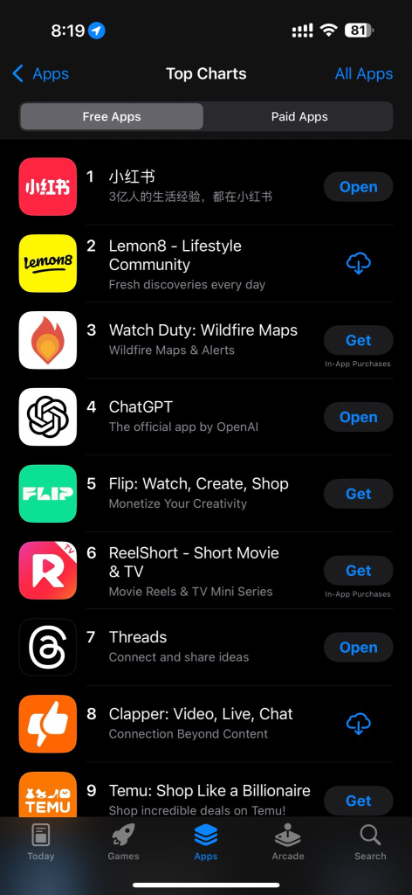

# Tecnologia e Classe de 16/01/25

#### Canal do jornal 'A Nova Democracia' banido do YouTube

<https://www.instagram.com/p/DE2mKS7pMXd/?img_index=1>

<https://www.instagram.com/p/DE28DYmIk8L/>

<https://anovademocracia.com.br/canal-and-youtube-encerrado-acao-arbitraria/>

### Eae Meta, como tá indo?

- Aplicativo que 'nudifica' fotos roda milhares de propagandas na Meta

<https://www.404media.co/instagram-ads-send-this-nudify-site-90-percent-of-its-traffic/>

- Houve resistência às mudanças na moderação vindo de dentro da Meta
- <https://www.intercept.com.br/2025/01/10/novas-regras-da-meta-permitem-chamar-gays-de-aberracoes-e-imigrantes-de-imundos/>

  > “Definir os limites da moderação de conteúdo sempre foi um esforço político”, diz Klonick, professora associada de direito na Universidade St. John’s e estudiosa de políticas de moderação de conteúdo. “Fingir que essas novas regras seriam mais ‘neutras’ que as antigas é uma ilusão e uma mentira.”

- Sob a nova política de moderação da Meta, estas frases seriam permitidas:

> “Os imigrantes são uma merda imunda e asquerosa.”
>
> “Os gays são uma aberração.”
>
> “Olha esse traveco (sob a foto de uma garota de 17 anos)”.

> Após a publicação desta matéria no site do Intercept dos EUA, Andy  Stone, representante da Meta, informou que a empresa havia cometido um  erro em um dos exemplos do material informativo. Stone diz que a Meta  pretendia ilustrar conteúdo que não seria permitido quando incluiu o  exemplo “olha esse traveco (sob a foto de uma menina de 17 anos”.
>
> Embora muitos dos exemplos e das políticas que os orientam pareçam  confusos, o documento é bastante claro quanto aos comentários  depreciativos sobre pessoas trans, incluindo crianças. Os materiais  destacam que “traveco \[tranny\] não é mais considerado insulto, e não é  uma violação”, e fornecem três exemplos de discurso que não deve mais  ser removido: “os travecos são um problema”, “olha esse traveco (sob a  foto de uma menina de 17 anos)”, e “tirem esses travecos da minha escola  (sob uma foto de alunos do ensino médio)”.

- O banimento do Tik Tok beneficia a Meta, mas será que o Trump não vai voltar atrás? Talvez por isso o Zuck queria ser o melhor amigo do Trump (o trisal com o Elon intensifica)

  
- Nós já falamos sobre a censura da Meta ao tema da Palestina, mas agora vou trazer alguns outros temas que comumente são censurados na plataforma e se liguem no **caráter** da censura:
- <https://www.404media.co/meta-is-blocking-links-to-decentralized-instagram-competitor-pixelfed/>
- <https://www.404media.co/meta-deletes-trans-and-nonbinary-messenger-themes/>
- <https://www.404media.co/facebook-is-censoring-404-media-stories-about-facebooks-censorship/>
- <https://www.404media.co/facebook-deletes-internal-employee-criticism-of-new-board-member-dana-white/>

**Após fim da checagem de fatos, buscas sobre como excluir Facebook e Instagram disparam 5.000% nos EUA:** termos relacionados atingiram o nível máximo de interesse (100/100) no Google Trends no país. Além disso, houve um aumento na pesquisa por alternativas como Bluesky (99/100) e Mastodon. No Brasil também foi detectado um leve crescimento nas buscas de como excluir as contas, mas o interesse nos termos já retornou ao nível padrão. As informações são dos sites TechCrunch e Tecnoblog.

#### Mix de notícias

**Após uma década de disputa, Tribunal do País de Gales rejeita processo de engenheiro de TI para resgatar 8 mil Bitcoins em aterro sanitário:** James Howells descartou acidentalmente o disco rígido em 2013. Atualmente, os ativos estão avaliados entre 700 e 750 milhões de dólares. Na ação, o indivíduo solicitava acesso ao local — com 1,4 milhão de toneladas de resíduos — ou uma compensação de 495 milhões de libras, oferecendo parte das moedas digitais recuperadas ao conselho e à comunidade local. As informações são do site Crypto News.

**Lei que restringe uso de dispositivos eletrônicos em escolas é sancionada no Brasil:** a legislação de número 15.100/2025 proíbe o uso de celulares, tablets e smartwatches durante aulas, recreios e intervalos, abrangendo pré-escola, ensino fundamental e médio. Os alunos poderão levar os aparelhos, mas somente utilizá-los em condições específicas, como emergências de saúde ou para fins pedagógicos, sob orientação dos professores. As instituições poderão implementar as novas regras a partir de fevereiro. As informações são do site Convergência Digital.

**Rede social Mastodon será controlada por organização sem fins lucrativos:** o objetivo é garantir que a plataforma “não seja de propriedade ou controlada por um único indivíduo”, diferente do modelo adotado por Mark Zuckerberg e Elon Musk, por exemplo. O CEO Eugen Rochko assumirá uma nova função focada na estratégia de produtos. A transição não deve impactar os usuários. As informações são do site The Verge.

**Projeto busca criar rede social “resistente à influência bilionária”:** o Free Our Feeds pretende arrecadar 30 milhões de dólares ao longo de três anos, com objetivo de desenvolver um ecossistema baseado no AT Protocol, utilizado pelo Bluesky. A iniciativa será gerida por um grupo de nove custodiantes, incluindo dois da Mozilla Foundation. Entre os apoiadores estão Mark Ruffalo — o Hulk do universo cinematográfico da Marvel — e Jimmy Wales, fundador da Wikipedia. As informações são do site The Verge.

<https://manualdousuario.net/mastodon-nova-fundacao-free-our-feeds/>

### Momento Inteligência Artificial: IAAAAAAAAAAAAAAAH

<https://www.404media.co/ceo-of-ai-music-company-says-people-dont-like-making-music/>

**Resumo de notificações da Apple pode reescrever e-mails e mensagens fraudulentas, fazendo-os parecer legítimos:** o recurso pode omitir detalhes importantes que ajudariam a identificar golpes. Um caso citado por um usuário envolveu um alerta priorizado sobre uma falsa declaração para o escritório de impostos da Austrália, no valor de 751,23 dólares australianos. A Apple afirma que planeja incluir uma indicação clara de que o texto exibido é um resumo gerado por IA. As informações são do site Crikey.

**Meta planeja inserir mais perfis de IA no Facebook e Instagram:** essas contas incluirão biografia, imagem de exibição e capacidade de postar conteúdos gerados por modelos. A empresa já havia anunciado essa iniciativa em 2023. No entanto, usuários forneceram feedbacks negativos após a introdução da funcionalidade. Consequentemente, a companhia excluiu todos os perfis de IA das plataformas. Os novos bots devem ser incorporados neste ano. As informações são dos sites SocialMediaToday e Ars Technica.

**CEO da OpenAI afirma que empresa já sabe como desenvolver inteligência artificial geral:** Sam Altman prevê que agentes de IA, capazes de executar tarefas de forma autônoma, poderão começar a impactar significativamente a produtividade das organizações ainda este ano. Segundo ele, o próximo objetivo da companhia é alcançar uma “superinteligência no verdadeiro sentido da palavra”, com potencial de acelerar descobertas científicas e inovações tecnológicas. As informações são do site The Verge.

### Vocês ouviram falar do Rednote?

- Primeiro precisamos falar sobre o banimento do Tik Tok nos EUA
  - Nas últimas notícias que saíram sobre eu já estou ouvindo indícios de que o Trump talvez queira reverter ou pausar por alguns dias esse processo para tentar sair como um herói da situação
  - Outro aspecto é que o Tik Tok está banido apenas nos EUA, porém empresas dos EUA estão proibidas de prover qualquer tipo de infraestrutura para distribuir o aplicativo, ou seja, isso pode afetar as lojas de aplicativo no Brasil.
  - Não relacionado, mas usuários de Tik Tok nos EUA estão processando o governo por causa do banimento e o Tik Tok está financiando eles kkkkk <https://www.nytimes.com/2025/01/10/us/politics/tiktok-creators-lawsuit-us-ban.html>
- Lembrando que a Tik Tok é uma empresa de Singapura embora seja controlada pela Bytedance (essa Chinesa).
- Nada mudando, o Tik Tok está se preparando para fechar as portas nos EUA em 19/01/25 e já provê um mecanismo para usuários baixarem todos os seus dados.

- Usuários da rede na expectativa do banimento estão preemptivamente se mudando para o aplicativo Rednote (Pequeno Livro Vermelho) ou 'Xiaohongshu'

- O aplicativo virou destaque nas lojas do Android e Iphone nos últimos dias (o segundo também é um aplicativo Chinês similar)

- O nome parece lembrar o 'Livro Vermelho' de citações do Presidente Mao, mas segundo o que li de alguns chineses esse geralmente é 'Xiaobaoshu'
- "Imagina que hilário se a gente fosse pra uma rede social chinesa mesmo, só de zoa?"

<https://www.nytimes.com/2025/01/14/business/tiktok-rednote-xiaohongshu-app.html>

- Um tema comum das interações tem sido "nós somos refugiados do Tik Tok" e os chineses respondem "somos os espiões chineses, bem vindos"

- O que tem virado um ponto comum de debate é: 'nossa, até que os chineses são gente como a gente' além de contrastar com a opinião comum de que a China é um 'país de escravos' e que eles famintos tem que comer cachorros
- Na realidade fica parecendo que eles estão vivendo no **futuro** (na minha opinião estão mesmo)

- Exemplo de algumas interações: <https://bsky.app/profile/everywhereerica.bsky.social/post/3lfpiqrjksc23>

- Essa situação toda chama atenção pra algo que sempre repetimos aqui. A China não tem interesse em bloquear o acesso dos seus habitantes à informação. Eles querem bloquear a influência de redes sociais controladas pelos EUA.
  - Pensando no que aconteceu nos últimos meses com o Xwitter e a Meta isso não faz sentido para vocês?
  - Existe a possibilidade real dos EUA começar a fechar as suas comunicações com a China (nova potencia cultural) e nós já falamos disso.

##### Memes ideia errada

- E os riscos de segurança? Eles podem ser reais e são similares ao que existe nas outras redes sociais. Você confia mais nos EUA ou na China?
- Agora coisas como isso são piada né?

<https://www.forbes.com/sites/kateoflahertyuk/2025/01/15/is-rednote-safe-heres-what-millions-of-tiktok-users-need-to-know/>

### E ae programador, chegou a sua vez?

**59% das empresas globais não planejam reduzir sua força de trabalho devido à IA:** uma pesquisa com mais de 1.000 empregadores de 22 setores indica que 77% das companhias planejam aprimorar suas equipes até 2030 para otimizar o uso dessas tecnologias. Além disso, cerca de 70% desejam contratar profissionais especializados na construção de modelos. As informações são da CNN.

**Empresário demite equipe inteira de programadores para substituí-la por IA, mas volta atrás:** Wes Winder afirma que a tecnologia permite a entrega de resultados “100 vezes mais rápida” com um código “10 vezes mais limpo”. Os funcionários deram lugar aos sistemas o1, Lovable e Cursor. No entanto, o plano não teve o sucesso esperado —posteriormente, Winder recorreu ao LinkedIn para anunciar a necessidade de desenvolvedores em sua empresa. Especialistas argumentam que, apesar dos benefícios da IA, ela não possui capacidade de substituir completamente o trabalho humano. As informações são do site TechGig.

{{#embed https://www.youtube.com/watch?v=evVaZeysQKo }}

<https://br.ign.com/whatsapp/135044/news/mark-zuckerberg-anunciou-o-comeco-do-fim-para-os-programadores-da-meta-e-outras-empresas-deverao-faz>
