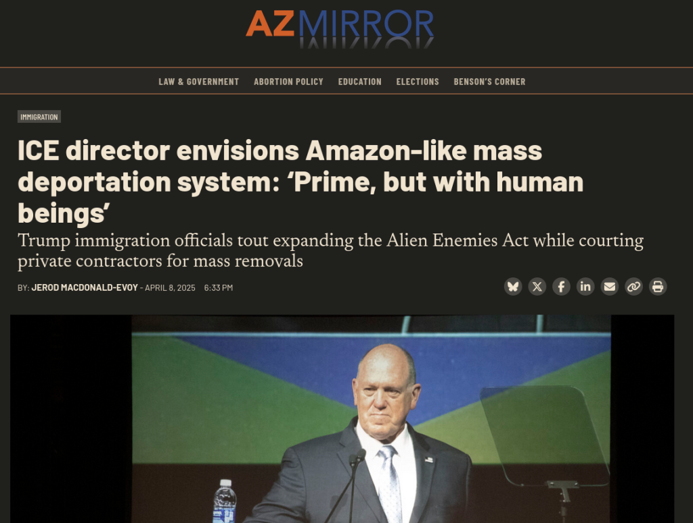

# 17/04/25

### Você não terá nada e será pago por isso 🙂

<https://www.wired.com/story/young-people-are-making-up-to-dollar36k-a-year-renting-their-t-shirts-and-speakers/>

### Mais um excelente uso pra inteligência artificial (sqn!)

<https://socket.dev/blog/slopsquatting-how-ai-hallucinations-are-fueling-a-new-class-of-supply-chain-attacks>

### Queima mercado de ações / Tarifas e Soberania dos Chips

##### Tarifas do Trump são tipo:

{{#embed https://www.youtube.com/watch?v=-ie8l8kzgFs}}

- NVIDIA anuncia a abertura de fábricas no Texas. É possível que isso não seja 'de agora', mas vitória para o governo Trump, certo?

<https://www.scmp.com/tech/big-tech/article/3306522/nvidia-says-it-will-build-us500-billion-ai-gear-us>

- Porém hoje os mercados deram uma balançada com a NVIDIA caindo uns 6% porque os EUA resolveu restringir a exportação dos chips H20 (feitos especialmente para serem exportados para a China)

[https://www.scmp.com/tech/tech-war/article/3306851/nvidia-curbs-and-asml-warning-spur-global-tech-stock-rout?utm_source=rss_feed](https://www.scmp.com/tech/tech-war/article/3306851/nvidia-curbs-and-asml-warning-spur-global-tech-stock-rout)

- Ainda existem dúvidas se a produção feita nos EUA será de chips de alta geração (ai 'gear', ai 'infrastructure')
- Esses chips serão apenas para o mercado interno? As tarifas recíprocas não podem machucar a venda desses chips para OUTROS PAÍSES?

##### Resposta da China às tarifas / bloqueios

<https://www.tomshardware.com/tech-industry/chinas-new-semiconductor-rule-spares-taiwan-fabs-punishes-intel-globalfoundries-and-texas-instruments>

- China está considerando a origem de fabricação como a variável para aplicar tarifas, ou seja, fábricas de chips em Taiwan, India ou qualquer outro país não terão as tarifas dos EUA
- E se NVIDIA e AMD colocarem mais da sua produção lá pra perto da China?
- Fabricantes como a Huawei já estão lambendo os beiços. A ideia é que isso possa acelerar o desacoplamento da dependência chinesa dos chips americanos

{{#embed https://www.youtube.com/watch?v=7BiomULV8AU}}

##### GPUs chinesas?

<https://www.tomshardware.com/pc-components/gpus/chinas-moore-threads-polishes-homegrown-cuda-alternative-musa-supports-porting-cuda-code-using-musify-toolkit>

##### Banimento da Deepseek de novo!

<https://techcrunch.com/2025/04/16/trump-administration-reportedly-considers-a-us-deepseek-ban/>

#### O hacker conhecido como "4chan" foi hackeado

- Em resumo o desquerido fórum anônimo mais famoso da internet foi hackeado por membros de uma 'facção' rival chamada 'Sojyjack Party'
- É um fórum concorrente que se separou do 4chan depois do banimento do fórum '/qa' onde estes usuários criaram a subcultura de spammar os memes de soyjack
- É uma subcultura dos fórum chans com sua própria idioglossia, rituais e piadas internas e aparentemente essa rivalidade e o hack já vinham sendo planejados há muito tempo
- No momento desta gravação o fórum está caído e provavelmente não irá voltar tão cedo
- Outra coisa interessante é que aparentemente o 4chan usava uma versão antiga do sistema de fórum phpBB e uma versão do PHP de pelo menos 2016 então devem ter rodado em alguma falha de segurança simples
- Coisas que foram vazadas de interesse (suposto, não temos certeza):
  - Fotos da interface administrativa
  - Email dos admins, moderadores e 'janitors'
  - Código fonte do site
  - IPs de usuários
- Existe muita especulação sobre a potencial ligação de admins do site com o governo dos EUA o que seria condizente com o papel desses fóruns de agitação de atividades ilegais e ligadas à extrema direita, porém não temos confirmação nenhuma

<https://arstechnica.com/information-technology/2025/04/internet-cesspit-4chan-apparently-hacked-mostly-unreachable-since-monday-night/>

<https://www.404media.co/4chan-is-down-following-what-looks-to-be-a-major-hack-spurred-by-meme-war/>

##### Recomendação de vídeo

{{#embed https://www.youtube.com/watch?v=lwUiEbO9sl8}}

### A tecnologia que alimenta um genocídio

<https://www-aljazeera-com.translate.goog/news/2025/4/5/pro-palestinian-protesters-interrupt-microsofts-50th-anniversary-event?_x_tr_sl=en&_x_tr_tl=pt&_x_tr_hl=en&_x_tr_pto=wapp>

> Durante uma apresentação de Mustafa Suleyman, CEO da Microsoft AI, focada no futuro do aplicativo de IA da empresa, Copilot, Aboussad interrompeu a plateia.
>
> "Mustafa, que vergonha! Você afirma que se importa em usar a IA para o bem, mas a Microsoft vende armas de IA para o exército israelense", disse ela, atraindo a atenção de todos.

> Vaniya Agrawal interrompeu uma sessão de perguntas e respostas com os ex-CEOs Bill Gates e Steve Ballmer, bem como o atual CEO de origem indiana, Satya Nadella. "Que vergonha! Vocês são todos hipócritas. Sou funcionária da Microsoft e não consinto", disse ela, dirigindo-se diretamente à liderança da gigante da tecnologia.

- A Microsoft possui um contrato de 133 milhões de dólares para o uso da sua infraestrutura de IA pelo exército israelense

<https://noazureforapartheid.com/>

### O país mais democrático do mundo

##### União sinistra das Big techs com o fascismo pt. 2

<https://www.404media.co/ice-just-paid-palantir-tens-of-millions-for-complete-target-analysis-of-known-populations/>

<https://www.404media.co/this-college-protester-isnt-real-its-an-ai-powered-undercover-bot-for-cops/>

##### A volta da "iniciativa chinesa" de Trump

<https://www.wired.com/story/professor-xiaofeng-wang-update/>

##### Governo Trump pressionando instituições acadêmicas

<https://arstechnica.com/science/2025/04/harvard-says-feds-research-funding-demands-amount-to-a-takeover/>

- Eu não repercuti aqui mas aconteceu um movimento parecido de chantagem e pressão pra cima de agências de advocacia que representaram ações contra o governo Trump

#### A invasão do NLRB pelo DOGE

<https://www.npr.org/2025/04/15/nx-s1-5355896/doge-nlrb-elon-musk-spacex-security>

- Uma denúncia alega que o DOGE, liderado por Elon Musk, causou uma violação de segurança na NLRB.​ Cerca de 10 GB de dados sensíveis foram supostamente extraídos dos sistemas da NLRB.​
- Os dados incluíam informações sobre atividades sindicais e segredos comerciais.
- Os técnicos do DOGE teriam desativado ferramentas de monitoramento e apagado registros de acesso.​
- Tentativas de alertar a CISA foram supostamente obstruídas por altos funcionários da NLRB.​
- O whistleblower recebeu ameaças após relatar o incidente. Uma nota colada em sua porta com fotos suas passeando com seu cachorro.

  ​
- O incidente ocorre enquanto SpaceX e Amazon desafiam a constitucionalidade da NLRB.​
- Elon Musk tem um histórico de perseguição a whistleblowers de suas empresas

##### Recomendação de vídeo

{{#embed https://www.youtube.com/watch?v=WjWFTHcaiBY}}

#### Em resumo

- O governo Trump tem um padrão fartamente estabelecido de perseguição dos seus oponentes políticos
- As políticas "anti imigrantes", "antigangues" e "antiterrorismo" e "anti antisemitismo" são uma desculpa para a deportações indiscriminadas e sem nenhum processo legal. El Salvador fica feliz de servir de campo de concentração para os EUA
- DOGE é um cavalo de Tróia que com o discurso de 'eficiência' está demitindo qualquer tipo de funcionário de carreira que não seja um trumpista convicto e desmontando sistemas de monitoramento e transparência internos.

### A infra da internet está doente de EUA

- Nós quase perdemos o  sistema de CVE por que o governo Trump só resolveu que não ia mais financiar...

<https://www.csoonline.com/article/3963190/cve-program-faces-swift-end-after-dhs-fails-to-renew-contract-leaving-security-flaw-tracking-in-limbo.html>

- O pessoal responsável resolveu às 23:55 criar uma espécie de fundação pra desacoplar isso do orçamento dos EUA

<https://www.thecvefoundation.org/>

- Por que esse tipo de coisa está na mão dos EUA?

- Que outras peças da nossa infraestrutura global estão na mão do império em decadência. Me ajuda xét:
  - Governança da Internet
  - Computação em Nuvem e Hospedagem de Dados
  - Pagamentos Globais e Sistemas Financeiros
  - Plataformas de Mídias Sociais
  - Cadeias de Suprimentos de Hardware
  - Segurança Cibernética e Certificados
  - Infraestrutura de Satélites

##### Administração Trump tá de olho na CISA

<https://krebsonsecurity.com/2025/04/trump-revenge-tour-targets-cyber-leaders-elections/>
