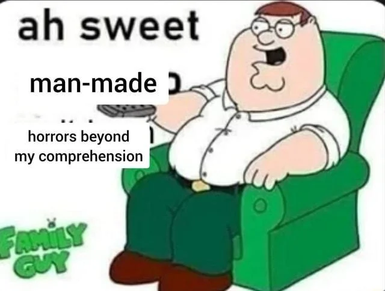

# Tecnologia e Classe de 17/10/24

### Sobre o canal 'Central Pandora'

{{#embed https://www.youtube.com/watch?v=5UB6GX-Bd7Y }}

**que maneiro**
**horrores feitos pelo homem**
**além da minha compreensão**

#### Isso é tipo o filme HER né?

<https://arstechnica.com/ai/2024/10/man-learns-hes-being-dumped-via-dystopian-ai-summary-of-texts>

#### IA para mandar currículo

<https://www.404media.co/i-applied-to-2-843-roles-the-rise-of-ai-powered-job-application-bots>

- A ferramenta **Auto_Jobs_Applier_AIHawk** usa o LinkedIn para encontrar vagas, preencher informações biográficas, gera currículos e cartas de apresentação personalizados, e aplica automaticamente para várias vagas em minutos
- Pode ser configurado em 15 minutos por qualquer pessoa com conhecimentos básicos de Python, exigindo apenas ajustes no código e uma chave de API da **OpenAI**.
- Se tornou viral no GitHub, com milhares de usuários utilizando-a para se candidatar a empregos em massa, resultando em entrevistas e até ofertas de trabalho para alguns.
- O uso de IA na candidatura e triagem de currículos está criando um ciclo automatizado, onde bots escrevem cartas de apresentação que são lidas por outros bots. Teoria da Internet 💀
- Federico Elia, criador do AI Hawk, afirmou que sua intenção é **nivelar o campo de jogo** entre candidatos e empresas, automatizando tarefas repetitivas e personalizando candidaturas a vagas.
- O LinkedIn veta o uso de ferramentas de IA para esse tipo de atividade, porém promete em breve lançar as suas próprias ferramentas.

<https://github.com/feder-cr/Auto_Jobs_Applier_AIHawk/>

### Wikipedia VS IA

**Editores da Wikipedia formam grupo para combater conteúdos gerados por IA:**  de acordo com os membros, o objetivo é proteger o site contra  desinformação, que já está afetando resultados de busca no Google,  livros na Amazon e revistas acadêmicas. Para isso, o grupo detecta  conteúdos que apresentam sinais claros de serem artificiais, focando em  termos comumente utilizados pelos modelos. Um exemplo é o artigo sobre o  Chester Mental Health Center, que, em novembro de 2023, incluía a frase  “Até a minha última atualização de conhecimento em janeiro de 2022”. As  informações são do site Slashdot.

<https://www.404media.co/the-editors-protecting-wikipedia-from-ai-hoaxes/>

{{#embed https://www.youtube.com/watch?v=in4e91tK4cg }}

### O robô do Elon Musk

**Evento “We, Robot” da Tesla apresenta robotáxis e destaca capacidades do robô Optimus:**  o Cybercab, previsto para antes de 2027, não contará com volante ou  pedais, e poderá ser carregado por indução, dispensando o uso de cabos; o  Robovan é uma van autônoma projetada para transportar até 20  passageiros; o robô humanoide Optimus ganhou destaque no evento, com  vídeos mostrando que ele poderia realizar tarefas do dia a dia, como  levar pacotes para dentro de casa e regar plantas. Depois da  apresentação, o público pôde interagir com eles, que fizeram gestos  simples, como acenar, segurar um copo de gelo e entregar pequenas  sacolas de presentes, além de jogar pedra, papel e tesoura com um dos  convidados. Elon Musk afirma que o Optimus poderá custar entre 20 mil e  30 mil dólares a longo prazo, e prevê que ele será o “maior produto de  todos os tempos” e representará uma “transformação fundamental para a  civilização”. As informações são dos sites The Guardian e The Verge.

#### Dança robozinho dança

{{#embed https://www.youtube.com/watch?v=TsNc4nEX3c4 }}

<https://gizmodo-com.translate.goog/elon-musks-beer-pouring-optimus-robots-are-not-autonomous-2000510899?_x_tr_sl=en&_x_tr_tl=pt&_x_tr_hl=pt-BR&_x_tr_pto=wapp&p=1>

### IBM e outras 32 multinacionais acusadas de cartel de contratação

<https://www.sindpd.org.br/sindpd/site/noticia.jsp?id=1728659964862&p=1>

<https://www.baguete.com.br/noticias/rhs-de-multinacionais-acusados-de-cartel?p=1>
