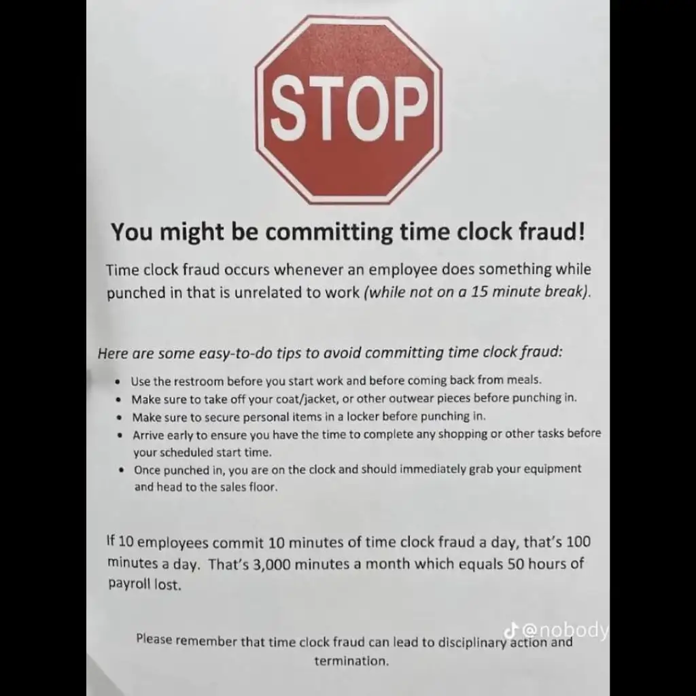

# Tecnologia e Classe de 18/04/24

## Lula no Bluesky

<https://bsky.app/profile/tecnologiaeclasse.bsky.social>

<https://www.cnnbrasil.com.br/politica/em-meio-a-embate-com-musk-lula-abre-perfil-em-rede-social-de-ex-ceo-do-twitter/>

### POLYWORK PASSANDO NA SUA TIMELINE

## Demissão Peaky Blinder

<https://epocanegocios.globo.com/empresas/noticia/2024/03/stellantis-pediu-para-400-profissionais-fazerem-home-office-em-um-dia-especifico-e-demitiu-todos-por-videochamada.ghtml>

### As tretas de licensiamento: Redis, Terraform e outros

<https://arstechnica-com.translate.goog/information-technology/2024/04/redis-license-change-and-forking-are-a-mess-that-everybody-can-feel-bad-about/?_x_tr_sl=auto&_x_tr_tl=pt&_x_tr_hl=en&_x_tr_pto=wapp>

<https://opentofu-org.translate.goog/blog/our-response-to-hashicorps-cease-and-desist/?_x_tr_sl=en&_x_tr_tl=pt&_x_tr_hl=en&_x_tr_pto=wapp>

### HAhaha ChatGPT

<https://www.instagram.com/p/C4isj-SuTWk/>

## Tarcísio e o ChatGPT

<https://revistaforum.com.br/politica/2024/4/17/tarcisio-vai-trocar-professores-por-chatgpt-nas-escolas-publicas-157456.html>

## O grande bosteamento

{{#embed https://www.youtube.com/watch?v=rimtaSgGz_4 }}

{{#embed https://www.youtube.com/watch?v=wVYG1mu8Lg8 }}

## PL dos Apps

### Resumo da PL

- Apenas para trabalhadores de aplicativo de carro (e.g. Uber e não Ifood)
- Parece haver uma vontade de mover para outros aplicativos, mas ainda não estamos lá
- Tempo de trabalho máximo de 12 horas (em corrida no app e quem computa É O APP)
- Cria uma nova classe de 'trabalhador de aplicativo' que é pretensamente autônoma, mas vai organizar uma representação sindical
- Empresa não pode exigir exclusividade do motorista e nem exigir horários ou jornada
- Poderá ocorrer a exclusão unilateral do cadastro do trabalhador por: fraudes, abusos, mau uso da plataforma
- Prevê um valor mínimo de remuneração por tempo de trabalho baseado no salário mínimo e um valor de 'custos'
- Não garante pro trabalhador intervalo, férias, 13º e FGTS
- Garante uma questão previdênciária similar a dos trabalhadores autônomos

### Problemáticas possíveis

- 0-hour contract / contrato de 0 horas
- Regras do App substituem leis de trabalho
- O tempo máximo de trabalho É POR APP
- O trabalhador de aplicativo é um autônomo mesmo?
- Empresas de apps cercaram o mercado e o plano é expandir isso para todas as áreas

### Plataformas de 'bicos' no Brasil

- Uber, Ifood e derivados
- Fivver <https://www.fiverr.com/>
- GetNinjas <https://www.getninjas.com.br/home-busca-v2>
- FGMED <https://fgmed.org/blog/uber-da-medicina-mais-conexao-e-saude/>
- <https://portal.cfm.org.br/noticias/cfm-regulamenta-uber-da-medicina/>
