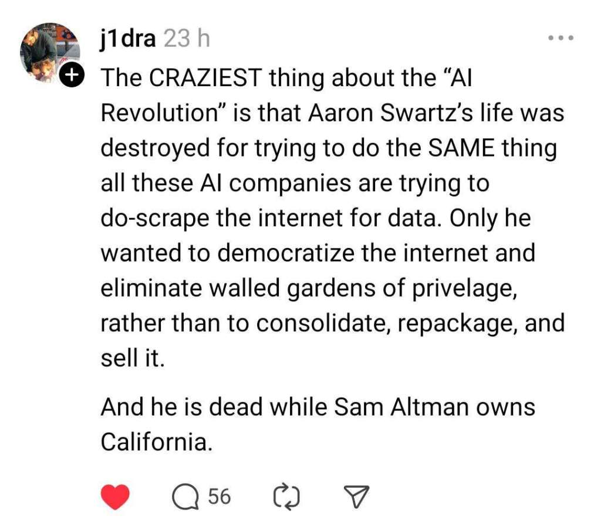

# Tecnologia e Classe de 18/07/24

### Notícias rápidas

**Meta suspende recursos de IA e coleta de dados no Brasil:**  a decisão foi tomada em resposta à exigência da Autoridade Nacional de  Proteção de Dados para que a empresa cessasse o uso de dados pessoais de  usuários no treinamento de seus modelos, afetando plataformas e  funcionalidades como criação de figurinhas no WhatsApp com a tecnologia.  A Meta afirma estar em diálogo com a ANPD para garantir a conformidade  com as normas de proteção de dados. As informações são dos sites Olhar  Digital e Correio Braziliense.

<https://tecnoblog.net/noticias/meta-suspende-ia-generativa-no-brasil-apos-pressao-da-anpd/>

### INFOSEC

**Profissionais  de tecnologia estão descontentes com falta de entendimento sobre  problemas de segurança por +chefes de outras áreas:** 60% dos  líderes “não-TI” estão “muito” ou “extremamente” confiantes de que suas  organizações são capazes de prevenir um ataque cibernético destrutivo  nos próximos 12 meses, enquanto apenas 46% dos especialistas na área  compartilham esse pensamento. Considera-se que líderes não técnicos  estejam mais focados nos impactos financeiros e reputacionais de  vulnerabilidades. As informações são do site TechRadar.

**Portal GovBR passará a aceitar denúncias e petições relacionadas à Lei Geral de Proteção de Dados:**  as reclamações poderão ser enviadas utilizando uma conta ou de forma  anônima, podendo envolver casos sobre vazamento de dados, exigências  abusivas de informações e situações onde empresas e órgãos públicos não  respondem a uma solicitação de resgate dos dados armazenados. As  informações são do site Tecnoblog.

<https://tecnoblog.net/noticias/portal-gov-br-passa-a-receber-denuncias-e-peticoes-relacionadas-a-lgpd/>

**Indonésia é alvo de ataque hacker e descobre que 98% dos dados governamentais não possuem backup:**  o grupo “Brain Cipher” utilizou uma variante do malware LockBit 3.0  para extrair dados sensíveis e criptografar os servidores, afetando mais  de 230 agências públicas, ministérios, serviços de imigração e  operações em aeroportos. Um oficial do governo descreveu a falta de  backups como uma "estupidez", destacando uma grave falha na governança e  na política de TI. As informações são do site TechRadar.

<https://www.tecmundo.com.br/seguranca/286729-hackers-infectam-indonesia-ransomware-liberam-chave-graca-pedem-doacoes-gentileza.htm>

### País da Liberdade ataca novamente

**Kaspersky decide encerrar operações nos EUA e demitir seus funcionários:**  a decisão ocorre após proibição imposta pelo Departamento de Comércio  do país em junho deste ano, que a empresa planejava contestar  judicialmente, mas voltou atrás ao avaliar o impacto das exigências  legais. O encerramento das operações será gradual, a partir do dia 20  deste mês. As informações são do site Zero Day.

<https://br.ign.com/tech/127063/news/a-proibicao-do-kaspersky-nos-eua-ja-tem-as-primeiras-vitimas-todos-os-funcionarios-da-empresa-no-pai>

### Relembrar é viver

**Pesquisa  realizada pela Comissão Federal de Comércio dos EUA indica que 76% dos  serviços de assinatura implementam “dark patterns” em suas plataformas:**  a análise, que abrangeu 642 sites e aplicativos, identificou métodos  utilizados pelas empresas, como impedir que renovações automáticas de  assinaturas sejam desativadas, preenchimento obrigatório de informações  de pagamento para participar de testes gratuitos e pré-seleção  automática de opções mais lucrativas de assinatura. Os nomes dos  serviços envolvidos não foram revelados. As informações são do site  TechCrunch.

**Amazon alega que 100% de seus data centers operam com energia limpa, mas funcionários contestam:**  os colaboradores argumentam que, com os dispositivos funcionando 24  horas por dia, não é garantido que eles utilizem energia renovável  durante à noite, horário no qual aparelhos solares não operam, por  exemplo. O grupo sugere que a Amazon adote a abordagem do Google, que  busca utilizar energia livre de carbono 100% do tempo em todas as suas  plantas. As informações são do site Fast Company.

{{#embed https://www.youtube.com/watch?v=5hTaTrJowJk }}

<https://sustainability.aboutamazon.com/climate-solutions/carbon-free-energy?energyType=true>

<https://www-datacenterdynamics-com.translate.goog/en/news/amazon-staff-say-company-is-distorting-the-truth-on-renewable-energy-progress/?_x_tr_sl=en&_x_tr_tl=pt&_x_tr_hl=pt-BR&_x_tr_pto=wapp>

### Humor Piada$

**Microsoft admite limitações de PCs Copilot+ sobre incompatibilidade com drivers e softwares:**  a empresa explica que certos hardwares e aplicativos, como programas  antivírus, só irão funcionar se forem projetados especificamente para  Windows 11 com Arm. Jogos online também podem apresentar problemas para  executar, devido à falta de compatibilidade com softwares anti-trapaça.  Mais detalhes estão disponíveis na página de FAQ da Microsoft. As  informações são do site TechRadar.

**Diretor  de IA da Microsoft afirma que conteúdos na web são como “freewares”  para treinar modelos de linguagem, a menos que proprietários de sites  declarem explicitamente o contrário:** para Mustafa Suleyman, há  um entendimento de que os dados na internet são de “uso justo”,  permitindo que qualquer pessoa copie, recrie e reproduza o material de  maneira gratuita. As informações são do site Slashdot.

**YouTube anuncia ferramenta que utiliza IA para remover músicas protegidas por direitos autorais sem prejudicar vídeos:**  a novidade está disponível no Studio, com opções para silenciar,  substituir ou remover o áudio por completo de forma precisa, sendo útil  para criadores de conteúdo que dependem da monetização pelo programa de  parceria do YouTube. As informações são do site TechRadar.

**Signal,  aplicativo de mensagens rival do WhatsApp e Telegram, armazena chaves  de criptografia em texto simples na versão de desktop para macOS e  Linux:** pesquisadores de segurança utilizaram um script Python  que copia o diretório de armazenamento local do mensageiro em um Mac e  transfere os dados para uma instalação virtual do sistema operacional,  permitindo clonar a sessão com todo o histórico de conversas, sem que o  Signal emita qualquer aviso. No Windows, as chaves são armazenadas no  arquivo “config.json” do diretório AppData. Recomenda-se que usuários  desvinculem dispositivos desktop de suas contas. As informações são do  site Stack Diary.

**Navegador  web construído totalmente do zero e financiado pelo cofundador do  GitHub, não utilizará “nenhum código” de softwares rivais:** o  Ladybird é um projeto open-source, atualmente em estágio pré-alfa e com  uma equipe de apenas três funcionários até o momento, que além dos  desafios técnicos, precisará concorrer com Chrome, Safari e Edge, que  juntos dominam 88% do mercado. Mais detalhes estão disponíveis no  repositório “LadybirdBrowser/ladybird” do GitHub. As informações são do  site DevClass.

<https://ladybird.org/>

### Isso aqui é a maior viagem que eu li nos últimos dias

<https://www-huffpost-com.translate.goog/entry/opinion-joe-biden-campaign-ai_n_668482b9e4b038babc7d56f2?_x_tr_sl=en&_x_tr_tl=pt&_x_tr_hl=pt-BR&_x_tr_pto=wapp>
