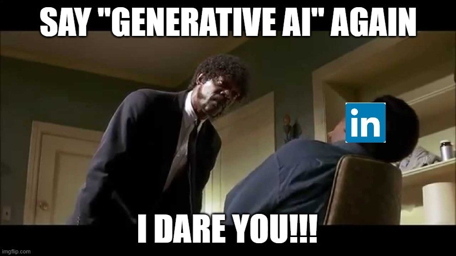
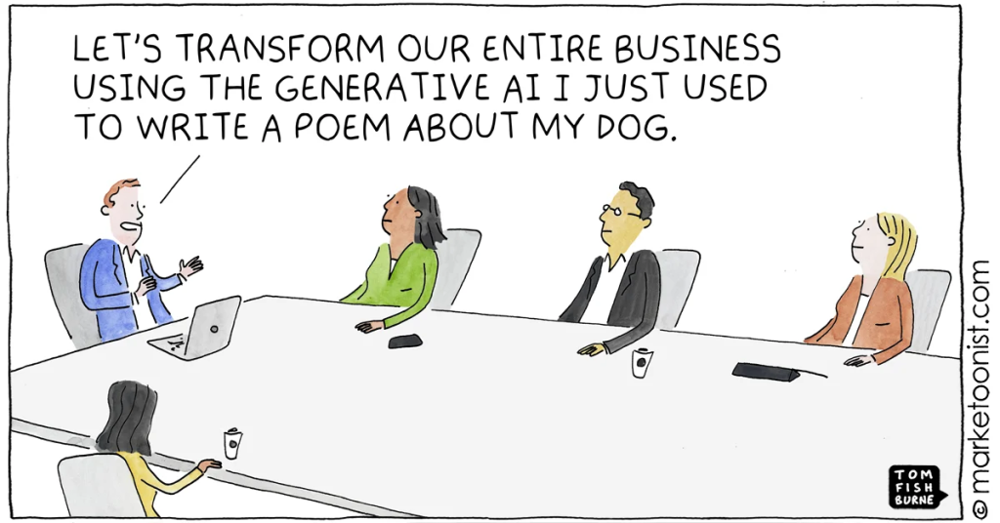
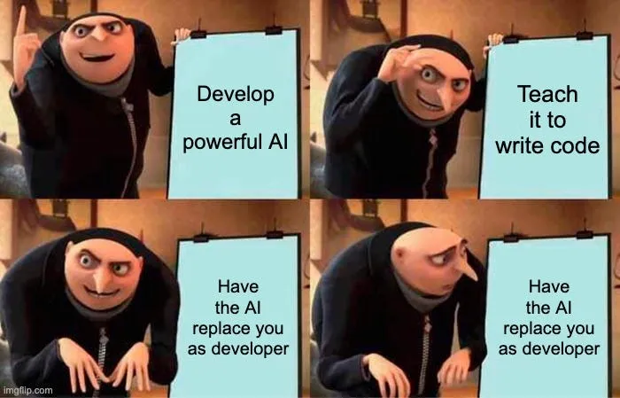

# 18/07/25

Recomendamos o vídeo da Lorelay Fox, falamos sobre novos tipos de malware em extensões de navegador, LAPD, OSINT no caso Epstein, IA generativa DE NOVO e reacts.

### Recomendação de vídeos

{{#embed https://www.youtube.com/watch?v=400DGiKfv7U }}

{{#embed https://www.youtube.com/watch?v=iX3JT6q3AxA }}

<https://www.instagram.com/p/DL5uyXKyHyo/>

{{#embed https://www.youtube.com/watch?v=HRfbQJ6FdF0 }}

<https://www.nucleodetecnologia.com.br/ocupalab>

### Extensões com malware

<https://blog-koi-security.translate.goog/google-and-microsoft-trusted-them-2-3-million-users-installed-them-they-were-malware-fb4ed4f40ff5?_x_tr_sl=auto&_x_tr_tl=pt&_x_tr_hl=pt&_x_tr_hist=true>

<https://www-pcworld-com.translate.goog/article/2845330/hundreds-of-chrome-extensions-create-a-web-scraping-botnet.html?_x_tr_sl=auto&_x_tr_tl=pt&_x_tr_hl=en&_x_tr_pto=wapp>

#### Lista de extensões infectadas

  * Mellowtel: <https://docs.google.com/spreadsheets/d/e/2PACX-1vT1XgBs25gRlg5e3nYCAff967WMtZZTO-TB3rR9zszaJpTpCVFg8j7FkBxnHb3tw3aHGjKBGSxYyLgV/pubhtml>

  * Red Direction: <https://blog.koi.security/google-and-microsoft-trusted-them-2-3-million-users-installed-them-they-were-malware-fb4ed4f40ff5#6e56>

- A gente tem que começar com um corolário aqui:
  - O crime compensa PRA CARALHO na internet
  - Logo a internet está lotada de crime 'organizado' e 'automatizado'

  <https://cybernews.com/news/most-internet-traffic-comes-from-bots/>
- 49\.6% da internet hoje é automatizado e 32% dessa quantia é tráfego malicioso
- Roubos de criptomoeda são o favorito
  - Ataques de cadeia de suprimentos
  - Ataques pelo stackoverflow
  - Slopsquatting
  - Entrevista de emprego fake

##### aaaaaaah, eu não tava maluco...

- No vídeo [A INTERNET ESTÁ MORTA E NÓS\* A MATAMOS](https://www.youtube.com/watch?v=OwqJUHkxOUo) eu descrevi a situação de receber constantes ataques de 'botnets' que pareciam coordenadas, mas tinham centenas de IPs e máquinas diferentes
- Isso não é de agora, mas estaríamos vendo o rescaldo da web 2.0, a era do compartilhamento e do software aberto?
- Eu sei que é muito chato o cara que fica dizendo o tempo todo: "isso é culpa do capitalismo", mas vamos pensar...
- É socialismo ou cibercalamidade

### Tecnologias usadas para o bem (?)

##### Reconhecimento facial de policiais

<https://www.404media.co/fucklapd-com-lets-anyone-use-facial-recognition-to-instantly-identify-cops/>

<https://fucklapd.com/>

- O site fucklapd ponto com (fodasse a polícia de Los Angeles) permite usuários fazerem o upload de fotos de políciais que estejam com as suas indetificações cobertas e descobrir os seus dados
- O site não faz mais do que juntar informações públicas numa interface amigável ao usuário e que roda localmente no aparelho

  <https://github.com/kylemcdonald/lapd-face-search/>
- Uma espécie de protesto contra a violência policial que aconteceu nos protestos anti ICE em Los Angeles. Criado pelo artista Kyle McDonald

<https://kylemcdonald.net/>

#### Sobre os protestos contra a ICE

<https://abcnews.go.com/US/timeline-ice-raids-sparked-la-protests-prompted-trump/story?id=122688437>

- Baseado no projeto da ONG 'Watch the Watchers' que compilou dados públicos de policiais que são buscáveis por insígnia
- Parecido com o site de 2018, do mesmo autor, feito para identificar agentes ICE. Porém que está bastante desatualizado, o que torna seu uso perigoso...

  <https://icespy.org/>
- Por que alguém teria interesse nesse ferramenta?

{{#embed https://www.youtube.com/watch?v=qI5Uzj5r-Hc }}

##### Vazamento de dados sendo usado para OSI no caso Epstein

- Jeffrey Epstein era um financista bilionário que, em 2019, foi formalmente acusado de tráfico sexual de menores em Nova York. Ele já havia se envolvido em um escândalo anterior na Flórida, em 2008, com acusação por prostituição envolvendo menores de 14 anos
- Nos anos 2000, como procurador federal, Alexander Acosta fez um acordo judicial que concedeu imunidade a Epstein e seus cúmplices, interrompendo investigações mais profundas — um acordo posteriormente considerado ilegal
  - Procurador Geral do Trump 1
  - When he was vetted for his cabinet post in the Trump administration, Acosta stated “I was told Epstein ‘belonged to intelligence’ and to leave it alone.”[\[41\]](https://en.wikipedia.org/wiki/Alexander_Acosta?utm_source=chatgpt.com#cite_note-41)
- Em agosto de 2019, Epstein foi encontrado morto na cela, oficialmente por suicídio. Houve falhas graves nos protocolos prisionais e desaparecimento de vídeos com gravações das últimas horas
  - Vídeo liberado agora mostra evidências de ter sido forjado
- **Investigações e “client list”**: Após sua morte, especulou-se a existência de uma “lista de clientes” — pessoas poderosas associadas aos abusos. FBI e DOJ revelaram não existir evidência de tal lista nem de conspiração ou homicídio
  - Trump já falou: "se tem lista os DEMOCRATAS EDITARAM ELA"
- Ghislaine Maxwell, associada chave de Epstein, foi condenada em 2022. Vítimas continuam com processos civis, enquanto se investigam as transações financeiras suspeitas envolvendo US$1,5 bilhão de transferências e redes ocultas de poder
  - Gislaine famosamente ligada aos Clintons, e agências de inteligência.

##### Encerramento do caso sob Trump 2

- O Departamento de Justiça e o FBI, ainda sob a administração Trump, divulgaram um memorando declarando que não há evidência de morte por assassinato, “lista de clientes” ou conspiradores adicionais, encerrando formalmente a investigação
  - Um 180 total da posição informal que Trump, seus asseclas e base de apoio mantinha
- Sendo perguntado recentemente Trump atacou repórteres dizendo: "assunto chato / ainda estamos falando disso?"
- Essa é uma das conspirações que embora una direita e esquerda - deixando claro a influência da burguesia e do que geralmente eles chamam de 'deep state' na política, com certeza é uma bandeira mais forte da direita
- Lembrando que Elon Musk largou essa bomba aqui quando estava brigado com o Trump (e antes de ganhar mais contratos federais pra suas empresas)

- A base de Donald Trump, por enquanto, está como baratas tontas e muitos estão decepcionados com ele

##### Esse vídeo aqui tem 7 meses...

{{#embed https://www.youtube.com/watch?v=PjPHq-Ez0nc }}

### Reflexão #42 sobre IA generativa

- Sobre o VIBE CODING / Software 3.0 / qualquer nome
  - Boa regra geral: **NÃO GERE NENHUM CÓDIGO QUE VOCÊ NÃO É CAPAZ DE ESCREVER VOCÊ MESMO**
- Sobre o aumento da produtividade

  > Eu me lembro de um economista famoso, nos anos 1980, dizendo sarcasticamente que, para onde quer que olhasse, ele “via” os ganhos de produtividade que os computadores tinham trazido – “em toda parte”, continuou ele, “exceto nas estatísticas de produtividade”. Ele estava certo: assim como as primeiras gerações de computadores não economizaram papel nenhum, já que tendíamos a imprimir qualquer coisa importante (com frequência duas vezes), eles também fizeram pouco para estimular a produção industrial. Mas o computador teve, sim, um enorme impacto nas finanças. Ele multiplicou a complexidade dos instrumentos financeiros ao esconder a feiura no interior deles. E permitiu que sua negociação frenética chegasse quase à velocidade da luz.
  >
  > Trecho de 'Tecnofeudalismo: o que matou o capitalismo' por Yanis Varoufakis
- Sobre ser a ferramenta 'apropriada'

  

- Por que então as empresas querem tanto que a gente use IA?

  <https://www.adrenaline.com.br/ia/microsoft-muda-politica-interna-sobre-uso-de-inteligencia-artificial-ia/>

  

- Sobre a substituição dos nossos empregos

Ningúem vai automatizar meu emprego / Automatizaram meu emprego

{{#embed https://www.youtube.com/watch?v=rV7OLi36Fc4 }}

### Reacts

{{#embed https://www.youtube.com/watch?v=zOR9l5XMPgE }}

{{#embed https://www.youtube.com/watch?v=vLuXIum44-g }}
