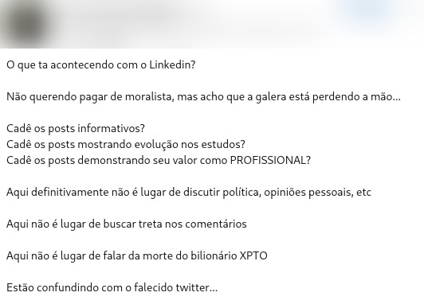

# Tecnologia e Classe de 19/12/24

## Aha-uhu é 40k!

### Natal sem Fome

### Recomendação de vídeos

{{#embed https://www.youtube.com/watch?v=YsXCVsDFiXA }}

{{#embed https://www.youtube.com/watch?v=X28gzRwTsoE }}

{{#embed https://www.youtube.com/watch?v=cDYyKDqgLoQ }}

### A cada dia que passa nos afastamos mais de 𝒹ₑᵤₛ

##### Filtro de minions no tiktok

[ssstik.io\_@spermamantitan_1734638263924.mp4](./19_12_24/ssstik.io_%40spermamantitan_1734638263924.mp4)

<https://knowyourmeme.com/memes/minion-ai-gore-videos>

##### O que está acontecendo com o Linkedin?

##### Exemplo para vocês testarem:

### Liderança, Consequências e a Responsabilidade do Poder

<https://chatgpt.com/share/67639ce2-da0c-800c-9ff9-31c69f9fd497>

> A recente morte de Brian Thompson, CEO da United Healthcare Group, pelas mãos de Luigi Mangione, trouxe à tona reflexões importantes sobre a responsabilidade que vem com a liderança. Em vez de ser recebida com pesar universal, a notícia foi marcada por reações de alívio e até comemorações por parte de alguns. O motivo? A insatisfação generalizada com a postura da empresa que ele liderava.
>
> Liderar uma organização não é apenas tomar decisões estratégicas ou entregar resultados financeiros robustos – é, sobretudo, ter consciência do impacto que essas decisões têm sobre vidas reais. Empresas como a United Healthcare, acusadas de práticas injustas como negar seguros a pessoas em situações vulneráveis, mostram que o poder corporativo, quando mal exercido, pode gerar consequências catastróficas.
>
> Esse caso levanta uma questão crucial: o que significa ser um líder responsável? Quando escolhas corporativas colocam o lucro acima das pessoas, a liderança falha. Em mercados complexos e altamente regulados como o de seguros de saúde, cada decisão pode significar a diferença entre esperança e desespero para milhares. A sensação de abandono que se acumula em quem foi prejudicado transforma insatisfação em indignação – e, em casos extremos, tragédia.
>
> É alarmante que o descontentamento com uma figura de liderança chegue ao ponto em que sua morte seja celebrada. Isso é um alerta sobre como a desumanização e o descaso podem corroer a reputação e o legado de uma empresa – e de seus líderes. Mais do que nunca, a ética e a empatia precisam ser parte central da estratégia de negócios, e não apenas um item na lista de “valores corporativos”.
>
> Brian Thompson, como qualquer outro líder, tinha a chance de usar sua posição para transformar o mercado de saúde em algo mais acessível e justo. Sua liderança, no entanto, parece ter sido marcada pela priorização de números em detrimento de vidas. Essa abordagem deixa um vazio, não apenas por sua ausência, mas pela falta de um legado positivo que ele poderia ter deixado.
>
> Este evento nos convida a refletir: estamos, enquanto líderes, trabalhando para construir um impacto positivo e duradouro? Ou estamos permitindo que nossas decisões alimentem revolta e sofrimento? A verdadeira liderança está em servir, e não em ser servido – um valor que todos nós, em qualquer posição, devemos constantemente buscar.

### Greve da Amazon

<https://www.cnnbrasil.com.br/economia/negocios/milhares-de-funcionarios-da-amazon-entram-em-greve-nos-eua/>

{{#embed https://www.youtube.com/watch?v=AI1kjUKL11Q }}

{{#embed https://www.youtube.com/watch?v=rz11XylQ24w }}

### Ex-funcionário da OpenAI que acusou a empresa é encontrado morto em sua casa

- Suchir Balaji, 26 anos. Foi encontrado morto em seu apartamento em São Franciso. Sem sinais de 'crime' segundo a polícia.
- Havia se demitido do seu cargo na OpenAI faziam 4 meses por enxergar que a empresa estava violando direitos autorais com seus produtos e 'tornando a internet um lugar pior'
- Começou a se interessar por IA por causa de um projeto da Deepmind que treinava redes neurais para jogar joguinhos.
- "Eu pensei que a I.A. era algo que poderia ser usado para resolver problemas insolúveis, como curar doenças e parar o envelhecimento", ele disse. "Eu pensei que poderíamos inventar algum tipo de cientista que pudesse ajudar a resolvê-los."
- A OpenAI discorda do Sr. Balaji, dizendo em uma declaração:

  > “Construímos nossos modelos de I.A. usando dados disponíveis publicamente, de uma maneira protegida pelo uso justo e princípios relacionados, e apoiados por precedentes legais de longa data e amplamente aceitos. Vemos esse princípio como justo para os criadores, necessário para os inovadores e crítico para a competitividade dos EUA.”
- Temos que lembrar da 'missão inicial' da OpenAI que era 'criar uma tecnologia de IA que irá beneficiar toda humanidade'. Balaji afirma que enquanto eles se enxergavam desse jeito parecia OK usar esses dados para 'pesquisa'
- Vamos falar sobre os casos do books3, Whisper para vídeos do YouTube e processos que a OpenAI sofre (NY Times)

  > Em uma carta de 18 de novembro protocolada em um tribunal federal, advogados do The New York Times nomearam Balaji como alguém que tinha “documentos únicos e relevantes” que apoiariam seu caso contra a OpenAI. Ele estava entre pelo menos 12 pessoas — muitas delas ex-funcionários ou atuais da OpenAI — que o jornal havia nomeado em processos judiciais como tendo material útil para seu caso, antes dos depoimentos.
- Impossível não lembrar do caso de Aaron Swartz... lembrem-se sempre: Swartz e Balaji não estão mais aqui e os CEOs de big techs cada vez mais mandam na internet. O que vamos fazer sobre isso?

<https://www.infomoney.com.br/mundo/ex-funcionario-da-openai-que-denunciou-praticas-da-companhia-e-encontrado-morto/>

<https://www.mercurynews.com/2024/12/13/openai-whistleblower-found-dead-in-san-francisco-apartment/>

<https://www.jornalemdestaque.com/7212/denunciante-da-openai-morto-os-pais-querem-saber-o-que-aconteceu-com-suchir-balaji-apos-aparente-suicidio/>

<https://www.nytimes.com/2024/10/23/technology/openai-copyright-law.html>

<https://www.musicbusinessworldwide.com/why-just-resigned-from-my-job-generative-ai/>
