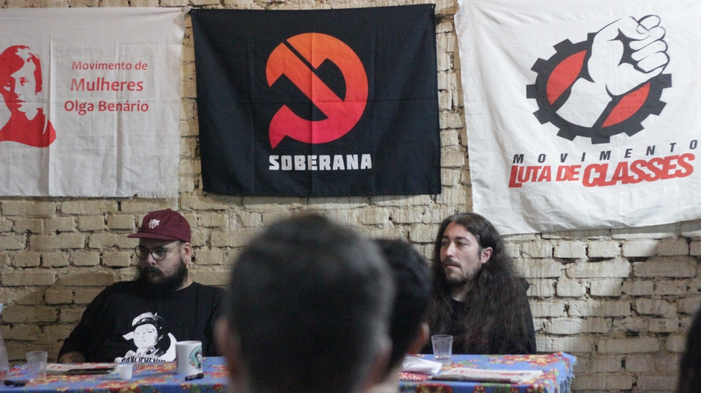
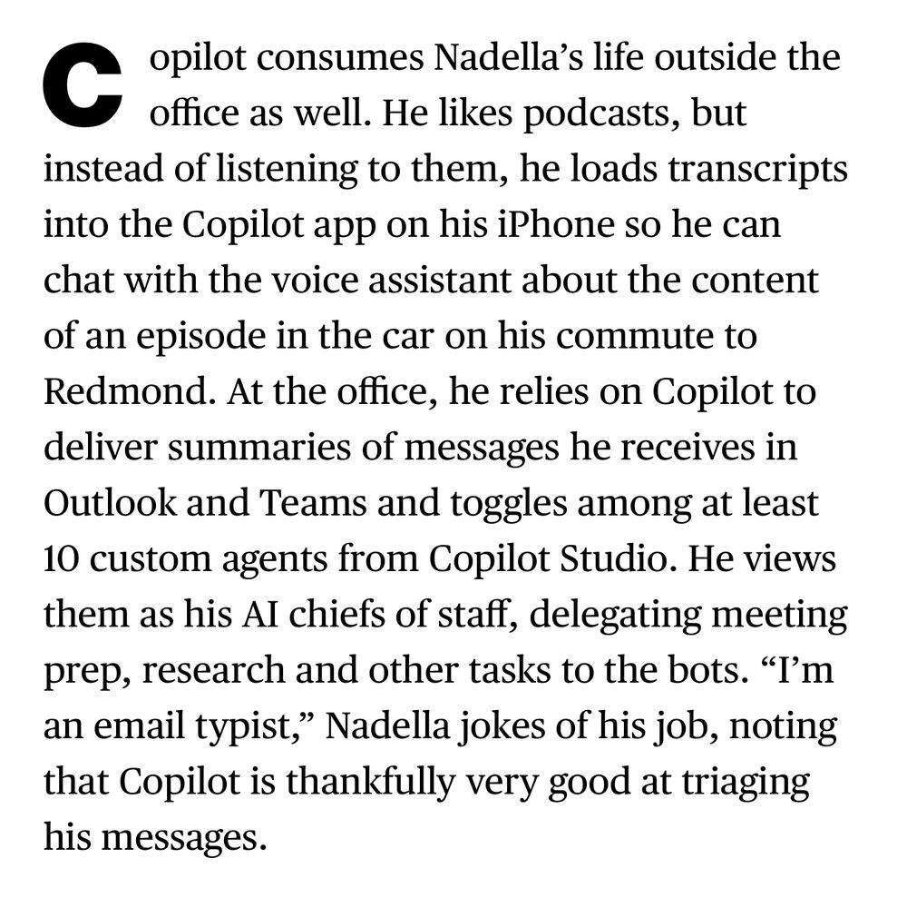
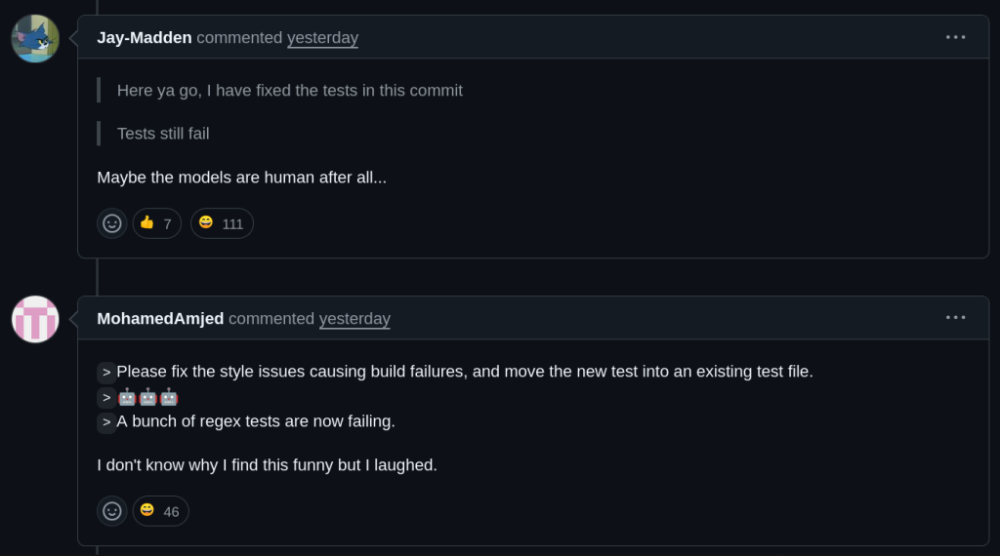

# 22/05/25

### Como está sendo a TeClas Tour 2025

#### Cryptorave 2025

- Um salve pra todo mundo que nos encontrou lá no evento!
- Eu vi algumas palestras maravilhosas (menos do que eu queria)
- Me parece que o comunismo cresce

- Não estamos no Ciberspaço. Estamos no Brasil.
- Em breve no canal!

#### Plenária sobre Uberização do Trabalho

<https://www.intercept.com.br/2025/05/19/chefes-do-mercado-livre-lotam-assembleia-para-implodir-tentativa-de-articulacao-dos-trabalhadores/>

- Assembleia sindical foi invadida por chefes e gerente que eram favoráveis a um acordo pior
- Sindicato pede redução da jornada para 40 horas semanais (atualmente são 44), reajuste salarial de 8,87%, aumento nos vales alimentação/refeição e respeito ao regime de home office
- Funcionários denunciam uma cultura interna de repressão à organização trabalhista, com represálias como mudanças de time ou avaliações negativas de desempenho.
- A transferência da sede para SC em 2023 reduziu a proteção dos trabalhadores ao submetê-los a um sindicato com convenções menos favoráveis.
- Apesar de faturar R$ 3,64 bilhões no último bimestre de 2024 e ser a empresa mais valiosa da América Latina, o Mercado Livre resiste a conceder avanços trabalhistas.

#### Palestra no Inf Ufrgs sobre IA/EUA/China

- Em breve no canal!

## Recomendação de vídeos

####

"Quando alguém vai fazer algo?"

{{#embed https://www.youtube.com/watch?v=zXrjlOE9e50}}

Sobre a Palantir

{{#embed https://www.youtube.com/watch?v=foMjM0iebNU}}

{{#embed https://www.youtube.com/watch?v=KipDBa4bTl8}}

## O layoff de 6k da Micro$oft

<https://www.tecmundo.com.br/mercado/404505-microsoft-demite-cerca-de-6-mil-funcionarios-em-nova-reestruturacao.htm>

## Satyia Nadella está viciado em IA

[https://www-bloomberg-com.translate.goog/news/features/2025-05-15/microsoft-ceo-satya-nadella-on-his-ai-efforts-and-openai-partnership](https://www-bloomberg-com.translate.goog/news/features/2025-05-15/microsoft-ceo-satya-nadella-on-his-ai-efforts-and-openai-partnership?utm_campaign=news&utm_medium=bd&utm_source=applenews&_x_tr_sl=en&_x_tr_tl=pt&_x_tr_hl=en&_x_tr_pto=wapp&_x_tr_hist=true)

#### Engenheiros da Micro$oft revisando PRs do Copilot

<https://old.reddit.com/r/ExperiencedDevs/comments/1krttqo/my_new_hobby_watching_ai_slowly_drive_microsoft/>

#### "Copilot" liberado como código aberto

<https://code.visualstudio.com/blogs/2025/05/19/openSourceAIEditor/>

#### WSL liberado como código aberto

<https://blogs.windows.com/windowsdeveloper/2025/05/19/the-windows-subsystem-for-linux-is-now-open-source/>

### Novo modelo de vídeo Veo3 da Deepmind

<https://deepmind.google/models/veo/>

### SP vai usar IA para corrigir trabalhos escolares

<https://www.instagram.com/reel/DJ397N4Oies/>

## Olha o tamanho dessa cagada...

<https://lupa1.com.br/blogs/ponto-de-ruptura/hackers-dao-prazo-final-prejuizo-do-grupo-jorge-batista-ja-passa-dos-r-400-milhoes-58040.html>

## React: anúncios fake de joguinhos

{{#embed https://www.youtube.com/watch?v=Ird3s09ITTA }}
