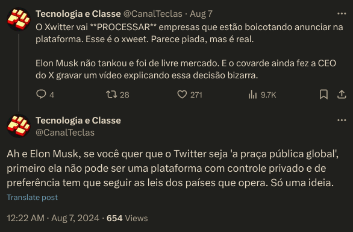

# Tecnologia e Classe de 22/08/24

### Últimas notícias do X

{{#embed https://www.youtube.com/watch?v=uyrqunDux54}}

{{#embed https://www.youtube.com/watch?v=fM_5vr0Lzu8}}

{{#embed https://www.youtube.com/watch?v=_IUHMuBH788}}

{{#embed https://www.youtube.com/watch?v=U_M_uvDChJQ}}

**Elon Musk encerra operações do X no Brasil e demite funcionários:**  a decisão foi comunicada em uma reunião de emergência realizada neste  sábado e afetou cerca de 40 colaboradores, cujo acesso aos sistemas da  empresa foi imediatamente suspenso. Fontes presentes no encontro sugerem  que o encerramento pode estar relacionado a recentes desentendimentos  com decisões judiciais no país, como ordens de remoção de perfis e  postagens, além da exigência de entrega de dados de usuários. Apesar  disso, a rede social continuará acessível aos brasileiros. As  informações são do site Tecnoblog.

<https://canaltech.com.br/mercado/por-que-o-xtwitter-vai-sair-do-brasil-entenda-o-caso-e-veja-o-que-muda/>

- Em resumo: o Elon Musk está em busca de novos factóides para denunciar uma ditadura '**LuloXandista**' que estaria perseguindo opositores políticos no Brasil

### Recapitulando:

**Iniciativa  “Right to Switch Off” do Reino Unido visa garantir que funcionários  tenham direito de ignorar mensagens recebidas fora do horário de  expediente:** a proposta visa combater o esgotamento dos  trabalhadores, garantindo que tenham tempo para descansar. No entanto,  as regras não serão diretamente aplicáveis a todas as empresas, funções e  setores, como a segurança cibernética, onde um ataque de ransomware em  uma sexta-feira à noite pode exigir ação imediata. A expectativa é que  as novas políticas permitam um acordo entre empregadores e funcionários  sobre o que é considerado aceitável. As informações são do site The  Register.

**Microsoft começará a avaliar desempenho dos funcionários com base no foco em segurança:**  o parâmetro será considerado em todas as atividades e poderá  influenciar decisões sobre promoções, aumentos salariais e bônus. A  empresa espera que a medida seja integrada desde o início do design de  produtos e que as melhores práticas sejam seguidas ao longo de todos os  projetos. A mudança faz parte da iniciativa “Secure Future” da  Microsoft, cujo objetivo é aprimorar a proteção dos sistemas e redes da  empresa. As informações são do site The Verge.

**Crescente demanda por sistemas de IA está aumentando consumo de água para resfriamento de data centers:**  na Virgínia, região de maior concentração de instalações desse tipo no  mundo, o uso aumentou cerca de 66,6% entre 2019 e 2023, passando de 4,2  bilhões de litros para 7 bilhões. Embora muitas unidades utilizem  sistemas de reciclagem de água em circuito fechado, uma parte é  destinada ao controle da umidade, o que pode resultar em evaporação. As  informações são do site TechCrunch.

**WhatsApp sofre derrota na maior ação judicial sobre privacidade de dados no Brasil:**  a decisão obriga que a plataforma ofereça uma opção clara e acessível  para que usuários decidam se desejam ou não permitir o compartilhamento  de seus dados com outras redes da Meta, como Instagram e Facebook. O  prazo para adequação é de 90 dias, e em caso de descumprimento será  aplicada uma multa diária de 200 mil reais. Essa ação é considerada a  maior do país em termos de proteção de dados, com valor de causa  acumulado em 1,7 bilhão de reais. As informações são do site Tecnoblog.

### Sessão Cookie Clicker

**Pesquisa indica que videogames podem melhorar saúde mental:**  os dados foram obtidos durante a época de pandemia no Japão, envolvendo  pessoas com idades entre 10 e 69 anos. Ao mesmo tempo que os jogos  traziam benefícios, indivíduos que passavam mais de 3 horas em frente à  tela demonstravam efeitos contrários. No entanto, o simples fato de  possuir um console já mostrava um impacto positivo. O estudo ressalta  que as circunstâncias da pandemia podem ter influenciado os resultados.  As informações são do site The Register.

**Ex-CEO  do Google afirma que baixo desempenho da empresa na área de  inteligência artificial está relacionado às políticas de trabalho  flexível:** para Eric Schmidt, a companhia “decidiu que o  equilíbrio entre vida pessoal e profissional eram mais importantes do  que vencer”. Em resposta, o Sindicato dos Trabalhadores da Alphabet  destacou outros fatores que impactaram a produtividade, como mudanças  constantes de prioridades, demissões em massa e salários estagnados.  Após a repercussão negativa, Schmidt disse que "cometeu um erro" ao  vincular o desempenho do Google ao trabalho remoto. As informações são  do site The Register.

**Uso de drones equipados com IA para realizar inspeções em casas dos EUA está resultando em cancelamentos inesperados de seguros residenciais:** um proprietário afirma ter tido sua apólice revogada após a detecção de musgo em seu telhado. Outro caso foi citado na Califórnia, com o sistema identificando um “aumento de riscos com desordem ou condições insalubres” em uma propriedade. Estima-se que a prática de usar drones e outros dispositivos aéreos na inspeção de moradias está se expandindo, com programas de imagem cobrindo 99% da população americana, com projeção para alcançar 2,6 bilhões de dólares em investimentos até 2032. As informações são da SCNR.

### IA e redes sociais nas eleições

<https://agenciabrasil.ebc.com.br/justica/noticia/2024-03/entenda-regras-do-tse-para-uso-de-inteligencia-artificial-nas-eleicoes>

- Exigência de rótulos de identificação de conteúdo multimídia  fabricado – qualquer material visual feito por meio de inteligência  artificial deverá trazer o aviso explícito sobre o uso da tecnologia;
- Restrição ao uso de *chatbots* e avatares para intermediar a  comunicação da campanha – fica proibido simular conversas com o  candidato ou outro avatar que aparente ser uma pessoa real;
- Vedação absoluta, seja contra ou a favor de candidato, do uso de *deep fake* – conteúdo  fabricado em formato de áudio, vídeo ou combinação de ambos e que tenha  sido gerado ou manipulado digitalmente para criar, substituir ou  alterar imagem ou voz de pessoa viva, falecida ou fictícia;
- Paralelamente, os provedores de aplicações na internet (redes  sociais e aplicativos de mensagem, por exemplo) ficam obrigados a  retirar do ar, sem a necessidade de ordem judicial, contas e materiais  que promovam condutas e atos antidemocráticos e também discursos de  ódio, como racismo, homofobia, fascismo e qualquer tipo de preconceito.

<https://www1.folha.uol.com.br/poder/2024/08/campanha-eleitoral-comeca-com-novas-regras-para-redes-sociais-e-ia-entenda.shtml>

{{#embed https://www.youtube.com/watch?v=88K1fddd6cQ}}

{{#embed https://www.youtube.com/watch?v=khRdQb6Me4Q}}
