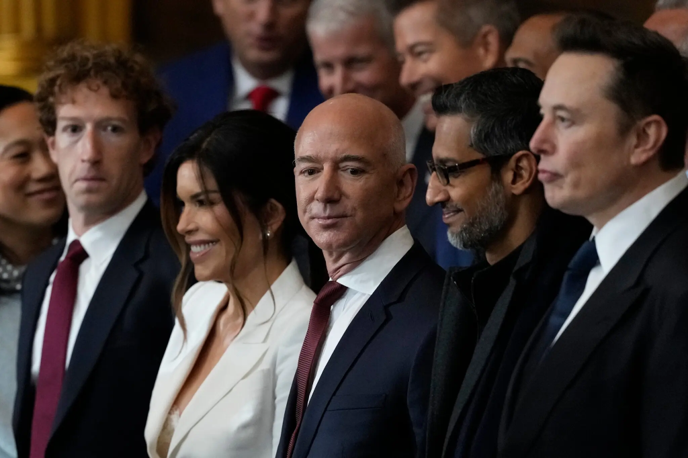
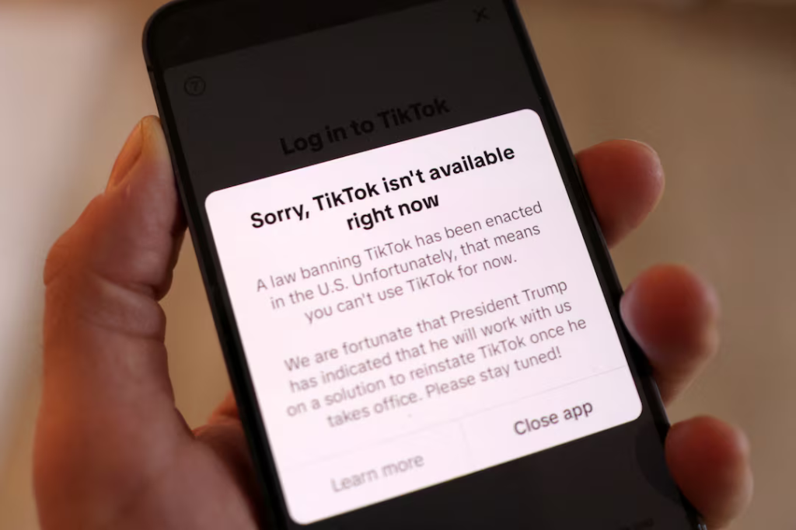

# Tecnologia e Classe 23/01/25

### Recomendação de vídeos

{{#embed https://www.youtube.com/watch?v=NFNK7LTRTBo}}

{{#embed https://www.youtube.com/watch?v=NEZ1W4uNdnY}}

{{#embed https://www.youtube.com/watch?v=NEDFUjqA1s8}}

### A União das Big Techs com o fascismo

- Vocês já ouviram falar do que a IBM estava fazendo durante a Segunda Guerra Mundial?
- <https://en.wikipedia.org/wiki/IBM_and_the_Holocaust>
- Em resumo, operando por intermédio de subsidiárias na Alemanha e Polônia a empresa americana prOveu tecnologia de holerites (cartões perfurados) que foram essenciais para o extermínio da população judaica
  - E isso não foi coisa pouca: o mercado alemão foi o 2º maior da empresa estadunidense, mesmo durante o esforço de guerra
- Agora eu chamo atenção de vocês para essa foto aqui:

- Na foto: **Mark Zuckerberg** (Facebook), **Jeff Bezos** (Amazon), **Sundar Pichai** (Google) e **Elon Musk**. Musk é o maior exemplo do burguês que torna ao fascismo para defender seus interesses econômicos, mas a inauguração do Trump mostrou que agora é hora de **fechar negócios**.
- Outras pessoas importantes que também estavam na inauguração: **Shou Chew** (CEO do TikTok), **Joe Rogan** e **Dana White** (ex UFC e board do Facebook).

- Só faltou o Sam Altman né? Não tem problema...

  <https://www.infomoney.com.br/business/nao-tem-o-dinheiro-musk-critica-joint-venture-de-ia-promovida-por-trump/>

- Nós já comentamos sobre a guinada à extrema direita do Musk e como ele e Trump agora são BFFs. E como o Zuck está seguindo essa mesma linha. A presença do CEO do TikTok e a 'suspensão' do banimento pelo Trump são pontos a se notar

  

- Se você não é um bilionário fica a pergunta: precisa ainda desenhar pra você entender como se interliga o poder econômico e o poder do estado?
- A ideia é que o estado **media** o conflito entre a classe que tudo possui (burguesia) e a classe que possui apenas o seu trabalho. Porém...
- O que vemos agora, podem chamar do que quiserem, é a burguesia assumindo que vai ser o próprio juiz dessa luta.
- Ao mesmo tempo que o Trump aponta para o inimigo "interno" dos imigrantes e LGBT para entreter sua base os EUA parecem se voltar para um projeto de colonialismo da América
- Só que o esquema pra gente pegar é que eles SEMPRE foram isso, e essa aqui é só pros estadunidenses: o fascismo é a lógica capitalista das colônias reproduzida agora na metrópole

- E as big techs vão ajudar - e lucrar muito no processo - o governo Trump a realizar seus objetivos:
  - Deportação de imigrantes em massa
  - Desumanização de pessoas LGBTQIAP+
  - Combate aos direitos reprodutivos das mulheres
  - Imperialismo e promoção de uma hegemonia cultural estadunidense (liberdade de expressão né)

<https://www.404media.co/meta-is-laying-the-narrative-groundwork-for-trumps-mass-deportations-2/?action=signin&success=true>

<https://g1.globo.com/mundo/noticia/2025/01/20/donald-trump-anuncia-primeiras-medidas-como-presidente.ghtml>

<https://www.404media.co/trumps-administration-is-taking-down-sites-about-gender-identity-all-over-the-internet/>

Por fim, é óbvio que o Elon é nazista gurizada, eu passei o ano passado inteiro dizendo isso, mas se quiserem um vídeo excelente vejam aqui:

{{#embed https://www.youtube.com/watch?v=xDyPSKLy5E4}}

### Não, o Trump não ganhou **U$50bi** com a sua criptomoeda

<https://www.citationneeded.news/trump-memecoin-valuation/>

{{#embed https://www.youtube.com/watch?v=YVmz2xmNQzk}}

- Aqui no canal a gente fala muito que cripto vive de especulação e golpes, mas não é sempre que entramos em detalhes
- Hoje eu queria usar os tokens do TRUMP e da MELANIA para explicar uma das maneiras que isso pode funcionar

> “A memecoin $TRUMP — um ativo financeiro que não existia na tarde de sexta-feira — agora representa cerca de 89% do patrimônio líquido de Donald Trump”, escreveu a Axios, que o apelidou de “cripto bilionário”. “. O **valor totalmente diluído** de todos os tokens foi considerado no sábado ao meio-dia, como sendo US$ 30 bilhões, um valor alcançado menos de um dia após o token ter sido colocado no mercado,

- Não precisa ser muito esperto pra perceber que esses números não podem ser reais, mas eu queria que a gente entedesse por que:

> Para usar $TRUMP como exemplo, as pessoas estão atualmente negociando essas moedas por cerca de US$ 53 cada. Há 200 milhões deles em circulação, o que coloca o “valor de mercado” do token (já altamente questionável, como explicarei em breve) em cerca de US$ 10,7 bilhões. Por fim, ao longo de um período de três anos (supondo que Trump não perca o interesse ou altere os parâmetros do acordo), 1 bilhão de tokens deverão ser lançados. É esta oferta — daqui a três anos — que está a ser multiplicada pelo preço atual dos tokens para atingir estimativas na ordem das dezenas de milhares de milhões de quanto o “património líquido” de Trump aumentou.

- Então imaginem que eu vou criar uma cripto chamada $TECLAS que até o fim da sua emissão de tokens irá criar 1mi moedas.
- Eu começo com 1001 delas na minha carteira e coloco ela em alguma exchange.
- Alguém (que totalmente não sou eu) compra 1 $TECLAS por 1000 reais.
- Nesse momento eu tenho 1 milhão de reais na minha mão e o valor diluído de todos os tokens  é 1 bilhão de reais.

- 80% da $TRUMP até o momento está na mão de empresas do grupo do Trump

  <https://time.com/7209169/trump-meme-coins-crypto/>

- Eu vou recomendar para vocês lerem o artigo ou ouvirem o podcast da Molly White porque ela explica como esses números são calculados e como eles meio que não valem nada
  - Por exemplo peguem o Wash Trading
  - Eu compro minha moeda por 1000 reais e depois um laranja compra por 2000 reais, o que faz o Neymar comprar ela por 1500 reais para especular
- Esse é o momento que eu queria fazer um apelo aos ancaps e monetaristas que colocam a impressão de dinheiro como o cerne da sua ideologia
- Da mesma forma que o governo cria dinheiro ao gastar e pode manipular variáveis da economia como a taxa de juros, quantidade de moeda em circulação e etc...
- Os bancos criam dinheiro toda vez que fazem um empréstimo
- Só que cada novo projeto de criptomoeda inaugura um novo ciclo vicioso de dinheiro falso e alavancagem e esse é o habitat natural dos malandros e dos tolos
- Então o caráter antiinflacionário da Bitcoin enquanto ela estiver atrelada e facilmente conversível entre essas shitcoins e esses golpes é basicamente inútil é fetichismo da tecnologia (e de qualquer forma a visão monetarista do dinherio é incompatível com a realidade)
- Mas daí eu recomendo o Humberto Matos sobre a moeda ou se quiserem um liberal Mark Blythe

### Data brokers são hackeados OU todos os seus dados são pertencem a nós

<https://www.404media.co/candy-crush-tinder-myfitnesspal-see-the-thousands-of-apps-hijacked-to-spy-on-your-location/>

- Milhares de aplicativos mobile estão coletando quantidades imensas de dados, principalmente de hábitos e localização e nós ficamos sabendo disso porque uma companhia chamada **Gravy Analytics** foi hackeada
- O grupo responsável pelo vazamente liberou **1\.5gb** de dados que foram analisados por repórteres. Depois de um tempo a postagem sumiu e se especula que a empresa possa ter pagado o 'resgate' dos dados.
- Aplicativos de encontro, jogos, saúde, religiosos todos coletavam esses dados, mas provavelmente indiretamente...
- Quando procuradas para comentar a maioria das empresas, principalmente as maiores são bem categóricas em dizer que não coletam e/ou vendem esses dados. Ou deixar claros os termos de uso que tem para os dados, etc...
- Peguem o esquema: as agências de distribuição de propagandas estão coletando todos esses dados.
- Esse tipo de dado é coletado como parte de um esquema que se chama 'Real Time Bidding'. Em resumo ele usa o perfil de usuários, mais um leilão de palavras chave para decidir quais propagandas serão mais eficientes de serem mostradas.
  - É como o YouTube funciona por ex.
  - Essas empresas então podem vender esses dados, como por exemplo para a **Gravy Analytics** que usa os metadados de endereço IP e tempo de acesso para montar informações de geolocalização
- Esse tipo de dado mais refinado está disponível para vários compradores, desde empresas até governos (até o governo da China)
- O modelo de negócio desse tipo de empresa se descrito há uns 20 anos atrás seria comparado a malware/spyware, mas hoje é apenas como se ganha dinheiro na internet. Notem que essa é a internet que o nosso modo de reproduzir a vida evoluiu.
