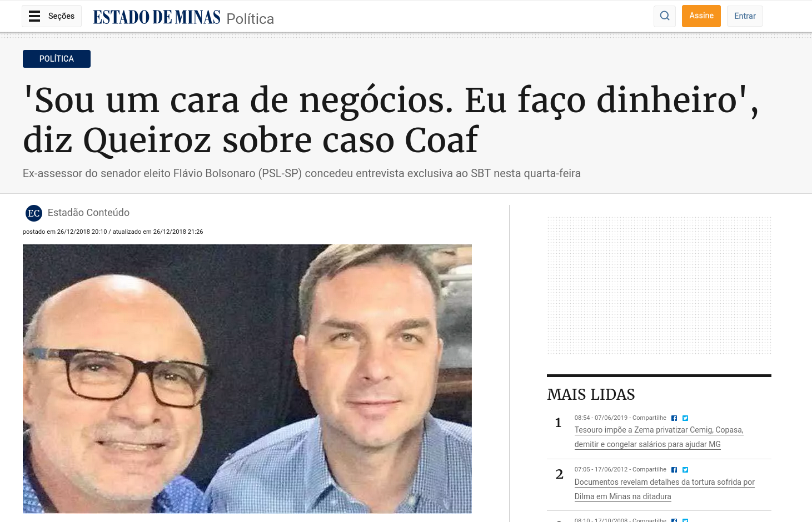
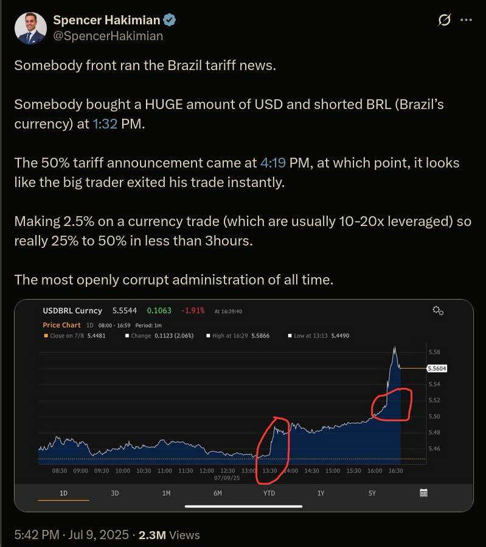

# 24/07/25

Nova plano de IA dos EUA, pix, GPS e especulação freestyle. Fechamento do 12ft.io, Subnautica 2 e reacts.

### Novas preocupações de IA desbloqueadas

<https://bsky.app/profile/bostonjoan.bsky.social/post/3lu6ozfvkc22t>

### O novo plano de IA dos EUA

<https://techcrunch-com.translate.goog/2025/07/23/trumps-ai-strategy-trades-guardrails-for-growth-in-race-against-china/?_x_tr_sl=auto&_x_tr_tl=pt&_x_tr_hl=en&_x_tr_pto=wapp>

> Os  efeitos dessa mudança provavelmente se espalharão por diversos setores e  poderão até ser sentidos pelo consumidor americano médio. Por exemplo, o  Plano de Ação para a IA minimiza os esforços para mitigar os possíveis  danos da IA e, em vez disso, prioriza [a construção de data centers](https://techcrunch-com.translate.goog/2025/07/22/openai-agreed-to-pay-oracle-30b-a-year-for-data-center-services/?_x_tr_sl=auto&_x_tr_tl=pt&_x_tr_hl=en&_x_tr_pto=wapp)  para alimentar o setor, mesmo que isso signifique usar terras federais  ou mantê-las energizadas durante períodos críticos da rede elétrica.
>
> No  entanto, muitos dos seus efeitos dependerão de como o Plano de Ação  para IA for executado, e muitos desses detalhes ainda precisam ser  resolvidos. O Plano de Ação para IA é mais um plano de ação do que um  manual de instruções passo a passo. Mas a direção é clara: o progresso é  fundamental.
>
> O  governo Trump posiciona isso como a única maneira de "inaugurar uma  nova era de ouro para o florescimento humano". Seu objetivo é convencer o  público americano de que gastar bilhões de dólares dos contribuintes na  construção de data centers é do seu melhor interesse. Partes do plano  também incluem sugestões de políticas para a qualificação de  trabalhadores e parcerias com governos locais para a criação de empregos  relacionados ao trabalho em data centers.
>
> “Para garantir nosso futuro, precisamos aproveitar todo o poder da inovação americana”, disse Trump em um [comunicado](https://translate.google.com/website?sl=auto&tl=pt&hl=en&client=webapp&u=https://www.whitehouse.gov/wp-content/uploads/2025/07/Americas-AI-Action-Plan.pdf)  . “Para isso, continuaremos a rejeitar o dogma climático radical e a  burocracia, como o governo tem feito desde o dia da posse. Em termos  simples, precisamos ‘Construir, querida, Construir!’”

#### Regulamentação da IA

> Parece que a questão ainda não foi resolvida, já que o Plano de Ação para IA explora uma nova maneira de impedir que os estados regulem a IA. Como parte de uma missão mais ampla de "liberar prosperidade por meio da desregulamentação", o governo ameaça limitar o financiamento federal dos estados com base em suas regulamentações de IA.

#### Meio ambiente

> Certas empresas, como a xAI e [a Meta](https://translate.google.com/website?sl=auto&tl=pt&hl=en&client=webapp&u=https://www.nytimes.com/2025/07/14/technology/meta-data-center-water.html) , foram criticadas por concentrar a poluição em comunidades vulneráveis. [Críticos acusaram a xAI](https://translate.google.com/website?sl=auto&tl=pt&hl=en&client=webapp&u=https://apnews.com/article/memphis-xai-elon-musk-pollution-naacp-571c16950259b382f9eae61bd59260ef) de burlar salvaguardas ambientais e expor os moradores a emissões nocivas de turbinas a gás com seu data center em Memphis.
>
> O  plano de ação prevê a criação de exclusões categóricas, a simplificação  dos processos de licenciamento e a expansão do uso de programas  acelerados, como o FAST-41, para facilitar a construção de  infraestrutura crítica de IA por empresas, especialmente em terras  federais, o que inclui parques nacionais, áreas selvagens protegidas  pelo governo federal e bases militares.

<https://www-whitehouse-gov.translate.goog/presidential-actions/2025/07/preventing-woke-ai-in-the-federal-government/?_x_tr_sl=auto&_x_tr_tl=pt&_x_tr_hl=en&_x_tr_pto=wapp>

> Anthropic, xAI, Google e OpenAI garantiram contratos governamentais [no valor de até US$ 200 milhões](https://translate.google.com/website?sl=auto&tl=pt&hl=en&client=webapp&u=https://www.cnbc.com/2025/07/14/anthropic-google-openai-xai-granted-up-to-200-million-from-dod.html)  cada para ajudar a integrar aplicações de IA no Departamento de Defesa.  As implicações da sugestão de política de Trump e de sua iminente ordem  executiva podem ser de longo alcance.

> “ [Segurança nacional](https://techcrunch-com.translate.goog/2025/04/04/trump-fires-head-of-national-security-agency-and-cyber-command/?_x_tr_sl=auto&_x_tr_tl=pt&_x_tr_hl=en&_x_tr_pto=wapp)  ” foi mencionada 23 vezes no Plano de Ação para IA — mais do que “data  centers”, “empregos”, “ciência” e outros termos-chave. A estratégia de  segurança nacional do plano concentra-se na integração da IA ao aparato  de defesa e inteligência dos EUA, e até mesmo na construção de data  centers de IA para o Departamento de Defesa, ao mesmo tempo em que  protege contra ameaças estrangeiras.

- Fomentar modelos abertos
- Segurança de IA
- Ataques diretos à China e mais restrições

### Mais sobre o Pix, Trump e os ataques à nossa soberania

{{#embed https://www.youtube.com/watch?v=IYM1g_2dtNs }}

{{#embed https://www.youtube.com/watch?v=WcBA3QEXJ2o }}

A partir de [1:55:48](https://www.youtube.com/watch?v=WcBA3QEXJ2o&t=6948s)

<https://exame.com/mundo/estudo-revela-que-eua-tem-superavit-digital-de-us-600-bilhoes-e-poe-em-xeque-tarifas-de-trump/>

#### O discurso do Lula

{{#embed https://www.youtube.com/watch?v=yLF7DXjrhu8 }}

- Chamou atenção para a Soberania nacional
- Diz que o Brasil vai buscar intervenção dos órgãos internacionais
- Ataca políticos que estão a fora da ação dos EUA como 'traidores da pátria'

<https://www.infomoney.com.br/politica/lula-reage-a-trump-e-promete-taxar-as-big-techs-dos-eua-nao-aceito-ordem-de-gringo/>

#### Especulação financeira freestyle

<https://x.com/SpencerHakimian/status/1943048225763782840>

### ô tramp desliga o GPS

<https://g1.globo.com/tecnologia/noticia/2025/07/21/eua-gps-brasil-entenda-como-funciona-sistema-de-geolocalizacao.ghtml>

- Anti clickbait: A chance de que role um "desligamento do GPS no Brasil" é MUITO REMOTA

> **O que é e como funciona o GPS?**
>
> O Sistema de Posicionamento Global, mais conhecido pela sigla em inglês GPS (*Global Positioning System*) oferece com rapidez e precisão a localização de um ponto na superfície terrestre.
>
> Ele é utilizado em celulares, carros, aeronaves, embarcações e sistemas de monitoramento, como [tornozeleiras eletrônicas](https://www.bbc.com/portuguese/articles/c75rgg0x7w4o?xtor=AL-73-%5Bpartner%5D-%5Bg1%5D-%5Blink%5D-%5Bbrazil%5D-%5Bbizdev%5D-%5Bisapi%5D), e é essencial para áreas como navegação, cartografia e monitoramento ambiental.

> Como alternativa ao GPS, é possível desenvolver sistemas próprios, como  o sistema russo GLONASS, o chinês BeiDou e o Galileo, da União  Europeia. Há também sistemas regionais, como indiano NavIC e o QZSS, no  Japão.
>
> "Esses sistemas são interoperáveis e, em muitos dispositivos modernos,  funcionam em conjunto com o GPS. Há também sistemas de backup  terrestres, como o eLoran, Navegação de Longo Alcance Aprimorada, em uso  em alguns países, para garantir posicionamento e tempo mesmo sem  satélites", explica Santos.

### 12ft.io

<https://tecnoblog.net/noticias/empresas-de-midia-derrubam-site-que-burlava-paywalls/>

### Crise no Subnautica 2

<https://br.ign.com/subnautica-2/142613/news/lideres-de-desenvolvimento-de-subnautica-2-sao-demitidos-e-substituidos-em-tentativa-de-renovar-as-e>

<https://www.portaldonerd.com.br/krafton-responde-processo-subnautica/>

- A empresa responsável pelo hit indie Subnautica (UNKOWN WORLDS) foi vendida para o grupo Krafton.
- O valor foi U$500mi e um potencial bônus de U$250mi dependendo dos resultados financeiros de 2026
- Subnautica 2 está em desenvolvimento e o lançamento do **early access** parece estar se encaminhando para 2025, porém a Krafton adia o lançamento para 2026
- Os dois fundadores da empresa e o atual CEO, mesmo não envolvidos diretamente com o Subnautica 2 foram demitidos e daí começou a brigaiada
- Eles acusam a Krafton de ter atrasado o jogo para que o bônus financeiro não fosse pago
- Agora eles estão processando a Krafton por quebra de contrato e rolaram acusações de todos os lados:
  - Empresa diz que o jogo estava empacado por causa deles
  - Eles acusam a empresa de sabotar o desenvolvimento para não pagar o bônus
  - Empresa diz que eles receberiam 90% do dinheiro
  - Eles dizem que iriam dividir com os outros trabalhadores como já fizeram no passado

{{#embed https://www.youtube.com/watch?v=gg-zm8CnhBw }}

- Lembrei da frase do PH: "o pior que pode acontecer com um jogo é fazer sucesso"

### React 1

{{#embed https://youtube.com/watch?v=-loO9QwH36Q }}

### React 2

{{#embed https://youtube.com/watch?v=nqxb6XEpDvs }}
