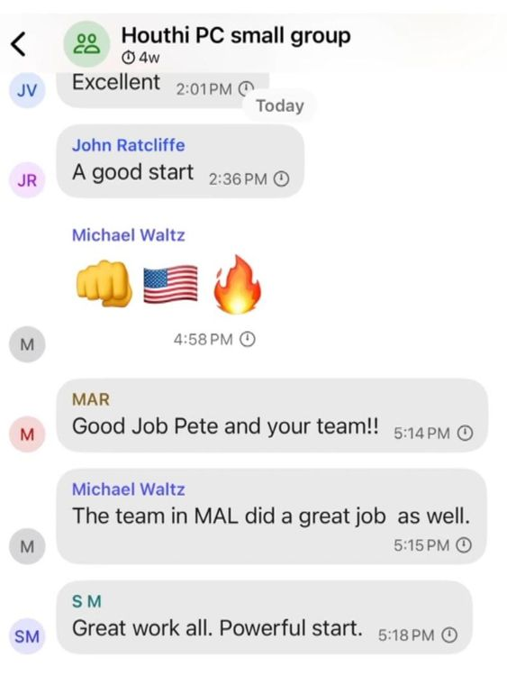
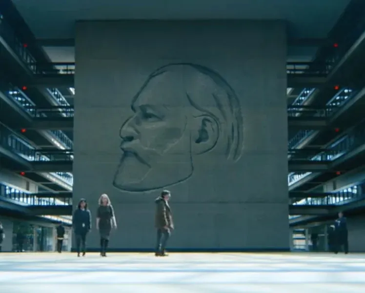
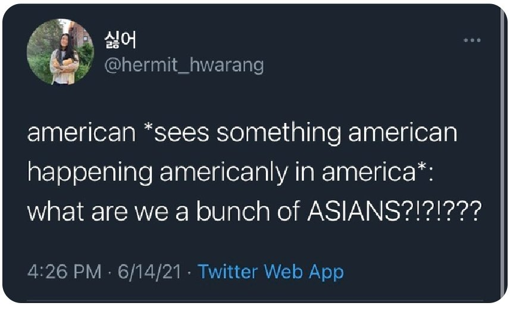

# Tecnologia e Classe de 27/03/25

#### Greve dos ferroviários em SP

<https://www.instagram.com/p/DHtVPH7utee>

<https://iclnoticias.com.br/ocupada-manifestantes-contra-privatizacao/>

### O grupo de Signal do Trump

Lembrem-se sempre <https://12ft.io>

<https://www.theatlantic.com/politics/archive/2025/03/trump-administration-accidentally-texted-me-its-war-plans/682151/>

<https://www.theatlantic.com/politics/archive/2025/03/signal-group-chat-attack-plans-hegseth-goldberg/682176/>

- No dia 15/03/25 o governo Trump realizou um ataque contra o Iemen
- Em 11/03/25 o jornalista Jeffrey Goldberg do **The Atlantic** foi adicionado por "acidente" num grupo de Signal com diversos membros do gabinete do Trump. O secretário de defesa, o vice presidente e outros conselheiros de segurança
- Segundo Jeffrey ele ficou achando que tudo não passava de algum tipo de piada até que em 15/03/25 ele ouviu as notícias de um ataque ao Iemen nos mesmos moldes do que conversado no grupo

  

- Um problema gritante aqui é a falta de certificação de segurança de uma ferramenta como o Signal para uso em conversas desse nível do governo dos EUA e a função de autodeletar mensagens automaticamente, ambos crimes
- Também se especula que a maioria dos dispositivos de comunicação que esses cargos tem a disposição não são celulares comuns e provavelmente não teria acesso ao Signal, logo eles estavam usando telefones pessoais
  - Benghazi e os emails da Hillary Clinton
- Os **EUA** iniciaram ataques contra os rebeldes Houthis no Iêmen em resposta às ações do grupo no Mar Vermelho. Os Houthis, apoiados pelo Irã, declararam que retomariam ataques a navios israelenses após Israel interromper o fluxo de ajuda humanitária para Gaza.
- Um pouco sobre o Signal...
- Motivos para imaginar que tudo isso é uma grande armação
  - Embora o jornalista e o **The Atlantic** sejam 'inimigos' da casa branca ele tem um passado servindo na **IDF** e poderia ser considerado um "sionista de esquerda"
  - A proximidade da política externa de Israel com esse ataque e o conteúdo das mensagens não pintam uma imagem "ruim" da administração Trump
  - O fato que trechos foram vazados sugere que possa haver, pelo menos, algum tipo de autocensura por parte do Jeffrey
  - Correção de 26/03: ele liberou "todas as mensagens"

##### Referências:

  {{#embed https://www.youtube.com/watch?v=LwGErMSYIAU}}

  * Como o governo britânico propôs quebrar a criptografia do WhatsApp: <https://www.lawfaremedia.org/article/principles-more-informed-exceptional-access-debate>
  * Suspeitas sobre o Signal: <https://www.linkedin.com/pulse/us-governments-covert-manipulation-signal-espionage-j-damien-scott-4e5yc/>
  * Comparação de mensageiros mais comuns <https://www.securemessagingapps.com/>

### O Brasil como um grande 'canteiro' de data centers

{{#embed https://www.youtube.com/watch?v=DGjj7wDYaiI}}

- Problemas ambientais, poluição sonora e luminosa e degradação da qualidade de vida das pessoas que moram em volta
- Custos cada vez maiores de água e eletricidade que pressionam o custo de vida dos moradores em volta desses empreendimentos
- O vídeo descreve a preferência desses data centers se instalarem no estado da Georgia por dois motivos:
  - Custo baixo de energia elétrica
  - Isenções de impostos
- O vídeo também deixa bem claro que existe um interesse das big techs em acabar com a 'burocracia' para a instalações desses data centers e como as diferentes instâncias do governo também apoiam essa medida.
- Ao mesmo tempo os moradores das áreas afetadas estão tentando se organizar para lutar contra essa tendência e conscientizar outros lugares pensando em instalar esses datacenters

##### O que nos leva ao Brasil:

<https://neofeed.com.br/poder/exclusivo-governo-prepara-plano-para-tornar-o-brasil-uma-potencia-dos-data-centers-em-10-anos/>

- Entrevista do secretário Uallace Moreira do **Ministério do Desenvolvimento, Indústria, Comércio e Serviços**

> “O Brasil tem um potencial muito grande em data centers por causa da sua matriz energética, que é limpa. Mas uma preocupação é que o investimento em data center não se dê apenas pelo uso da fonte energética e da exportação de serviço”, afirma Lima, em entrevista ao NeoFeed.
>
> O potencial de investimentos nessa área, segundo Lima, citando dados do Ministério da Fazenda, é de R$ 2 trilhões no período de 10 anos.
>
> O número pode soar exagerado. Mas, nesta conta, estão incluídos os investimentos que são necessários para a compra de equipamentos, a construção civil para erguer os data centers e até a energia que vai ser consumida. Além disso, isso vai gerar serviços agregados, como inteligência artificial e até cidades inteligentes.

> O Brasil tem um potencial muito grande em data centers por causa da sua matriz energética, que é limpa. Mas uma preocupação é que o investimento em data center não se dê apenas pelo uso da fonte energética e da exportação de serviço. Mas que uma parte desses investimentos sejam internalizados aqui, comprando máquinas e equipamentos de tecnologia da informação. E, ao mesmo tempo, que uma parte do serviço gerado, como inteligência artificial, seja ofertado para o mercado interno. Isso está sendo discutido internamente. Temos uma expectativa de que até o meio do ano esse programa seja lançado.

#### Vamos falar de Ruptura?

{{#embed https://www.youtube.com/watch?v=yz6UpizRYFw}}

- Vou tentar não mandar spoilers da segunda temporada, mas sem muitas promessas.
- Ruptura é um crítica social foda sobre o balanço entre vida e trabalho, sobre o ambiente corporativo e seus rituais e muito mais

##### MarkS. / Helly R. e a crítica nível 0 sobre o trabalho

##### "Severance" como "desligamento"

##### As reformas / o desenho animado: "Lumon está te escutando"

{{#embed https://www.youtube.com/watch?v=ITxgOZMTKPE}}

##### O papel da religião / culto a Kier

##### Referências ao socialismo / Lenin / cor vermelha

##### Os diferentes departamentos no subsolo

#### A IA é a estética dos 'nossos tempos'

{{#embed https://www.youtube.com/watch?v=sPAFsDdO44w}}

* Hoje os modelos de IA estão engolindo toda a produção humana e vomitando ela de volta na internet. Nós vivemos dentro desse vômito
* Existe essa estética do marketing corporativo e sem alma que geralmente é usada por empresas e campanhas políticas

  {{#embed https://www.youtube.com/watch?v=1fpr0CqGqw8}}

* Se antes era necessário a troca do nosso trabalho como mercadoria, o nosso """consentimento""" para ser usado como uma ferramenta do capital, agora a burguesia pode utilizar 'fantasmas' do povo real para defender as suas pautas
* E pode ser que essa venha a ser conhecida como a estética do novo fascismo do século 21. Fantasmas hiper reais, sem materialidade, sorrindo e fazendo exatamente o que se pede deles.
* Talvez uma das piores partes das IAs generativas, mas vamos incluir tecnologia de automação aqui também, é esse movimento que consegue transformar todo esse poder de trabalho em 'captial constante' ou 'trabalho vivo' em 'trabalho morto'
* A desigualdade de poder entre os trabalhadores e a burguesia está cada vez mais nos fazendo construir esse mundo onde o trabalho com significado - não alienado - e a criatividade são afogados no vômito de IA
* O que acham? Deixem comentários, sigam, like e apoiem
