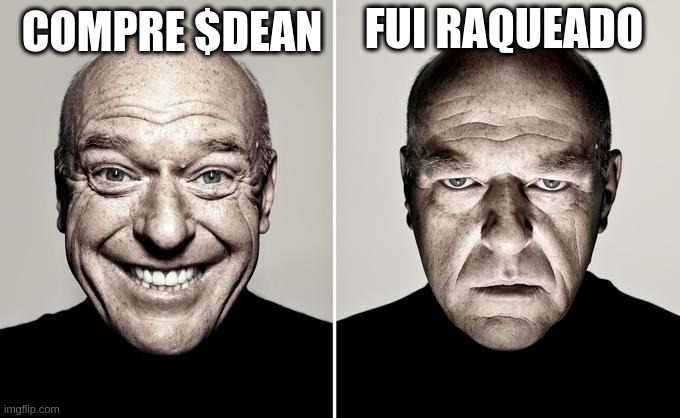
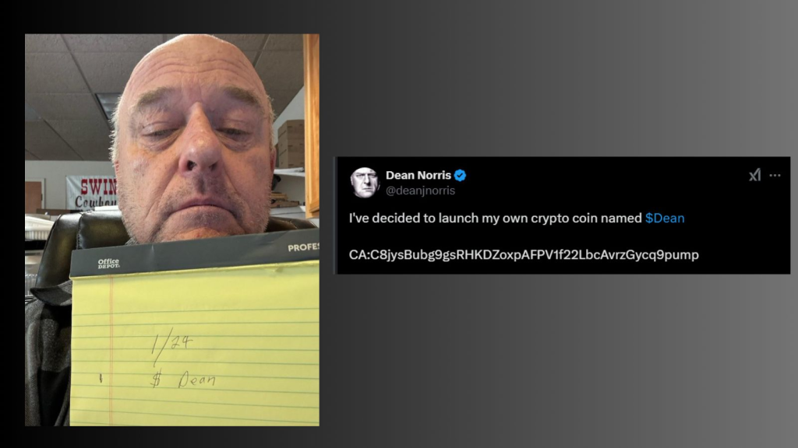
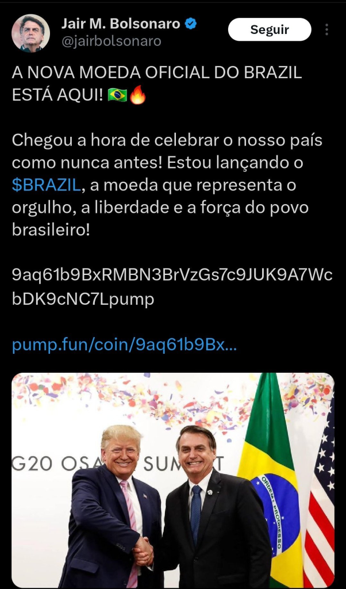

# Tecnologia e Classe de 30/01/25

### O que a Deepseek pode nos ensinar sobre o trabalho em informática?

- Contexto:

  {{#embed https://www.youtube.com/watch?v=MehfqW9lgYA}}

  {{#embed https://www.youtube.com/watch?v=ULxDMeDSNQg}}

- Porém com essa história eu 'me peguei' interessado no campo de IA novamente?!

- Eu tive um pouco da sensação que eu tinha na minha adolescência, no início da minha faculdade ou quando descobri o movimento de software livre.

- Uma coisa que eu tinha sentido começar a definhar com as revelações do Edward Snowden em 2013 e terminar de morrer depois de algum tempo no mercado de trabalho

- É uma sensação parecida com a da minha radicalização política...

- E essa reviravolta da Deepseek me retornou um pouco a 'fé' na ciência, na pesquisa, na 'alegria do saber'.

- Por que uma tecnologia 'orbitando' o Vale do Silício e com os techbros de mecenas é a coisa mais deprimente que existe.

- Politicamente eu também acho que muita gente sentiu essa faísca e eu espero que isso seja um momento de inflexão pro software livre

- Hoje um projeto aberto, apenas por ser tecnicamente melhor, mostrou que pode derrubar os gigantes que tem todo dinheiro do mundo. Mas será que é só isso que a gente precisa?

- Muita gente, eu incluso, sente muito ÓDIO E NOJO da indústria da computação: IA, blockchain, redes sociais, jogos, etc...

- Mas é isso, a gente odeia a maneira como ela existe aqui nesse país onde vivemos (um país chamado capitalismo)

- Odiamos o trabalho alienado, odiamos ter que construir algo que não vemos a necessidade ou que não conversa com a nossa realidade

- E mesmo que vocês não gostem da China, mesmo que vocês achem que o Deepseek é uma mudança séria. Hoje eles nos deram esse vislumbre do que o mundo poderia ser. E de que como é gostoso ver burguês se ferraram

- Etc.: se ferraram só um pouquinho, é de ferro em ferro até a vitória final.

### Vocês sabiam que Balatro é feito em Lua?

{{#embed https://www.youtube.com/watch?v=YntG_mSE0d4}}

{{#embed https://www.youtube.com/watch?v=PLDTLUpYsjM}}

### Ei Walt, quer comprar umas criptomoedas?

- Dean Norris, ator famoso por Breaking Bad criou sua própria memecoin $DEAN e fez o lançamento pelo Xwitter

- Só que na realidade ele supostamente foi hackeado e era tudo MAIS UM esquema de 'rugpull', fraude comum com os criptoativos

  > Enquanto esta publicação se tornava viral, o mercado de memecoins explodiu para incríveis US$ 7 milhões e depois caiu 90% quando Norris o abordou como uma farsa.

[Suposto cameo dele fazendo propaganda de cripto](./30_01_25/dean-cameo.mp4)

<https://www.bitgetapp.com/news/detail/12560604528916>

#### Retratação e pedido de desculpas

<https://x.com/deanjnorris/status/1883365489159946475>

[Dean pedindo desculpas](./30_01_25/dean-desculpas.mp4)

#### Bolsonaro também foi hackeado:

<https://www.tecmundo.com.br/internet/401825-jair-bolsonaro-e-hackeado-no-x-twitter-e-perfil-divulga-criptomoeda-fake.htm>

{{#embed https://www.youtube.com/watch?v=S-C_bHAvRgc}}

- Como disse um sábio comentário: "eu queria achar um esquema de pirâmide NO INÍCIO pra eu entrar"

- Se você é um entusiasta das tecnologias de criptomoedas é imperativo solucionar esse problema porque ele é um impeditivo imenso pras pessoas levarem a sério a área

  <https://www.bbc.com/news/articles/crlkjejpwr8o>

- Eu particularmente acho que cripto só será adotada de verdade como algo que parece uma moeda quando a regulamentação for mais ostensiva (e perder as caratcterísticas que os ultraliberais gostam)

- O foco na 'moeda' como uma coisa que nós temos posse é um vício no pensamento que não nos deixa ir além. A gente que é trabalhador acha que esse acumulo de bens que vai nos garantir dignidade, conforto, aposentadoria. E por isso a inflação, impostos, regulamentação nos tiram o sono

- Mas a verdade é que a gente vive num contrato social frágil e se a polícia política do Trump vier te deportar eles vão dar um jeito de pegar a tua carteira igual pegaram o ouro das vítimas do holocausto

- A gente constrói o mundo com o nosso trabalho e a única maneira de realmente avançar nessa luta por um mundo melhor é colocar a importância do trabalho no topo

- Uma coisa como criptomoedas pode te ajudar a proteger teu patrimônio de 100 mil reais, mas ajuda muito mais a elite financeira a proteger seus interesses e pra mudar o mundo a gente precisa destruir essa elite financeira, não vai ser pedir com jeitinho.

- No comunismo e no caminho até ele a blockchain vai ser realmente útil, vamo nessa camaradas

### React: largar a área de TI?

{{#embed https://www.youtube.com/watch?v=hrUKT8GJjwk}}
