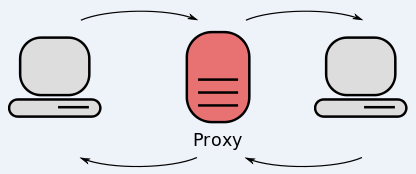

# 50% da internet são robôs

Agora tem mais bots do que humanos usando a internet (no protocolo HTTP) e hoje nós vamos falar do porquê. Obviamente é culpa do capitalismo, mas tem proxy, fazendo de bots e iptv aí no meio do esquema.

*Veja no canal:*

{{#embed  https://www.youtube.com/watch?v=btPAvPuadXw }}

- Recentemente a Cloudflare lançou um relatório que avisava: agora mais do que 50% do tráfego do protocolo HTTP é feito por robôs

https://radar.cloudflare.com/traffic#bot-vs-human

- Também recentemente a rede de proxy residencial NetNut foi desbaratada pelo FBI com ajuda do Google e Lumen (empresa de rede nos EUA) 

[https://economictimes.indiatimes.com/tech/technology/google-disrupts-netnut-proxy-network-used-in-malware-operations/articleshow/132150948.cms](https://economictimes.indiatimes.com/tech/technology/google-disrupts-netnut-proxy-network-used-in-malware-operations/articleshow/132150948.cms (preview))

- É uma empresa de VPN/proxy residencial, ou seja, ela vende para você IPs residenciais que podem ser usados para acessar a internet

- E para falar dessas empresas que revendem proxy precisamos falar das ‘botnets’:

https://krebsonsecurity.com/2025/10/aisuru-botnet-shifts-from-ddos-to-residential-proxies/

> Identificado pela primeira vez em agosto de 2024, o Aisuru propagou-se para pelo menos 700.000 sistemas IoT, como roteadores de internet e câmeras de segurança com segurança precária. Os operadores do Aisuru utilizaram sua enorme botnet para atacar alvos com ataques DDoS de grande repercussão, inundando os hosts visados ​​com rajadas de solicitações inúteis provenientes de todos os sistemas infectados simultaneamente.

- Muitas dessas botnets agem com um modelo de negócios criminoso e legal ao mesmo tempo
  - Captação de dispositivos “legal” e “ilegal”
  - Uso para DDoS, mas também para proxy residencial

- E quem precisa de proxy para fingir que é um endereço residencial? Elas mesmo: as empresas fazendo raspagens de dados para treinar IA

- Tráfego automatizado não necessariamente é um problema, o problema é o sistema de incentivos econômicos que degrada a internet livre e aberta numa rede que só serve para gerar lucro
  - Cibercrime “de varejo” compensa: gangues cada vez mais profissionalizadas e poderosas
  - Crime das big techs compensa: construa produtos valiosíssimos baseado no roubo de todos sites da internet e inunde ela de conteúdo inútil

- A internet não deixou de ser humana porque está lotada de bots, ela está lotada de bots porque ela não serve para os interesses dos humanos e sim do capital
