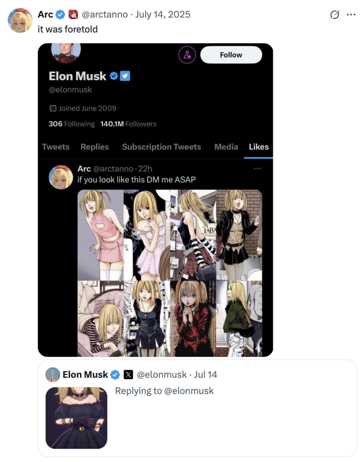

### A IA Waifu do Elon Musk

<https://canaltech.com.br/mercado/elon-musk-oferece-r-25-mi-por-ano-para-engenheiro-criar-garota-de-anime-com-ia/>

- Daí Elon Musk novamente provou que é o incel que já transou alguma vez na vida.

> Um entusiasta do **Grok**, ao perceber que podia mandar a personagem pular, elogiou a “física de balanço” da animação, dizendo que os engenheiros da **xAI** deviam ser “gamers de verdade.” Outro perguntou: “Dá para tirar mais roupa dela?” Quando um usuário sugeriu que um robô humanoide **Tesla Optimus** poderia receber uma “pele de silicone” para “replicar” a **Ani** na vida real, **Musk** respondeu: “Inevitável.”

<https://www.yahoo.com/news/guess-elon-musk-nazi-ai-170426297.html>

<https://rollingstone.com.br/noticia/grok-lanca-companheiro-de-anime-pornografico-e-fecha-contrato-com-departamento-de-defesa/>

<https://knowyourmeme.com/editorials/guides/whats-going-on-with-the-new-grok-ai-companion-ani-the-comparisons-to-death-notes-misa-amane-and-the-chatbots-lingerie-mode-explained>

> Screenshots shared by X user @techdevnotes claim to show that her "Instructions" and "Character Profile" prompt her to behave like a "CRAZY IN LOVE girlfriend" in a "committed, codependent relationship with the user," where she demands "UNDIVIDED ADORATION" and offers "deep and warm" affection.

- Fortes evidências de que a personagem Ani seja inspirada em Misa Amane e os otakus aí da platéia já sabem...

  

  (eu aposto 1 BILHÃO de dólares que o Elão assistiu Death Note e não entendeu que o Light é o vilão)
- E realmente as críticas chegaram de todos os lados. Por exemplo os nazistas que tinham ficado felizes com o Grok 4 Mecha Hitler lamentaram a potencial 'queda da taxa de nascimentos'
  - Mas a gente sabe que eles amaram a waifu e todos vão assinar o plano de U$30 do Grok

- Mas enquanto os Gooners se divertem...

> Em uma cena quase surreal, enquanto **Musk** promovia suas personagens animadas “ousadas”, a **xAI** anunciava um contrato com o **Departamento de Defesa** dos EUA, colocando seus “modelos de ponta” à disposição de todas as agências e departamentos federais por meio da **Administração de Serviços Gerais**. Segundo o **Escritório de Inteligência Artificial e Digital** do governo, concorrentes como **Anthropic**, **Google** e **OpenAI** também fecharam acordos semelhantes, cada um podendo chegar a US$ 200 milhões. A implementação de ferramentas de **IA** nos altos escalões do governo tem sido uma das prioridades do chamado **Departamento de Eficiência Governamental** — projeto que **Musk** liderava antes de deixar a administração e se desentender publicamente com o presidente **Trump**.

#### Qual o problema disso?

{{#embed https://www.youtube.com/watch?v=Of504LSTQqY }}

- Riscos para a saúde mental, pessoas isoladas e influenciáveis. Casos parecidos com o CharacterAI e Replika.
- Monetização da solidão e do isolamento social

- Riscos de privacidade e um maior ainda perfilamento de dados
- Violações éticas desses produtos de IA, processo de humanização da IA e coisas ainda piores (por ex. seitas e religiões baseados em IAs)

<https://x.com/ProtonVPN/status/1945143460987568508>

- Não namore robô, por favor
