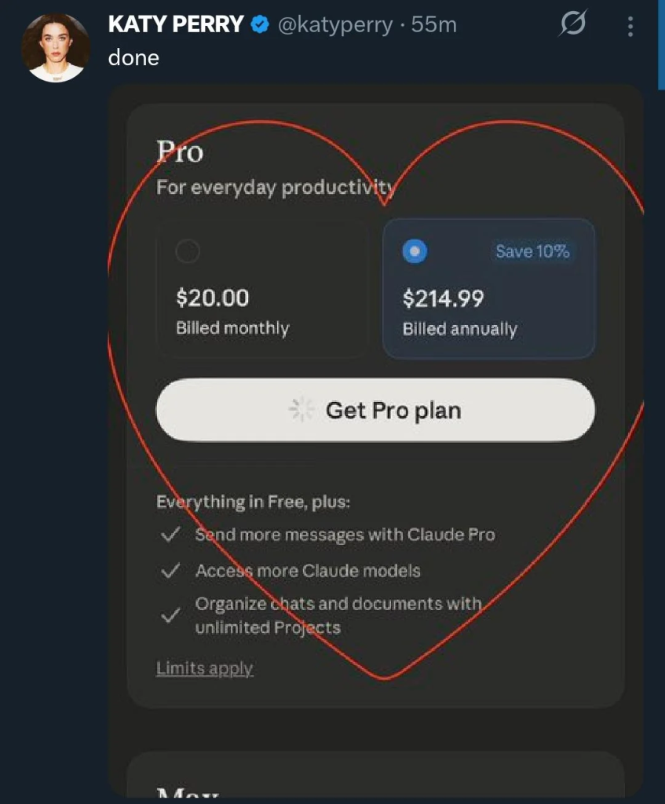

# Pentágono VS Anthropic (feat. OpenAI)

Anthropic rejeitou a assinatura de um contrato para o uso de seus modelos pelo exército dos EUA, porém a OpenAI aproveitou e pegou pra ela. Segundo Sam Altman, a IA não fará nada ilegal! Sim, nada é ilegal pro governo desse país desgraçado.

- A foto acima é uma thumbnail da propaganda que a Anthropic fez no Superbowl. Nela um personal trainer age como o ChatGPT, sendo muito amigável e solícito, mas no final não sendo de grande ajuda para o menino 'frango'. Pra concluir ele ainda fala 'agora vou passar um propaganda'
  - Isso faz parte do marketing da Anthropic de seus modelos Claude, tentando se posicionar como uma startup de IA "que não é como as outras"
  - Por ironia do destino "six pack" foi traduzido como "tanquinho"

- Pra quem não sabe: a Anthropic é uma dessas startups laboratório de IA, como por exemplo a OpenAI ou Google Deepmind e etc... O nome do CEO é **Dario Amodei**
  - Os investimentos da empresa vieram inicialmente do Jeff Bezos (Amazon) e hoje todo mundo tem um dedinho na torta também
  - Ultimamente seus produtos tem recebido mais mídia, como por exemplo a suíte de agentes do Claude, Claudecode e etc...
  - São famosos por publicar bons papers sobre segurança e 'traceability' de IA:
    - Aquele sobre a máquina de refrigerante
    - Aquele sobre a IA que mataria pra não ser desligada
    - Aquele sobre a IA que achava ser a ponte Golden Gate

- Mas hoje estamos falando sobre a recusa da Anthropic de entrar num contrato de U$200 com o Departamento de Guerra dos EUA:

> A Anthropic está preparada para contestar judicialmente qualquer ação formal do governo, embora considere o impacto direto da designação pequeno. A disputa decorre da recusa da Anthropic em permitir o uso militar irrestrito de sua IA Claude, alegando preocupações éticas sobre armas totalmente autônomas e vigilância doméstica em massa.

<https://economictimes.indiatimes.com/tech/technology/anthropic-ceo-calls-supply-chain-risk-designation-retaliatory-and-punitive-signals-legal-challenge/articleshow/128941551.cms>

- Trump tentou a estratégia de chamar eles de uma empresa 'woke' e antiestadunidense e mandou o governo cessar todos contratos com Anthropic:

<https://truthsocial.com/@realDonaldTrump/posts/116144552969293195>

> OS ESTADOS UNIDOS DA AMÉRICA JAMAIS PERMITIRÃO QUE UMA EMPRESA RADICAL DE ESQUERDA LACRADORA DITE COMO NOSSAS GRANDES FORÇAS ARMADAS LUTARAM E VENCEM GUERRAS! Essa decisão pertence ao SEU COMANDANTE-EM-CHEFE e aos excelentes líderes que nomeio para comandar nossas Forças Armadas.
>
> Os lunáticos de esquerda da Anthropic cometeram um ERRO DESASTRESO ao tentar FORÇAR o Departamento de Guerra e obrigá-lo a obedecer aos seus Termos de Serviço em vez da nossa Constituição. O egoísmo deles está colocando VIDAS AMERICANAS em risco, nossas tropas em perigo e nossa Segurança Nacional em RISCO.
>
> Portanto, estou ordenando a TODAS as agências federais do Governo dos Estados Unidos que CESSAREM IMEDIATAMENTE todo o uso da tecnologia da Anthropic. Não precisamos dela, não a queremos e não faremos negócios com eles novamente! Haverá um período de transição de seis meses para agências como o Departamento de Guerra, que utilizam os produtos da Anthropic em vários níveis. A Anthropic precisa se organizar e ser prestativa durante esse período de transição, ou usarei todo o poder da Presidência para obrigá-la a cumprir as determinações, com graves consequências civis e criminais.
>
> NÓS decidiremos o destino do nosso país — NÃO alguma empresa de IA descontrolada e de esquerda radical, administrada por pessoas que não têm ideia do que é o mundo real. Obrigado pela atenção a este assunto. FAÇA A AMÉRICA GRANDE NOVAMENTE!
>
> PRESIDENTE DONALD J. TRUMP

- Pete Hegseth, secretário do Dept. de Guerra, declarou a Anthropic como um 'risco para a cadeia de suprimentos'. Não apenas vetando esse contrato, mas potencialmente muitos outros para a empresa.
  - Esse tipo de designação geralmente é usado para empresas Russas ou Chinesas e não empresas dos próprios EUA
  - Pra quem não lembra, esse é o cara que adicionou um repórter no grupo ilegal de Signal do Departamento de Defesa dos EUA
- Uma coisa que ainda não foi feita, mas que poderia, é o governo dos EUA usar o "**Defense Production Act of 1950"** que permite a declaração de algumas empresas como críticas e estratégicas e basicamente toma o controle delas nacionalizando a sua produção.

- E aí vem o Sam Altman, líder supremo da dinastia monarquica OpenAI e diz assim: **deixa pro pai que ele assina aqui**
- Olhando de fora se imagina que muitas pessoas lá dentro da OpenAI reclamaram, e daí nós tivemos um vazamentinho do que rolou.

<https://timesofindia.indiatimes.com/technology/tech-news/read-memo-that-sam-altman-sent-to-employees-hours-before-openai-signed-deal-with-pentagon-and-said-that-actually-meant-anthropic-is-overreacting/articleshow/128881513.cms>

- Em resumo o que ele disse foi: *pode crer que nós somos tão éticos quanto a Anthropic e o contrato que a gente assinou **não permite fazer nada ilegal!***

> aaaaaaaaaaaaaaaaaaaaaaaaaaaaaaaaaaaaaaaaaaaaaaaaaaaaaaaaaaaaaaaaaaaaaaaaaaaaaaaaaaaaaaaaaaaaaaaaaaaaaaaaaaaaaaaa
>
> vai se fudê

- Pra ser bem explícito aqui. EUA sempre foi assim, mas agora tá claríssimo que está no modo: eu sou a lei.
  - Desde o Afeganistão todas as guerras que eles fazem já são ilegais (perante a lei DELES, não a lei de um povo civilizado)
  - O monitoramento de todos os cidadãos já basicamente legalizado com esquemas de compras de dados pelo governo.

- Sam Altman fez um AMA ("me pergunte qualquer coisa") no Xwitter sobre a situação e muita gente achou essa resposta aqui estranha por demais da conta:

<https://xcancel.com/sama/status/2027921762319827330>

> Três pontos gerais desta sessão de perguntas e respostas:
>
> 1. Há um debate mais aberto do que eu imaginava, pelo menos nesta parte do Twitter, sobre se devemos preferir que um governo democraticamente eleito ou empresas privadas não eleitas tenham mais poder. Imagino que haja discordâncias sobre isso, mas... eu não. Parece ser uma área importante para mais discussões.
> 2. Acho que existe uma questão subjacente a muitas das perguntas, mas que não vi ser articulada de forma clara: o que acontece se o governo tentar nacionalizar a OpenAI ou outros projetos de IA? Obviamente, não sei; já pensei nisso, claro (há muito tempo me parece que seria melhor se o desenvolvimento da Inteligência Artificial Geral fosse um projeto governamental), mas não me parece muito provável na trajetória atual. Dito isso, acredito que uma parceria estreita entre governos e as empresas que desenvolvem essa tecnologia seja extremamente importante.
> 3. As pessoas dão sua segurança (no sentido de segurança nacional) como garantida mais do que eu imaginava, o que, no geral, acho positivo, mas não demonstra respeito suficiente pelo enorme trabalho necessário para que isso aconteça.

- Ouvindo alguns comentaristas que conhecem o Sam Altman de outros carnavais a avaliação foi: "ele é pai do ChatGPT mesmo porque vai falar o que for necessário pra agradar quem tá na frente dele"

- Um dos resultados inesperados disso foi a Anthropic chegando ao topo dos apps mais baixados com o Claude na Apple Store
  - Uma mistura de "fodasse o governo" e "carai se tão fazendo isso deve ser bom!"

<https://economictimes.indiatimes.com/tech/artificial-intelligence/anthropics-claude-chatbot-climbs-to-no-1-on-apples-us-app-store-amid-pentagon-contract-row/articleshow/128937320.cms>

- Infelizmente o que a gente traz pra vocês hoje é: "que legal essa startup de IA se recusou a trabalhar com o governo mais assassino e sanguinário do mundo" e isso só significa: "mas todas as outras não"
- Pra que serão usados esses modelos? Até agora a única certeza que temos é para a análise massiva de dados, provavelmente escolha de alvos, monitoramento de pessoas de interesse. Mas podemos imaginar outras coisas mais macabras...
- Agora vamos retornar à propaganda da Anthropic farpando a OpenAI durante o Superbowl e sobre análises que eu fiz sobre, por exemplo a bolha de IA.
- O mercado de IA é insustentável, nem fudendo os laboratórios de IA ou os provedores de SaaS vão conseguir recuperar todos os bilhões de investimento vendendo propagandas e assistente pessoal, porém...
- Tem um lugar que sempre tem grana infinita e que eu todas as vezes que falo sobre preciso lembrar vocês: GUERRA e REPRESSÃO. Esse é o tweet.
- Nós estamos chegando num ponto seríssimo onde quem trabalha nessas empresas tem sangue em suas mãos. Na real já faz muito tempo, mas agora não dá pra negar.
- Depressão Bônus: durante o ataque ao Irã o governo dos EUA também trabalhou num contrato com a Oracle para processar todos os dados de governo com IA. uhul :) temos vídeo sobre...
