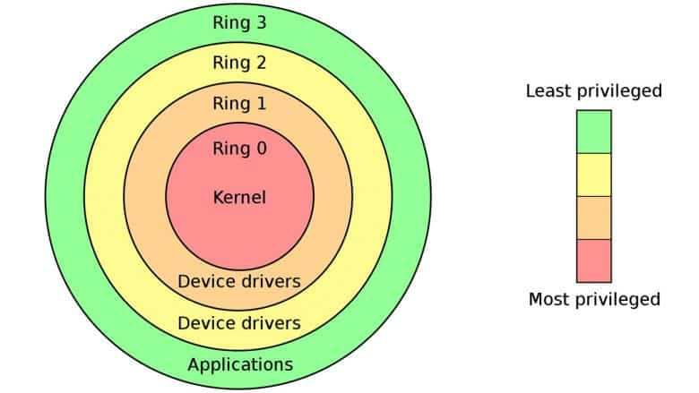
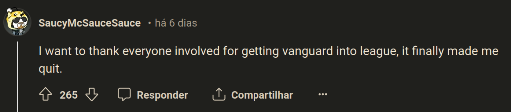

# DRM, Anticheat e Jogos

- League of Legends vai incorporar o sistema anticheat 'Vanguard', antes utilizado apenas no Valorant (desde 2020)
- Vanguard é um sistema de AC que roda no 'nível do Kernel'. Existe um 'senso comum' que aponta para o fato de AC no nível de kernel serem melhores, mas...

{{#embed https://www.youtube.com/watch?v=RwzIq04vd0M }}

- Uma desvantagem é que neste nível estamos abrindo mão de bastante controle sobre nosso computador. Alguns comparam um programa desses a um **rookit**

- Outro ponto **vital** dessa polêmica é: **Rito Gomes** hoje é parte de uma empresa chinesa chamada **Tencent**

- A polêmica começou quando um usuário num fórum de hacking fez a 'denúncia' de que o Vanguard tiraria fotos do seu desktop inteiro

  <https://www.unknowncheats.me/forum/anti-cheat-bypass/634974-vanguard-taking-screenshot-pc.html>

- Isso foi facilmente extrapolado para: o **Partido Comunista Chinês** tem acesso a todos os seus dados

  

- Agravantes são que o fato de que o Vanguard precisa ser carregado junto com o SO e antes de todos processos e rodar mesmo sem o LoL estar ativo. Além de habilitar o TPM 2.0 no hardware (secure boot é apenas exigido no Valorant). Falhando qualquer desses passos seu computador não será marcado como confiável. Isso tem interações estranhas com outros programas como por exemplo **Citrix**.

- Pronunciamento da Rito: <https://www.reddit.com/r/leagueoflegends/comments/1civ4l7/update_from_riot_on_vanguard/>

- O que achar disso?

#### Referências:

<https://www.keengamer.com/articles/features/opinion-pieces/kernel-level-anti-cheat-and-7-games-or-programs-that-use-it/>

<https://www.pcgamer.com/according-to-experts-on-kernel-level-anticheat-two-things-are-abundantly-clear-1-its-not-perfect-and-2-its-not-going-anywhere/>

<https://levvvel.com/games-with-kernel-level-anti-cheat-software/>
