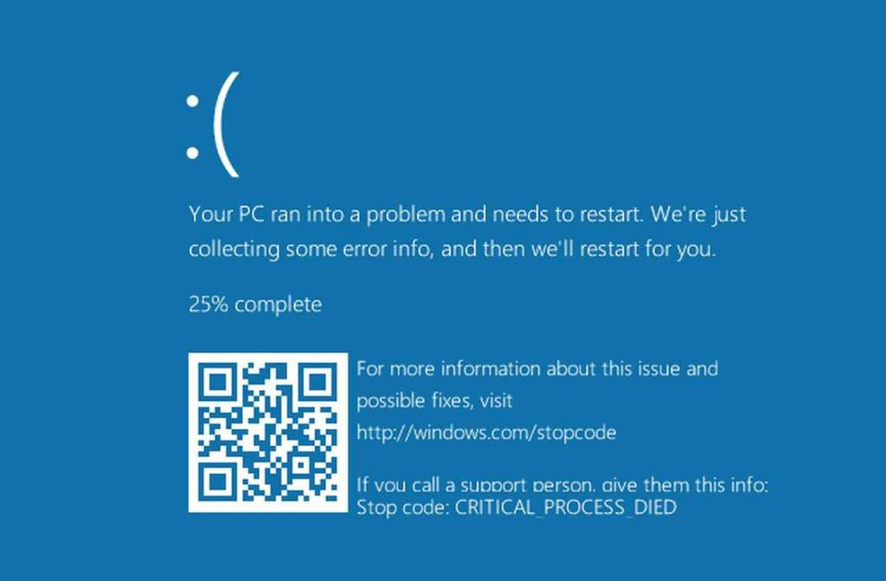
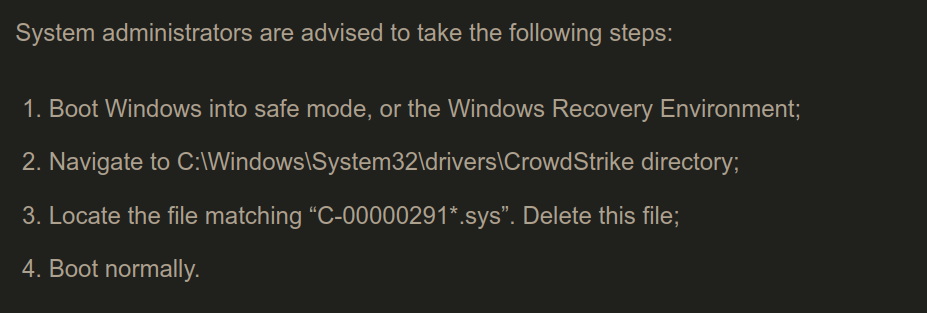
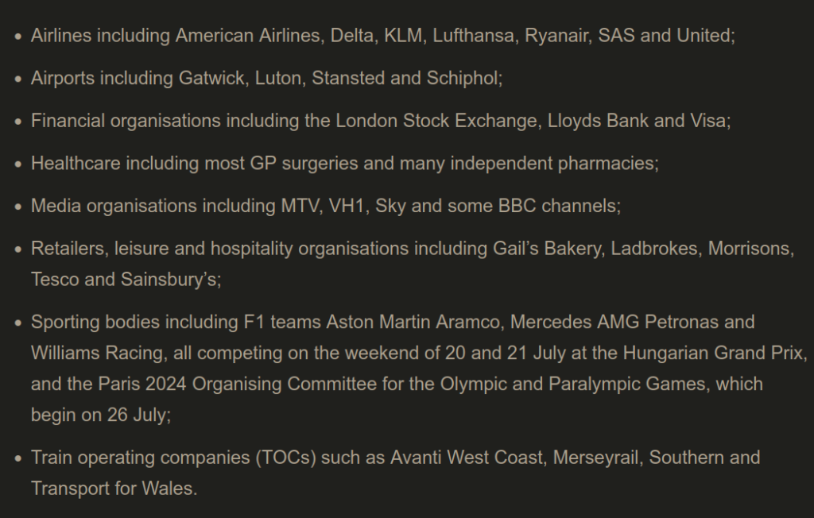

# Apagão Cibernético ou Falha da Crowdstrike

- Um incidente que foi notado como um 'loop de boot' em computadores windows. Ou seja, os PCs crashavam antes de acabarem o boot tendo que ser reiniciados

- Tela azul da morte

- Relatos do ocorrido começaram a se espalhar durante a manhã do dia 19/07/24 pela Austrália, Ásia e Amérca com empresas aéreas e aeroportos sendo os mais afetados

- Inicialmente se imaginou que era uma falha do Windows, parecida com o que aconteceu em 2012, e a Microsoft deu uma declaração de que estava investigando. Porém logo ficou evidente que era uma falha relacionada à atualização do **Falcon Sensor**, um software de segurança destribuído pela empresa **Crowdstrike**.

- Crowdstrike é uma empresa de cíbersegurança com mais de 8000 funcionários e U$ 3 bilhões de receita

- Falcon Sensor é uma 'solução de segurança unificada', podemos imaginar como um antivírus que tem como pública alvo empresas que querem se proteger de malwares, invasões, ransonwares, etc...

- Pelo que se entende até agora, o processo de boot do Windows é interrompido porque a solução de segurança estaria conflitando com partes do sistema operacional, algum tipo de incompatibilidade ou falso positivo

- O problema todo foi composto porque é comum que se habilite a atualização automática de soluções de segurança em desktops e terminais de serviço

- Até agora não se trabalha com a hipótese de ataque cibernético

- Mandaram uma atualização dessa importância sem testar? **Provavelmente kkkkkkkkkk**

- Já existe uma atualização/rollback corrigindo o problema então a solução é entrar em modo seguro no Windows e deletar o arquivo antigo, para o computador dar boot e permitir a correção

- Reiniciar várias vezes até que o sistema consiga conectar na internet e atualizar parece que funciona
- A normalização deve demorar alguns dias pois o processo de recuperação em muitos casos será manual. Neste período deve haver um aumento nos golpes

- Serviços afetados

- Um abraço aos profissionais de TI que vão fazer hora extra no final de semana!

  Retirado principalmente de: <https://www.computerweekly.com/feature/CrowdStrike-update-chaos-explained-What-you-need-to-know>

  <https://www.tecmundo.com.br/mercado/287236-crowdstrike-saiba-empresa-que-causou-o-apagao-cibernetico.htm>

## Atualizações 26/07/24

- Análise 'famosa' e 'estranha' do que aconteceu

{{#embed https://twitter.com/Perpetualmaniac/status/1814376668095754753?t=A1Gyg7rNYdh_iNseiaGwuA }}

- Análise que faz mais sentido

{{#embed https://twitter.com/taviso/status/1814762304229273745 }}

- Melhor vídeo sobre o assunto

{{#embed https://www.youtube.com/watch?v=wAzEJxOo1ts }}

- Em resumo:

  - Qualquer erro não tratado num nível tão baixo (ring-0 onde a maioria dos drivers roda) pode causar uma tela azul

  - Atualizações em código ring-0 são muito perigosas e passam por um escrutínio maior, porém o **Falcon Sensor** trabalha com 'atualizações de definições' que são apenas arquivos carregados pela mesma versão do driver. Um desses arquivos veio corrompido.

- Prova de que um dos artigos estava 'zerado': <https://x.com/christian_tail/status/1814299095261147448>

- Sobre o Linux ser mais seguro:

  - <https://www.reddit.com/r/linux/comments/1e72ovd/has_something_as_catastrophic_as_crowdstrike_ever/>
  - <https://www.theregister.com/2024/07/21/crowdstrike_linux_crashes_restoration_tools/>

- O CEO da Crowdstrike tem bastante experiência com situações assim: <https://www.businessinsider.com/crowdstrike-ceo-george-kurtz-tech-outage-microsoft-mcafee-2024-7>

- Cartão de U$ 10 dólares <https://techcrunch.com/2024/07/24/crowdstrike-offers-a-10-apology-gift-card-to-say-sorry-for-outage/>

- Chorume de extrema-direita. Será mesmo que é a esquerda que politiza as questões?

- Precisamos de tecnodiversidade: <https://www1.folha.uol.com.br/blogs/sou-ciencia/2024/07/o-apagao-da-internet-e-a-tecnodiversidade.shtml>
