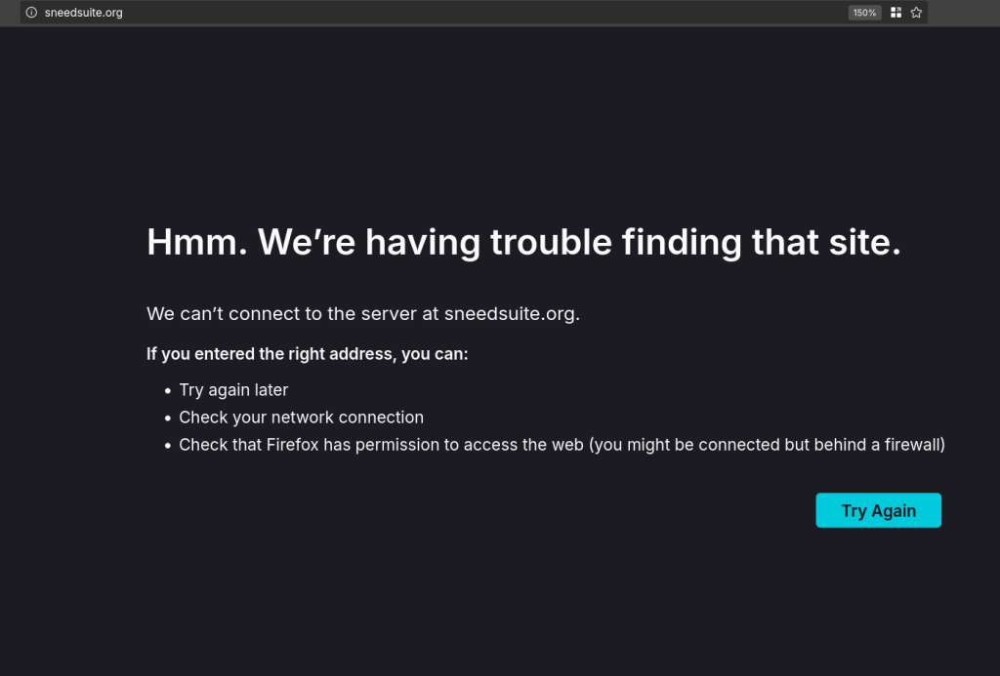

# Eu adoro o Audacity ainda mais agora

Audacity é um dos software livres mais famosos, amado por profissionais e amadores. É provável que você já tenha usado para editar algum áudio, remover ruído e etc... Hoje eu quero falar sobre o futuro do Audacity, "tretas" e como a comunidade do software livre lida com elas.

{{#embed https://www.youtube.com/watch?v=QYM3TWf_G38 }}

#### Um histórico das controvérsias

- 5 anos atrás o Audacity foi vendido para o Muse Group

<https://musictech.com/news/industry/audacity-acquired-muse-group-ultimate-guitar-musescore/>

<https://www.mu.se/>

- O mesmo grupo já havia comprado o site [Ultimate Guitar](https://www.ultimate-guitar.com/) e o software livre [Musescore](https://musescore.org)
- Desde esse momento a comunidade de software livre esteve numa série de brigas com o grupo que volta e meia vem à superfície

<https://arstechnica.com/gadgets/2021/07/audacitys-new-owner-is-in-another-fight-with-the-open-source-community/>

- Faz sentido comprar um projeto aberto? No caso do Musescore é importante pensar na música e direitos autorais.

#### Lembram do sneedacity? provavelmente não...

- A inclusão de telemetria no software e uma mudança nos termos de privacidade criou o movimento de fazer um fork do Audacity "Temporary Audacity" que chamou a "comunidade" para decidir um novo nome

<https://knowyourmeme.com/memes/events/sneedacity-tenacity-harassment-controversy>

<https://pbanks.net/projects/sneedacity/index.html>

<https://github.com/Sneeds-Feed-and-Seed/sneedsuite.org>

- Onde o projeto Sneedacity está hoje? E o Sneedsuite?

- Com o devido afastamento e o tempo necessário para a reflexão deveria ficar claro para todos como grupos conservadores instrumentalizam problemas reais para dar vazão à sua guerra cultural.
- Durante todo o momento eles se pintam como moralmente superiores e mais técnicos. Como se os novos desenvolvedores do Audacity tivessem acordado e pensado "eu vou arruinar esse projeto porque sou muito malvado mUHAUAHUA"

#### Voltando para o Audacity

- Não podemos ter certeza do futuro do projeto, mas é muito bom ver ele na mão de pessoas tão apaixonadas por ele quanto eu.

- Assistam com calma esse vídeo porque ele é uma aula de design e desenvolvimento de software e todos os outros aspectos que geralmente a comunidade de software livre ignora.

#### Recomendação de vídeo

{{#embed https://www.youtube.com/watch?v=RMWNvwLiXIQ }}
