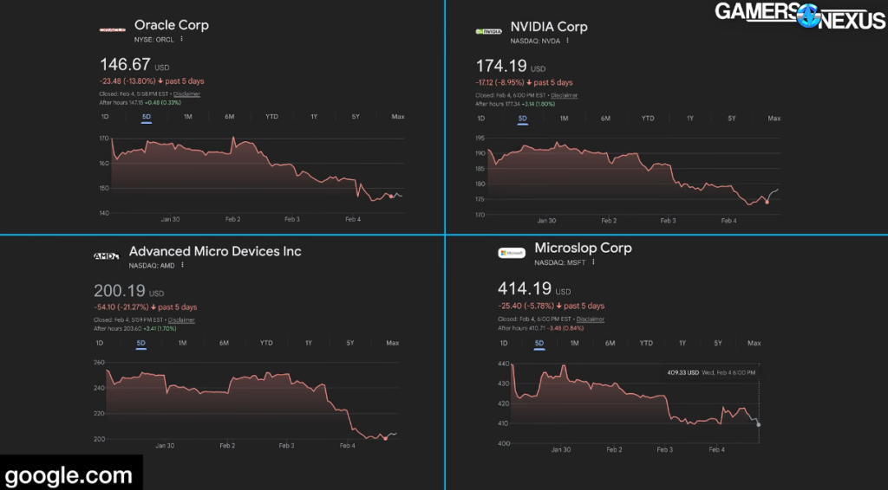
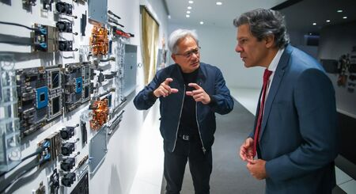

# O prédio da IA está estremecendo
(estamos ficando sem metáforas)

As dinâmicas da crise no mercado de IA e na econômia dos EUA estão ficando mais claras. Hoje nós vamos falar sobre os diferentes componentes dessa bolha e onde a coisa tá mais feia

- Tudo começou com o estremecimento da bela amizade entre Jensen Huang e Sam Altman

<https://www.tecmundo.com.br/mercado/410445-openai-teria-reclamado-de-chips-da-nvidia-e-poe-acordos-em-risco.htm>

> O CEO da empresa, Jensen Huang, teria "expressado dúvidas" sobre uma suposta "falta de disciplina" da empresa de IA em termos de modelo de negócios. Ele também estaria preocupado com a concorrência crescente de outros modelos de linguagem, como o Google Gemini e o Claude.
>
> Em uma entrevista na saída de um evento em Taiwan, Huang respondeu que "nunca disse que iria investir US$ 100 bilhões em uma só rodada" e que o convite foi de "até US$ 100 bilhões". O executivo também reafirmou que de fato vai fazer um enorme investimento na OpenAI, "talvez o maior que já fizemos", e reforçou que "acredita" na empresa.

> Ao mesmo tempo, a própria OpenAI teria as próprias reclamações sobre o acordo. Segundo a Reuters, a empresa se mostrou insatisfeita com os recentes chips entregues pela Nvidia para uso em data centers de IA.
>
> Os problemas estariam principalmente no atraso da inferência, etapa de processamento de pedidos e respostas aos prompts dos usuários. Essas questões teriam surgido em testes do Codex, o chatbot da marca voltado para programação.
>
> ...
>
> Na rede social X, o CEO da OpenAI, Sam Altman, chamou os rumores de "insanidade" e reforçou o compromisso com a marca. "Adoramos trabalhar com a NVIDIA, que fabrica os melhores chips de IA do mundo. Esperamos ser um cliente gigante por muito tempo", disse o executivo.

<https://www.cnbc.com/2026/02/03/nvidias-jensen-huang-denies-openai-deal-rumors-theres-no-drama.html>

- Isso foi considerado por muitas pessoas como o banco dizendo: "não se preocupem pessoal, nós temos dinheiro suficiente para pagar todo mundo"
- Isso causou uma reação nos preços das ações das big tech:

  

- Vamos entender as divisões mercado de IA:
  - Hardware para IA: AMD, NVIDIA, talveiz Google
  - Empresas de infraestrutura de IA e Nuvem: Oracle, Coreweave, Crusoe, AWS e outras
  - Laboratórios de pesquisa em IA: OpenAI, Anthropic, Google, Mistral e etc...
  - Startups e produtos baseados em IA: Cursor, Manus, todos os SaaS por aí

- Então onde tecnicamente está essa bolha? Provavelmente o problema vai aparecer na segunda camada: infraestrutura de datacenters. Porém ele é puxado pelas outras partes:

{{#embed https://www.youtube.com/watch?v=NFP_Dwddcag }}

- A construção de data centers ocorre com muito dinheiro de empréstimos. Hoje diversos projetos estão em estágios intermediários de finalização e só vão dar retorno de investimento real quando forem prédios completos, cheios de GPUs, usando eletricidade e rodando inferência.
- A Oracle por exemplo para financiar a construção de data centers, prometidos para a OpenAI, contraiu diversas dívidas. Essas dívidas estão sendo empacotadas pelos credores em investimentos que são repassados em mercado e retornam juros aos investidores (alguém lembra de 2008?)

- Uma dificuldade da OpenAI pagar a Oracle, falta de demanda por ferramentas de IA, dificuldade de acesso a energia, concorrência interna aos EUA ou externa por parte da China. Todos esses são fatores que podem desencadear um estouro.

- As relações do governo dos EUA começam a ficar mais claras com as empresas de IA:

{{#embed https://www.youtube.com/watch?v=NIXd3PEbsNk }}

- Só falta o Jensen Huang mandar áudio no zap falando do Trump igual o Mamãe Falou das ucranianas

- EUA tem o plano Pax Sillica para garantir o acesso a infraestruturas críticas de IA

  <https://www.state.gov/pax-silica>
- E tem falado cada vez mais em voz alta que os movimentos de expansão e conquista de recursos são explicitamente para garantir a dominância dos recursos para IA.
- Enquanto isso a possibilidade da 'disrupção' pelas ferramentas de IA está criando uma fuga de ações ligadas a serviços nos EUA o que pode desencadear toda uma outra crise por lá e provavelmente aqui.
- Enquanto isso \[2\] o BraZil está falando em dar incentivo fiscal para trazer data center de big tech pra cá.

  <https://www.infomoney.com.br/politica/camara-deve-votar-urgencia-para-o-redata-na-terca-feira-afirma-lider-do-pdt/>

> Reivindicação do setor, o Redata isenta custos de importação de  diversos produtos críticos para a instalação de data centers, como as  placas de vídeo que sustentam o processamento de nuvem e inteligência  artificial.

- Os gringos tão falando até em construir data center no espaço, mas aqui no BraZil a gente oferece o que eles precisarem. Lembrando:
- Nosso território, nossa energia, nossa água
- Hardware deles, empresas deles

### Referências

{{#embed https://www.youtube.com/watch?v=ITxy2K-fhDU }}

<https://economictimes.indiatimes.com/tech/artificial-intelligence/rough-ride-for-ai-stocks-in-2026/articleshow/128035364.cms>
