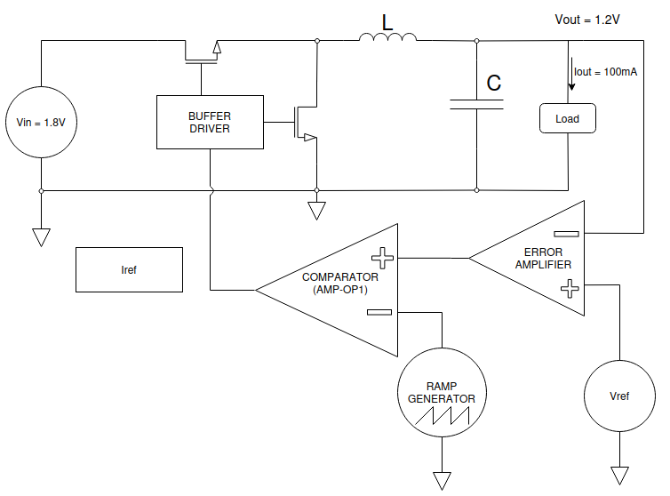
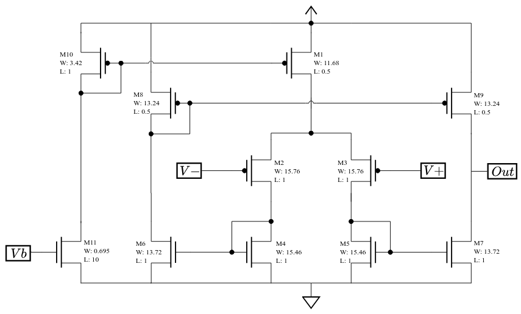
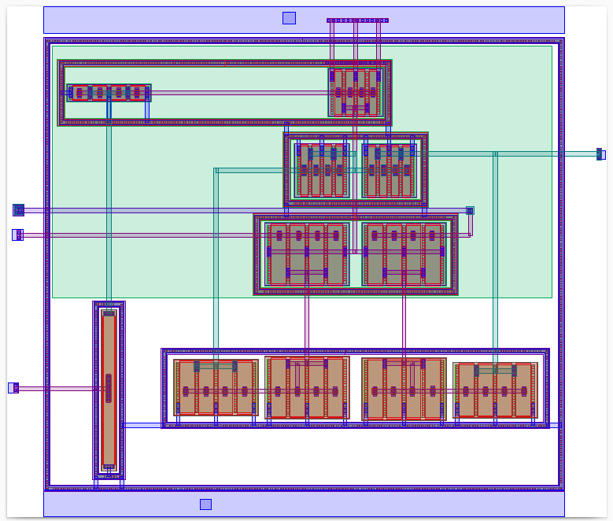
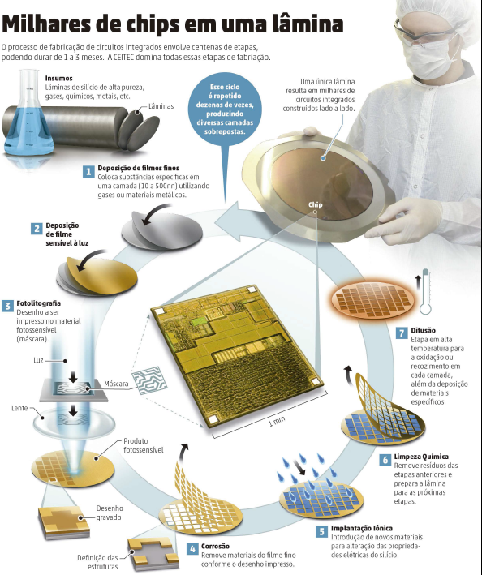
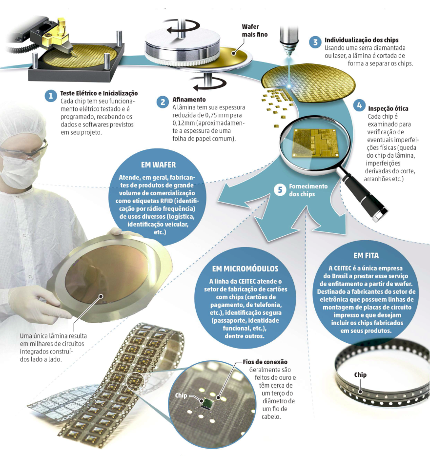
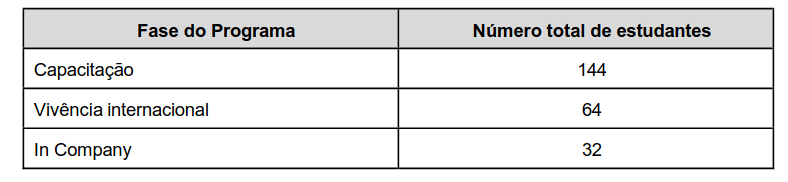
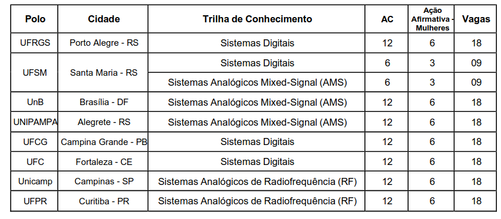

# O histórico e a importância da CEITEC

Este vídeo tem o propósito de explicar de maneira simples o processo de fabricação de microchips, a sua importância e a da CEITEC enquanto única fábrica da América Latina com infraestrutura adequada para desenvolvimento e produção industrial de circuitos integrados. Vamos passar pelo histórico da CEITEC a tentativa de liquidação dela e o seu futuro.

- Roteiro escrito pelo Giordano Rossa e o Iuri Tinti que fazem parte do programa CI Inovador e que inclusive está com novo edital aberto agora com inscrições até o dia 15/06/26. Nós vamos falar de novo mais pro final!

Inscrições: <https://ciinovador.softex.br/chamada-e-edital/>

Sigam a Associação de Colaboradores do CEITEC: <https://www.instagram.com/acceitec_oficial/>

### 1. O que é um Microchip?

- Na eletrônica moderna, o método mais eficiente de construção de dispositivos eletrônicos é através do uso dos dispositivos transistores.

- Os transistores estão presentes na base do funcionamento de uma infinidade de aplicações eletrônicas da atualidade. Desde relógios de pulso, controle de microondas, cartões bancários, processadores, celulares, computadores, e mais o que pensar que funcione a base de energia elétrica

- Seu funcionamento é similar ao de uma torneira que controla a passagem de água, mas, no caso do transistor, ele controla a passagem de corrente elétrica.

- A partir de avanços científicos, foi possível reduzir o tamanho do transistor a níveis microscópicos.Os processos de fabricação mais avançados conseguem fabricar transistores na ordem de nanômetros (isso são 9 zeros depois da vírgula)

- A partir de componentes tão pequenos, foi possível construir sistemas complexos em dimensões reduzidas. Atualmente, um único circuito de um processador pode possuir até bilhões de chips funcionando juntos, e tudo isso cabendo na palma da mão. 

- Dominar a fabricação de circuitos integrados é um dos setores mais críticos das tecnologias modernas. O país que detém os meios de fabricação possui um ativo de altíssimo valor agregado. Atualmente, mal chega a uma dezena os países que possuem fábricas de circuitos integrados.

### 2. Como é fabricado um Microchip?

- Em alto nível as etapas são as seguintes:
  - Front-end: Design → Fabricação
  - Back-end: Testagem → Afinamento e Corte → Encapsulamento

#### 2.1 Design

- Dada uma especificação, são feitos projetos e simulações a nível lógico, elétrico e físico. 

- São realizadas simulações a partir dos chamados PDK’s (process development kit), que são arquivos que possuem as especificações de funcionamento de cada modelo de transistor que é fabricado

- A palavra chave aqui é “processo”, pois cada foundry (fábricas que realizam a “impressão” de circuitos integrados, por exemplo TSMC, Samsung, Intel, etc) possui o seu próprio processo de fabricação, que é o bem mais valioso da empresa, com termos de manutenção de sigilo altamente estritos.

- Vamos ver como exemplo um circuito abaixador de tensão (<https://ieeexplore.ieee.org/document/11421732>) :

#####   
2.1.1 - Design - Nível lógico:

Imagem 1: exemplo de esquemático a nível lógico de um sistema abaixador de tensão (entrada em 1.8V e saída em 1.2V com corrente de 100mA).

##### 2.1.2 - Design - Nível elétrico:

- Para cada bloco representado na imagem anterior, é necessário realizar o esquemático elétrico de cada um deles.

- É no projeto elétrico que serão realizadas simulações a fim de obter o comportamento do circuito para que se atinja as especificações de interesse.

- Também é no projeto elétrico que serão obtidas as dimensões físicas dos transistores.

Imagem 2: Diagrama elétrico de um comparador de tensão.

##### 2.1.3 - Design - Nível Físico (layout)

- Após validar o funcionamento a nível elétrico, é necessário realizar o projeto a nível físico dos circuitos integrados. Aí entra o chamado “layout”.

- Após consolidar as simulações elétricas, é necessário realizar o projeto físico dos componentes. 

- A seguir, é exibido a imagem de um layout, processo SkyWatter130 (130 faz alusão à dimensão mínima do gate do transistor, neste caso 130 nanômetros), referente ao esquemático elétrico exibido na imagem anterior..

Imagem 3: layout do comparador de tensão em SkyWatter130.

#### 2.2 Fabricação

##### Front-end

##### Back-end

### 3. O Portfólio da CEITEC

- Identificação Veicular: O chip para identificação veicular da CEITEC ​é um circuito integrado passivo (não necessita de bateria para funcionar). Ele se integra a tags (etiquetas) coladas no para-brisa de veículos. Guarda em seu interior dados criptografados de identificação do veículo e possui um padrão de comunicação seguro que permite ao usuário o pagamento automático em cancelas de pedágio, rodovias pedageadas com o sistema free-flow​, estacionamentos, postos conveniados e outros estabelecimentos. 

- Identificação Patrimonial: Etiquetas em um objeto, uma embalagem ou um pallet permitem que, por meio de um sinal de radiofrequência com um leitor UHF, se possa ler o código que os identifica e ter acesso, via sistemas informatizados, às informações de interesse a eles relacionadas. Essa tecnologia facilita o controle do fluxo de produtos por toda a cadeia de suprimentos, permitindo tanto o seu acompanhamento desde a sua fabricação, até o ponto final da distribuição, quanto ao controle de estoque. 

- identificação animal (“chip do boi”): A CEITEC S.A. desenvolveu uma solução para identificação eletrônica de animais.

### 4. O histórico da CEITEC

http://www.ceitec-sa.com/pt/quem-somos/historico

#### A Fase de Estruturação e Primeiros Avanços (2008-2012)

- 10/11/2008 - Fundação: Decreto presidencial cria a CEITEC S.A
- 27/03/2009 -  O Prédio Administrativo e o Design Center da CEITEC são inaugurados. 
- 01/07/2011 - CEITEC assume a operação e a manutenção do prédio da Fábrica.
- 29/08/2011 - A CEITEC e a empresa alemã X-FAB firmam acordo de transferência de tecnologia para produção de circuitos integrados.
- 27/09/2011 - CEITEC apresenta o CTC13000, seu chip RFID UHF para múltiplas aplicações em logística
- 13/10/2011 - CEITEC anuncia a produção do Chip do Boi em escala comercial.
- 05/03/2012 - CEITEC participa, como expositora, de sua primeira feira internacional, a CeBIT, em Hannover, na Alemanha.
- 13/07/2012 - CEITEC anuncia conclusão da primeira etapa da transferência de tecnologia para sua operação em Porto Alegre (RS)

#### Consolidação Técnica e Reconhecimento Nacional (2013-2014)

- 06/06/2013 - O CTC13001, produto desenvolvido pela CEITEC, é o primeiro circuito integrado do País a obter o reconhecimento de tecnologia com desenvolvimento nacional.
- 25/11/2013 - Ao atingir o volume de mais de seis milhões de chips vendidos, a CEITEC bate a meta de faturamento de R$ 1 milhão prevista em seu Planejamento Estratégico para 2013
- 23/10/2014 - A CEITEC e a Agência Nacional de Transportes Terrestres (ANTT) assinam acordo de cooperação técnica para o desenvolvimento de uma solução de identificação eletrônica de transportadores rodoviários de carga e suas respectivas frotas de veículos, visando a melhoria do sistema logístico brasileiro.
- 12/12/2014 - A CEITEC é recomendada para receber a certificação ISO 9001:2008, norma internacional para sistemas de gestão da qualidade.

#### O Início do Desmonte (2015-2016)

- 2015 - Apesar de avanços técnicos (como o chip de passaporte em desenvolvimento, CTC21001), a empresa começa a sofrer com restrições orçamentárias e desinvestimento.
- 31/08/2016 - Com o golpe parlamentar que levou Michel Temer à presidência, a política de desmonte das estatais se intensifica, e a CEITEC passa a ser tratada como um problema fiscal, não como um ativo estratégico de soberania nacional.

#### O Cerco Neoliberal à Soberania Nacional (2017-2019)

- 2017 - A Casa da Moeda, sob influência do governo Temer, pretere a solução da CEITEC para os chips de passaporte (CTC21001) e escolhe uma empresa privada estrangeira com um chip menos seguro e sem a certificação internacional Common Criteria. A solução da CEITEC era mais barata e com comprovada qualidade, evidenciando um movimento claro para esvaziar a estatal.
- 2019 - A CEITEC é incluída no programa de desestatizações do governo Bolsonaro. Apesar de acumular expertise única na América Latina e ter seu portfólio de RFID em desenvolvimento, o governo inicia os trâmites para sua liquidação.

#### A Liquidação e a Reação da Sociedade (2020-2022)

- 12/06/2020 - O conselho do PPI (Programa de Parcerias de Investimentos) recomenda a dissolução da CEITEC.
- Dezembro/2020 - O governo federal publica o decreto que oficializa o processo de liquidação da empresa.
- 01/09/2021 - O Tribunal de Contas da União (TCU) atende a um pedido e suspende o processo de liquidação por irregularidades. O ministro Vital do Rêgo aponta que o governo não seguiu o rito legal, ignorou o Ministério da Ciência e Tecnologia e não apresentou justificativas plausíveis, além de estimar que manter a empresa paralisada custaria entre R$ 200 e 300 milhões

#### A Reversão e a Retomada da Produção (2023-2024)

- Janeiro/2023 - Logo no início do novo governo, a ministra da Ciência, Tecnologia e Inovação, Luciana Santos, anuncia a decisão de reverter a liquidação, considerando a empresa como estratégica.
- Abril/2023 - O presidente Lula assina o decreto que autoriza a reversão do processo de liquidação e a retomada operacional da CEITEC.
- 2024 - A empresa foca em reativar seu portfólio de produtos RFID e na reaproximação com clientes históricos

#### O Novo Ciclo e a Transição Tecnológica (2025 em diante)

- Dezembro/2024 — O MCTI anuncia um robusto investimento de R$ 220 milhões para a nova fase da empresa. O recurso, dividido em três anos, é destinado à produção em escala de semicondutores de Carbeto de Silício (SiC) e à transferência de tecnologia para fabricar dispositivos de potência para veículos elétricos e sistemas de energia renovável. A ministra Luciana Santos afirma que não há dúvidas de que a CEITEC reúne as condições para o desenvolvimento e a fabricação desses dispositivos de ponta, já havendo encomendas para esses novos chips.
- 2025 -  A estratégia de retomada dá frutos. A CEITEC registra R$ 5,47 milhões em receitas próprias até agosto, com o resultado impulsionado principalmente pela reativação de contratos e foco no portfólio de soluções RFID.
- A empresa destaca que o desempenho de 2025 recoloca a companhia em um "patamar de destaque frente aos últimos anos". A demanda pelos chips RFID, como o chip de identificação veicular, se mantém aquecida e os projetos são retomados com sucesso.

#### Missão da CEITEC

- Desenvolver e fabricar dispositivos semicondutores com tecnologias inovadoras contribuindo para a transição energética e a transformação digital em benefício da sociedade​.

- Principais atividades:
  - Design de circuitos integrados com nicho em aplicações RFID( antes da liquidação)
  - Teste, afinamento, corte (discretização), enfitamento

### 5. O que mudou após a tentativa de liquidação?

- Nesta sessão vamos explorar o que a CEITEC fazia e deixou de fazer após a liquidação.

- O time de desenvolvimento de designs foi descontinuado, os projetistas de CI’s foram demitidos. 

- Na tese é mencionado que 80% dos profissionais demitidos na liquidação encontravam-se trabalhando para empresas estrangeiras em 2023 (pag 96, item IV)

- A CEITEC ficou fora do mercado de RFID por um período significativo. Porém, mesmo com o período de hiato no mercado, os produtos RFID legados possuem demanda atualmente e são o carro chefe do faturamento atual da empresa.

- Para ler sobre toda tramitação de liquidação recomendamos o capítulo 6 da tese (pag 99)

- Ou seja, tudo isto não era para vender ou transferir para o setor privado, mas sim para liquidar a empresa, como se país não tivesse vocação ou mesmo capacidade para incursionar neste tema. 

- É quase inacreditável, que exatamente quando há uma corrida no mundo para deter o domínio e a expertise em semicondutores, pois ele é uma questão de geopolítica, de soberania e de sentido comercial global, país opta por renunciar um ativo muito importante, que poderia fazer com que déssemos um grande salto neste campo (RONCAGLIA; BARBOSA, 2021)

### 6. Sobre a nova rota tecnológica: informação vs potência

- As aplicações apresentadas anteriormente são sobre tecnologia da informação. A nova rota tecnológica que a CEITEC está se posicionando é a de eletrônica de potência

- É um dos usos possíveis de materiais semicondutores. E, tendo em vista o estágio atual de transição energética, foi escolhido o carbeto de silício (SiC)

- A eletrônica de potência distingue-se da tecnologia de informação uma vez que trabalha com ordens de grandeza completamente diferentes. Enquanto um microchip opera com tensões próximas à 1,2 volt e com correntes na ordem de microamperes, a eletrônica de potência opera com tensões na ordem de 700 volts e correntes superiores a 50 amperes.

- Estamos falando de um outro paradigma de aplicação, um em que opera com potências superiores à 35 mil watts.

### Sobre a 2a edição do CI Inovador

Residência em microeletrônica com remuneração, via bolsa mensal, no valor de R$ 5.000,00 (cinco mil reais). Requer dedicação de 40h semanais.

Inscrições abertas até o dia 15/06/2026

<https://ciinovador.softex.br/chamada-e-edital/>

30% das vagas reservadas para mulheres.

As provas serão presenciais, verificar locais no edital, no dia 28/06/2026 das 14h às 18h. 

  
Trilhas de especialização: 

- Sistemas Digitais
- Sistemas analógicos mixed-signal
- Sistemas analógicos de radiofrequência 

Fases do programa:

Vagas por polo:

#### Como estudar pra prova?

Olhar o anexo 3 do edital, na trilha de interesse, e montar plano de estudo que cubra cada tópico listado. Não tem caminho fácil, mas é altamente enriquecedor.

Não deixar de conferir o edital completo, disponível em: <https://www.ufsm.br/pro-reitorias/prograd/editais/001-2026-2>

### Referências:

- Os Semicondutores, o Caminho para a Superação da Dependência  
  Tecnológica no Setor e o Papel da CEITEC <https://lume.ufrgs.br/handle/10183/271585>
- CEITEC - Relatório Anual de Atividades de Auditoria Interna de 2019 <http://www.ceitec-sa.com/pt/acesso-a-informacao/auditoria>
- CEITEC - Relatório Anual de Prestação de Contas de 2014
- Bidenomics nos Trópicos - organizado por André Roncaglia e Nelson Barbosa - <https://editora.fgv.br/produto/bidenomics-nos-tropicos-3648>
