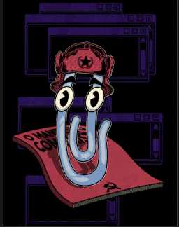
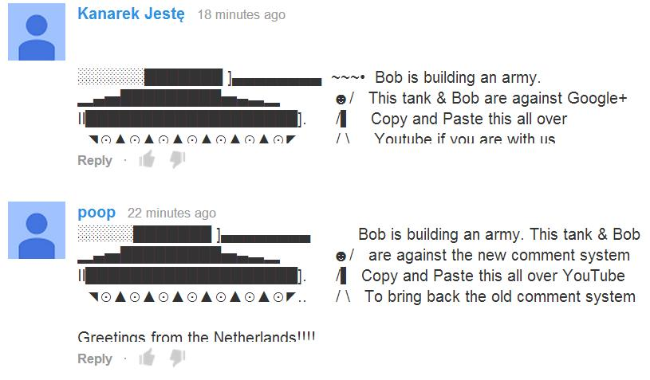

# O que é a revolução dos clippys?

Usuários de redes sociais estão mudando suas fotos de perfil para o Clippy e foi o canal TeClas que lançou a tendência (mentira).

##### Vocês sabiam que o canal TeClas lançou tendencia?

{{#embed https://www.youtube.com/watch?v=2_Dtmpe9qaQ }}

{{#embed https://youtube.com/watch?v=hKhRUB8AwnA }}

- O que é acidentalmente engraçado também é que isso constitui quase um 'Volta Temer' porque o Clippy era constantemente demonizado como o símbolo da empresa querendo colocar uma feature que o usuário não quer no produto.
  - Mas eu acho que o pessoal entende a ironia

#### Para ser justo com o Louis:

{{#embed https://www.youtube.com/watch?v=SkL9vzW7nY0 }}
