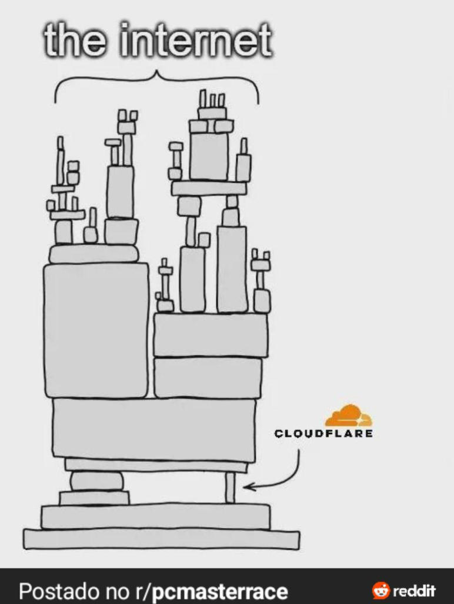
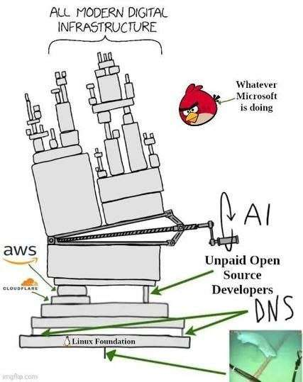

# Cloudflare de novo AAAAAARGG

A Cloudflare caiu de novo, manter a internet de pé é complicado. Nós já falamos disso algumas vezes no canal. Porém hoje eu trouxe alguns memes pra gente reagir.

> O incidente começou por volta das 11h48 UTC do dia 18 de novembro, com o site oficial da Cloudflare reconhecendo uma “degradação interna do serviço”. À medida que o problema se espalhava, usuários em diversas regiões relataram falhas de acesso não apenas a sites da Cloudflare, mas também aos seus serviços Access e WARP. Posteriormente, a empresa identificou uma dependência específica em suas ferramentas de defesa contra bots como a origem do problema.
>
> “Falhamos com nossos clientes e com a internet em geral”, escreveu Knecht. “Um bug latente em um serviço que sustenta nossa capacidade de mitigação de bots começou a apresentar falhas após uma alteração de configuração de rotina. Isso causou uma ampla degradação em nossa rede e em outros serviços. Não se tratava de um ataque.”

<https://techcrunch.com/2025/11/18/cloudflare-blames-massive-internet-outage-on-latent-bug/>

<https://www.tomshardware.com/service-providers/cloudflare-apologizes-after-outage-takes-major-websites-offline>

> Esta é a terceira grande interrupção a afetar sites importantes em menos de um mês. Em outubro, uma grande parte da região US-East-1 da AWS ficou offline por mais de duas horas, após o que a Amazon atribuiu posteriormente a uma configuração de DNS defeituosa. Poucos dias depois, uma enorme interrupção no Azure atingiu a Microsoft.
>
> Esses incidentes levantam questões mais amplas sobre como serviços e plataformas amplamente utilizados lidam com falhas internas e isolamento de dependências em grande escala — aproximadamente 19% da internet depende da Cloudflare, enquanto o Azure e a AWS representam cerca de 24% e 30% do mercado de computação em nuvem, respectivamente.

### Foi culpa do Rust?

<https://blog.cloudflare.com/pt-br/18-november-2025-outage/>

### React de memes

