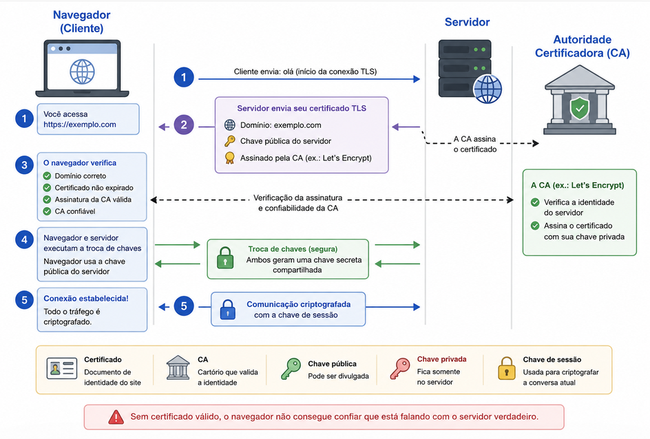

# Sobre confiança e centralização

Hoje eu quero trazer uma mescla de notícias sobre recaptcha e certificados digitais e como precisamos deles para nossa privacidade e segurança. A partir daí quero ter uma discussão sobre como esses assuntos tem a ver com confiança e centralização de poder

### Google e os captchas

<https://reclaimthenet.org/google-broke-recaptcha-for-de-googled-android-users>

<https://cybernews.com/privacy/google-qr-code-recaptcha-requires-approved-phone/>

- Sistemas mais privados, vêem mais captcha?

<https://www.reddit.com/r/privacytoolsIO/comments/jibg3e/is_it_just_me_or_google_punishes_me_with_nonstop/>

### Let’s Encrypt e a lei dos EUA

- O Let’s Encrypt faz um trabalho importantíssimo de prover certificados TLS gratuitamente desde 2012. E foi essencial para a popularização da criptografia de ponta a ponta em toda internet
- Muito rapidamente como funciona o sistema de validação de certificado:

- Você acessa um site (https://...)
- O servidor envia seu certificado TLS.
  -  Contém o domínio (exemplo.com). 
  -  Contém a chave pública do servidor. 
  -  É assinado por uma Autoridade Certificadora (CA), como Let's Encrypt ou DigiCert. 
- O navegador verifica:
  -  Se o certificado foi emitido para o domínio correto. 
  -  Se não expirou. 
  -  Se a assinatura da CA é válida. 
  -  Se a CA é confiável. 
- Se tudo estiver correto, navegador e servidor executam um protocolo de troca de chaves.

- O seu navegador precisa de um pacote de certificados de CA atualizado (muitas vezes é o que faz dispositivos muito antigos terem problemas de acesso à internet)

- Antes da existência do Let’s Encrypt era muito comum ter que pagar desde de 5 até centenas de dólares por alguns certificados válidos

- Emitir um certificado é trivial, qualquer um pode fazer. O “problema” é emitir um certificado para um CA válido no navegador

- O que nos leva ao problema, o Let’s Encrypt colocou nos termos deles mais explicitamente

<https://news.ycombinator.com/item?id=48453275>

- Seguir as leis dos EUA

### O problema da confiança 

- Os problema que os captcha, certificados digitais e várias outras ferramentas básicas da ‘internet livre’ resolvem são inerentemente difíceis de fazer quando o órgão centralizador é enfraquecido ou não confiamos nele.
- A solução padrão geralmente é: “esse órgão ou essa pessoa tem o poder de decidir e delega esse poder em camadas”
- É o “problema dos cartórios” que a gente vê vários anarcocapitalistas se embananando: “ah, mas tinham cartórios privados na Islândia medieval”
  - O que cartórios provêm não é estampar um documento de maneira etérea, na realidade é o consenso social sobre essas questões.
- Existem diversas soluções ‘técnicas’ para esse tipo de problema e inclusive a blockchain / criptotokens muitas vezes são sugeridas para isso
  - Esse foi o responsável pela criptotokenização de tudo nos anos da febre das criptomoedas

- A ideia é criar um sistema distribuído onde cada participante é obrigado a despender recursos (a mineração, a queima de tokens, o staking que lhes é “imposto”) para que o sistema funcione e se possa receber o benefício (por exemplo quantidades do token)
  - Mineração Bitcoin: Despende processamento (eletricidade) para validar transações e resolver um puzzle criptográfico → A cada 10 min 1 participante da rede resolve o problema em média e ganha um prêmio (sorteio) → Um bloco é colocado na rede e apenas se as transações forem válidas o prêmio é pago

- Acontece que a comunidade dos cripto é a terra da discórdia, dos golpes, esquemas de pirâmede e etc… por que será?

- Isso não é um problema tecnológico necessariamente, mas decorre da estrutura social em que o blockchain é CRIADO e inserido. Se o incentivo financeiro é o centro da validação de identidade, por exemplo, quem tem o poder financeiro sempre terá vantagens sobre o resto da rede. 

### Conclusão e voltando pra Google e Let’s Encrypt

- Vocês já se perguntaram por que os EUA tem a sua internet aberta para todo o mundo e inclusive financiam projetos abertos de segurança, privacidade e criptografia? É pra gente conseguir resistir melhor à dominação deles?

- O problema difícil que nos defrontamos aqui é:
  - Precisamos lidar com tráfego falso e malicioso na rede → Google faz isso
  - Precisamos criptografar o tráfego HTTP → Let’s Encrypt faz isso

- Ambas instituições tem seus próprios interesses e/ou estão sujeitas aos interesses econômicos (e portanto políticos) dos EUA

- A mentira da ‘internet livre’ e ‘100% técnica’ funciona para os EUA porque nas marcas do nascimento dessa tecnologia estão os interesses de hegemonia cultural e tecnológica do império dos EUA
- Mas é no momento político atual que a gente entende que as soluções de confiança e segurança que eles “tão altruísticamente” construíram pra gente podem e vão ser usadas contra a gente 

- Esse é um vídeo contra tudo que os EUA tocaram? Não. Porém é mais um aspecto daquela listinha de ‘soberania digital’  que a gente começou a fazer aqui.
