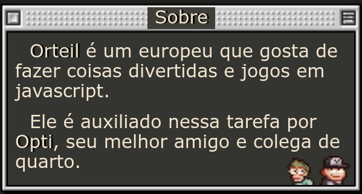
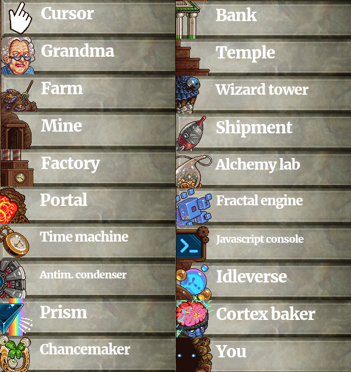
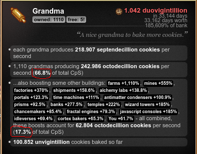
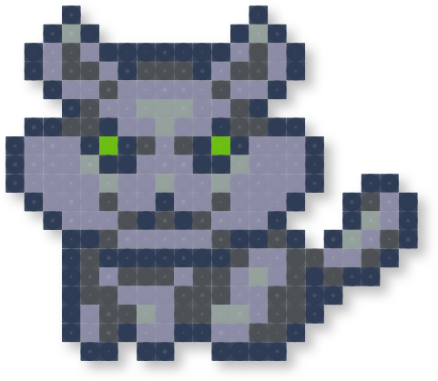
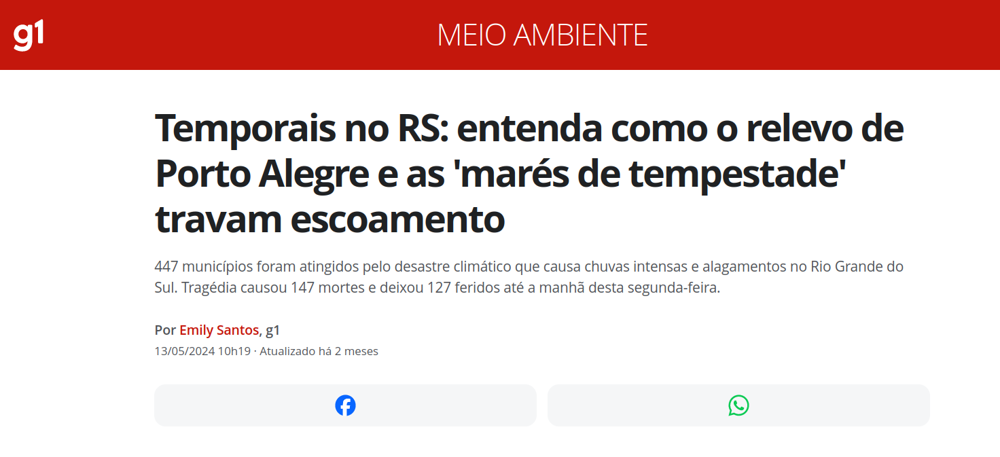
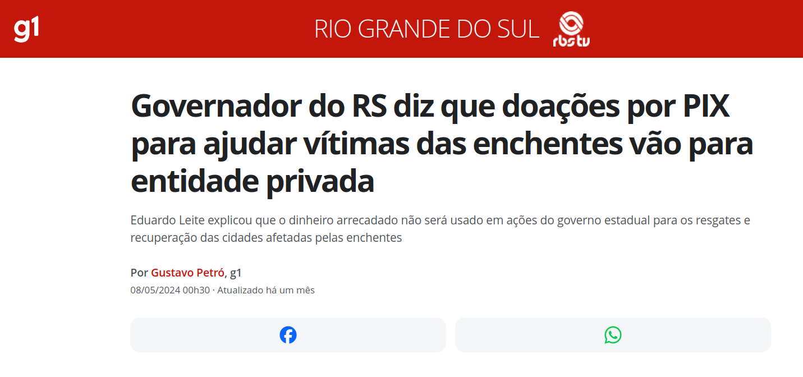
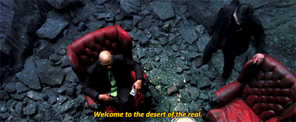
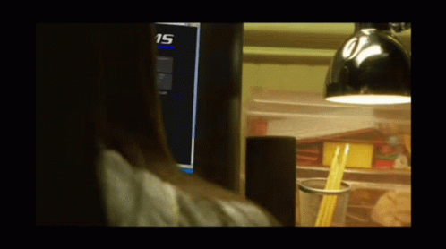
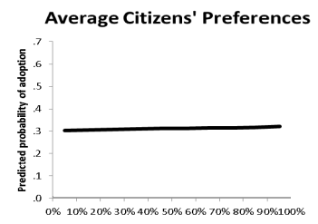
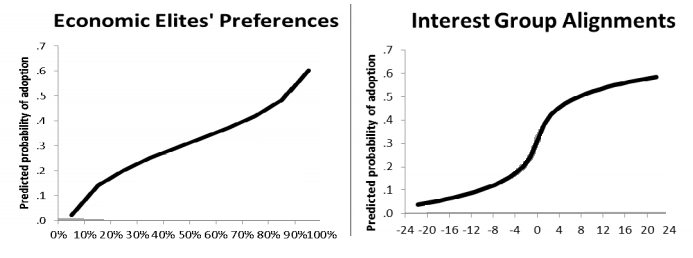

# Cookie Clicker


### Por quê fiz esse vídeo?

{{#embed https://www.youtube.com/watch?v=aFl99Wieknw }}

### O que é?

- Cookie Clicker é um 'idle game' de 2013 e que foi extremamente influente no gênero
- A versão original do jogo, conhecida como [Cookie Clicker Classic](-%20<https://orteil.dashnet.org/experiments/cookie/>), foi feita em 24 horas como parte de um gamejam
- É também uma crítica ao sistema de produção capitalista. Mesmo que seja uma simplificação.
- É uma sátira que brinca muito com o conceito de realismo capitalista e uma pitadinha de horror cósmico (senão não seria um jogo indie)
- Nos faz a pergunta o tempo inteiro: "por que é tão viciante ver o númerozinho subindo?"

### Sobre o criador




#### Saquem só esse domínio da dialética:


#### Absolute banger tweet


#### Sites do orteil

<https://orteil.dashnet.org/>

<https://x.com/orteil42/>

<https://orteil42.tumblr.com/>

### Reflexões em ordem aleatória

### Cookies são capital? Mais ou menos

- O dinheiro usado para tudo no jogo é cookies
- Trabalhadores são pagos com cookies
- O jogo dá a entender que cookies não são dinheiro, mas aos poucos começam a ser usados como dinheiro
- Eventualmente temos um mercado de ações e empréstimos de cookies
- As diferentes estratégias para o início, meio e final do jogo para mim representam a maneira como o capital se move dos mercados menos para mais produtivos
- Nem tudo precisa fazer sentido (o biscoito  gigante, biscoitos dourados e etc...). É capitalismo fantasia...

### Inovações tecnológicas significam...

- Mais cookies, mais poder mais biscoitos, mais bolachas e principalmente mais cookies
- Fica a dúvida se você uma espécie de deus nesse mundo (tipo Sim City e outros simuladores) ou se você apenas é poderoso porque controla os biscoitos

### Os prédios são os meios de produção? SIM

- Entretanto como as próprias dinâmicas do capitalismo as vezes rola uma dificuldade para entender.
- O jogo satiriza conceitos como a exploração do trabalho, agricultura, industrialização, financeirização, colonialismo, religião e imperialismo enquanto continuamos na nossa busca por expandir a produção de biscoitos.
- Eventualmente nos vemos buscando uma maior produção de biscoitos em métodos mais abstratos como outras dimensões, magia, viagem no tempo, desrespeito às leis da física até eventuais quebras da quarta parede.



- Existe um bônus de 1ª de Abril onde todos os prédios são substituídos por referências mais diretas ao mundo real (embora isso seja debatível)

## Vovós são as trabalhadoras? SIM


- Upgrades das vovós para cada prédio mostram como elas se tornam mais produtivas e aumentam os seus 'biscoitos por segundo' se especializando no trabalho de cada área
- O Vovópocalipse é um ponto de inflexão na narrativa do jogo onde as Vovós se revoltam contra você, chegando ao ponto onde elas podem ser 'conciliadas' ou contidas permanentemente por meio de um sacrifício
- No entanto nunca existe um real perigo de 'revolução'. Existe uma maneira de conciliar com as vovós ou viver num constante estado de horror.
- Perto do fim do jogo as vovós se tornam o prédio que de longe mais gera e impulsiona outros prédio. No meu jogo sendo responsável por 84% de todas produção:



- Os gatos também! Porém, talvez exista alguma comparação com gerentes aqui:



- Kitten helpers, Kitten workers, Kitten engineers ,Kitten overseers, Kitten managers, Kitten accountants, Kitten specialists, Kitten experts, Kitten consultants, Kitten assistants to the regional manager, Kitten marketeers, Kitten analysts, Kitten executives, Kitten admins, Kitten strategists

### Ideologia

Ideologia é estabelecida pelas "notícias" no topo da tela. Parece piada, mas é uma maneira de expor como o papel da mídia e dos 'especialistas' é garantir a reprodução do capital

#### **“nesse momento, os biscoitos permeiam a economia”, diz economista. “Se começarmos a comer qualquer outra coisa, estaremos todos mortos.”**


{{#embed https://www.youtube.com/watch?v=9Z-MgUDvD6g }}

#### **Fazendas de biscoitos suspeitas de empregar mão de obra idosa não declarada!**


~~Né **Sandro Fantinel**?~~

##### cidade inteira aparentemente engolida por buraco negro induzido por antimatéria; fontes mais confiáveis ​​afirmam que a cidade “nunca existiu de verdade”!

##### pequeno incidente relacionado a biscoitos transforma cidade inteira em cinzas; cidades vizinhas são solicitadas a contribuir para a reconstrução.





##### cientistas alertam contra a transformação sistemática da luz em matéria - "Um dia, acabaremos com só matéria e sem luz!"

##### Fábricas de biscoitos estão ligadas ao aquecimento global!

Essa é fácil né?


###### Público lamenta-se diante da noção de um cosmos feito de infinitos jogos ociosos. “Eu meio que esperava que houvesse mais do que isso”, diz cidadão perturbado.



###### caroços desagradáveis ​​encontrados em [animal] perto de fábrica de biscoitos; “eles sempre foram assim”, diz biólogo.

###### novas espécies de [animais] descobertas em países distantes; “sim, tem gosto de biscoito”, diz biólogo.”

###### "então acho que isso é normal agora", comenta o cientista sobre partículas de biscoito agora presentes em praticamente todo o aço fabricado desde que a produção de biscoitos aumentou em todo o mundo.

###### vestígios de partículas de biscoito detectados na maioria das criaturas vivas, algumas das quais as adaptam como parte de novos e exóticos processos metabólicos.


##### “seus cookies contêm [animal]?”, pergunta o PSA alertando contra cookies falsificados.



##### epidemia de obesidade atinge o país; especialistas culpam [aleatório].

<https://www.bbc.com/portuguese/geral-61961721>

0 resultados para **capitalismo**, **dinheiro**, **trabalho**, **aluguel**, **comida**, **nutrição**

2 resultados para **emprego**

##### cookies agora são ilegais em algum país atrasado com o qual ninguém se importa. Tensões políticas aumentando; guerra em breve, espero.

> A United Fruit Company (UFC) (1899-1970) era uma multinacional norte-americana que se destacou na produção e no comércio de frutas tropicais (especialmente bananas e abacaxis) em plantações no terceiro mundo.
>
> Tinha muito poder nos países centro-americanos já que, com a  colaboração do governo dos EUA, ajudava na derrubada de governos locais e  a implantação de governos que facilitassem sua atividades comerciais.  Dando lugar para que esses países e seus governos fossem chamados "[república das bananas](https://pt.wikipedia.org/wiki/Rep%C3%BAblica_das_bananas "República das bananas")", já que a empresa estabeleceu líderes locais para favorecer seus interesses econômicos.[\[1\]](https://pt.wikipedia.org/wiki/United_Fruit_Company#cite_note-1)
>
> Diversas atuações ilegais foram marcadas em sua história, como na Colômbia, em 1928, que diante dos protestos dos trabalhadores agrícolas exigindo melhorias no trabalho, a companhia ordenou às autoridades locais a reprimir a manifestação a tiros, assassinando truculenta e impunemente muitos manifestantes. É o que hoje é conhecido como Massacre das Bananeiras.

Ver também: <https://pt.wikipedia.org/wiki/Guerras_das_Bananas>

###### “Você não sente o prisma nos observando?”, divaga o insano morador local. “Não tenho ideia do que ele está falando”, dá de ombros o magnata dos biscoitos/político.

###### "explique-me novamente por que precisamos de aceleradores de partículas para assar biscoitos?" pergunta uma mulher local equivocada.

###### nossa mídia é controlada pela indústria de biscoitos? Isso pode muito bem ser o caso, diz o teórico da conspiração maluco.





Fonte: <https://www.vox.com/2014/4/18/5624310/martin-gilens-testing-theories-of-american-politics-explained>

Lembram dessa?


## Sobre trapacear

- De uma maneira estranha o jogo convida o jogador a trapacear e usar o console Javascript para 'fabricar biscoitos'
- O achievement 'Cheated Cookies Taste Awful'
- Seria uma maneira de subverter a lógica do jogo? Ou não?
- Afinal qual é o nosso objetivo ao jogar esse jogo? Ver números maiores (spoiler: são infinitos), desbloquear os achievements? Montar o maior império de cookies de todos?
- E como trapacear muda esse objetivo?
- Talvez trapacear nos ajude a parar de jogar 💀
- Eu acho que nunca refleti tanto sobre uma experiência de videogame

## Sobre mods

- Os comunas já se tiveram a sua vez, agora é hora dos nerdolas se divertirem
- O jogo tem uma 'API' extremamente simples e poderosa no console js. É possível fazer desde melhorias de 'qualidade de vida' até trapaças totais, passando por pequenas ferramentas e mods que podem ser úteis.
- Calculador de jardim: <https://github.com/mikex5/CCGardenSim>
- Calculador de magia: <https://joseph3079.github.io/FtHoF-Planner-v5/>
- Vários Mods: <https://klattmose.github.io/CookieClicker/>

#### Alguns dos meus 'mods'

```javascript
// Warning Buffets
warned = false
function warnBuffs(n) {
  if (Object.keys(Game.buffs).length >= n) {
      if (!warned) { PlaySound('snd/fortune.mp3') }
      warned = true
  } else {
    warned = false
  }
}

warnBuffsInterval = setInterval(function() { warnBuffs(3); }, 1000)


// No cookie sound
Game.playCookieClickSound = function() { return };

// Auto rena
var autoReindeer = setInterval(function() { for (var h in Game.shimmers){if(Game.shimmers[h].type=="reindeer"){Game.shimmers[h].pop();}} }, 1000);

// Auto biscoito dourado
var autoGoldenCookie = setInterval(function() { for (var h in Game.shimmers){if(Game.shimmers[h].type=="golden"){Game.shimmers[h].pop();}} }, 1000);

// Autoclique
clickCookieInterval = setInterval(Game.ClickCookie, 1);

// Auto elder pledge
shouldPledge = true
function alwaysPledge() {
  if (shouldPledge && Game.pledgeT == 0) {
    Game.UpgradesById[74].buy();
  }
}

pledgeInterval = setInterval(alwaysPledge, 1000)
```


#### Cálculo do preço de prédios

```ruby
# Find the cumulative price of buying N of a building
def next_price current, n, growth = 1.15
  res = current
  (1...n).each do |i|
    current = current*growth
    res += current
  end
  res
end

# Example for buying 10 'You' if they cost 4.775 unvingintillion  
next_price 4.775, 10 # 96.95025458670177
```
