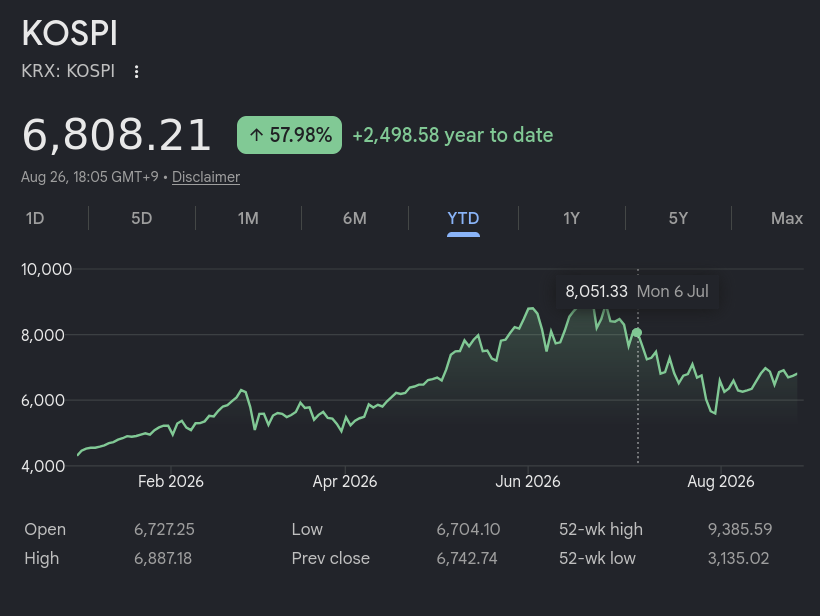

# O crash do mercado de ações Sul Coreano em 2026

Falar sobre uma crise do mercado de ações da Coréia do Sul é meio nichado né? Porém isso é um micro cosmo de uma bolha mais geral da IA e pode nos dar pistas pra entender como vai acontecer em outros países.

**Veja também no canal:**
{{#embed https://youtube.com/watch?v=yX-SltC1qUA}}

- Eu só queria começar com um aviso de que esse acontecimento já foi há quase um mês e quando estamos falando de IA e mercado financeiro isso é uma eternidade, mas eu acho importante a gente parar pra refletir e o que aconteceu ali
  - Até porque é mais fácil ver as coisas em restrospecto do que enquanto acontecem

- Nos últimos meses a bolsa de ações coreana, chamada KOSPI, tem enfrentando vários crashes e crises. Ao mesmo tempo que está no seu valor mais alto em muito tempo.
  - Por exemplo hoje o índice está em ≃ 6800, mas no início do ano estava em 4k e no seu pico em Julho chegou a 9k

- Muitas vezes a gente vê as pessoas falando de investir pensando no agregado com o passar do tempo: “em um ano o índice KOSPI mais que duplicou”. Mas a história que eu vou contar é sobre as pessoas que ficam no meio do caminho

- Primeiro a gente tem que entender por que as ações na Coreia do Sul estão tão valorizadas nos últimos tempos… como sempre é a Inteligência Artificial 
  - 2 das maiores empresas responsáveis pela produção mundial de memória HBM, necessária para todo tipo de componente que usa memória:  Samsung e SK Hynix
  - A partir de 2024 com o frenesi de construção de data centers, uso nas GPUs e todos outros componentes eletrônicos o valor dessas empresas disparou e gerou uma situação onde elas são mais que 50% da bolsa KOSPI

- Esse é um ponto importante: toda vez que a gente fala de bolha parece que tem uma implicação de que é especulação ou alguma moda de um produto que é falso ou algo assim. Não é o caso:
  - Essas empresas desenvolvem tecnologia de ponta e tem crescido a sua infraestrutura e produção puxadas pela situação da IA nos últimos 4 anos
  - Diferente do fenômeno Gamestop que rolou durante a pandemia, isso aqui é um investimento bastante racional e “com fundamentos”

- E isso levou à escalada do índice KOSPI e de um outro fenômeno que se popularizou entre os investidores “sardinha” coreanos: investimento ETF alavancado.
  - Em resumo é comprar ações com um empréstimo.
  - Se eu tenho 100 mil pra investir em posso comprar eles com 2x de alavancagem fazendo um empréstimo.
  - Eu dobro os meus ganhos… mas também dobro o que eu perco

- Recentemente as agencias reguladoras coreanas aliviaram as regras pra esse tipo de ativo e talvez isso tenha coincidido com uma das promessas de campanha do presidente Lee Jae Myung que era a KOSPI subir para 5000 pontos
  - Matéria de 6 meses atrás da Bloomberg mamando ele

[https://archive.is/20260223225242/https://www.bloomberg.com/news/articles/2026-02-23/south-korea-president-s-day-trading-losses-fuel-kospi-stock-market-reform#selection-1175.0-1175.71](https://archive.is/20260223225242/https://www.bloomberg.com/news/articles/2026-02-23/south-korea-president-s-day-trading-losses-fuel-kospi-stock-market-reform#selection-1175.0-1175.71 (preview))

- Como eu disse: perfeitamente racional. Mas o mercado de ações tem altos e baixos e alguns fatores causaram essa montanha russa:
  - A ascenção da Anthropic e das ferramentas de código no mercado mundial. Fez subir
  - O medo de que data centers vão atrasar ou não serão necessários. Fez descer
  - A China desenvolvendo a sua capacidade de produzir memória ram na CMXT (mesmo não competindo diretamente). Fez descer
  - Os medos justificados de que uma bolha de IA estoure nos EUA

- O problema é que quando estamos falando desses ETFs alavancados esses solavancos no mercado obrigam os investidores sardinha a venderem suas posições e perderem seus investimentos iniciais.

- Em resumo: pessoas investiram suas economias, dinheiro que iam usar pra pagar faculdade dos filhos, dinheiro pra comprar uma casa… e perderam quase tudo.

https://www.moneycontrol.com/news/business/markets/south-korea-market-crash-lost-my-apartment-fund-feel-like-dying-investors-recount-massive-losses-in-kospi-crash-13988253.html

- A comparação com a série Round 6 meio que se faz sozinha, por que a série está falando de pessoas que não tem expectativa nenhuma de ascenção social que não seja apostar tudo que tem numa bet do capeta. E isso é a versão vida real da história
- Pra referência, um apt. de 50m² no Brasil está em média R$ 480,5 (fonte https://g1.globo.com/economia/noticia/2026/01/06/precos-de-imoveis-residenciais-2025.ghtml)
  - Com a média salarial no Brasil (R$ 3.932,45 pelo IBGE) isso dá 10 anos de salário
  - Na Coreia do Sul essa média chega a 14 anos de salário

- Depois das crises do mês passado as agências reguladores estão falando em limitar esse tipo de ativo, mas muitos investidores já pensam em juntar o pouco que tem e voltar pra bolsa. Por que não tem uma alternativa muito melhor não

- E a pior parte dessa história é que um fenômeno parecido  está acontecendo nas bolsas dos EUA onde estão as big techs, laboratórios de IA, construtoras de data centers e etc…

- A gente ficou relativamente isolado dos efeitos no resto do mundo, mas se isso acontecer com os EUA a gente vai sentir.

### Referências

[https://asiatimes.com/2026/07/why-south-korean-stocks-just-crashed/](https://asiatimes.com/2026/07/why-south-korean-stocks-just-crashed/ (preview))

{{#embed https://www.youtube.com/watch?v=aFBzmWYxTrI}}

{{#embed https://www.youtube.com/watch?v=nJtL9MBVj48}}
