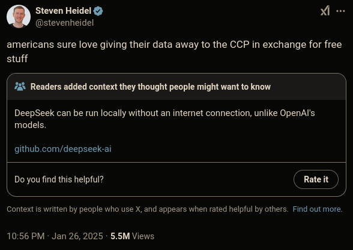

# Deepseek AI bota o "ocidente" pra mamar????

#### O que é o Deepseek R1?

- Um LLM, baseado em mixture of experts e com hablidade de 'raciocínio' e performance similar ou as vezes superior que os modelos Chat GPT o1 e Gemini
- Isso tudo ao mesmo tempo que é um modelo de código aberto. Isso quer dizer, os pesos resultado do treinamento. Porém também foi lançado um artigo explicando como ele funciona e foi treinado
- Disponível portanto para ser analisada, estudada e adaptada por outras empresas e entusiastas da área. Além de ser rodada localmente (como os modelos LLama e Mistral por exemplo)
- Criado por uma startup financeira chinesa que tinha diversas GPUs sobrando e queria achar um uso para elas
- Muita gente falando que esse seria um momento Sputnik transplantado pela corrida pela 'supremacia da IA'

#### E por que ela está dando o que falar?

- Os EUA tem há alguns anos um embargo de chips de GPU para a China numa tentativa de limitar o desenvolvimento de sua indústria de IA

  

- O custo de processamento do modelo da Deepseek é muito menor. Mais rápido com o mesmo equipamento OU menos equipamento para a mesma performance
- Custo das chamadas de API para o serviço da Deepseek é 96% mais barato que os competidores, como por exemplo a OpenAI.
- O custo de treinamento teria sido de apenas **6 milhões de dólares**. Para comparação o ChatGPT 4 é estimado custar entre 41 a 78 milhões, embora o Sam Altman tenha dito, mais de 100 milhões. Elon Musk anunciou um data center para treinamento do Grok na faixa de 4bi e com o Stargate anunciado a alguns dias pelo governo dos EUA prometeu 500bi para o setor de IA.
  - Muito se falou que esse custo de treinamento deveria estar sendo subsidiado ou que a China tem 'GPUs secretas', mas os modelos e a pesquisa estão aí para serem validados.

  

  

- <https://itsfoss.com/deepseek-r1-raspberry-pi-5/>
- O número demasiado de acessos fez o site ficar fora do ar por algumas horas e segundo os mantenedores eles sofreram um ataque  em 27/01/25

#### Como essa IA pode ser treinada tão barato?

- Se você pergunta para o Deepseek que tipo de modelo é, grande parte das vezes ele responder ChatGPT 4. Por que ele diria isso?
- Vamos pensar nas grandes tendências de IA com o passar dos anos:
  - Baseada em lógica e inferência baseada em fatos e proposições
  - Baseada em associação de dados e treinamento com fatos sobre o mundo
  - Eventualmente redes neurais e aprendizado baseado em reforço complementam o modelo baseado em dados
  - A arquitetura GPT desemboca no que chamamos de **LLM** ou **genai**
  - Inovações como MoE e o 'raciocínio' interno buscam melhorar o resultado dos LLMs
- Uma das tendências para o treinamento de dessa nova leva de IAs baseadas em LLM é o que? Um caminhão de dados. Mais recentemente tem se anunciado a ideia de dados 'sintéticos' para o treinamento e eu devo dizer que não interpretei isso da maneira correta
- A ideia é treinar um modelo com menos dados, mas com mais qualidade. Esses dados são gerados usando perguntas de domínio específico e problemas complexos respondidos por outros modelos.
- Imaginem como se fosse uma 'compressão' dos dados que estão em outros tipos de modelos para gerar algo mais leve que tem resultados similares

{{#embed https://www.youtube.com/watch?v=r3TpcHebtxM}}

#### A crise do mercado de IA é culpa da Deepseek?

{{#embed https://www.youtube.com/watch?v=GqcCvvFZsi4}}

- A Deepseek não saiu 'do nada', porém o anúncio do modelo R1 foi borbulhando pela comunidade de IA até que chegou na bolsa
- A existência de uma empresa oferecendo basicamente o mesmo que todas as big techs dos EUA a um preço muito mais barato e talvez com menos esforço fez os investidores se perguntarem se esse retorno que imaginam para os LLMs vai chegar um dia

- Será que num futuro não tão longínquo poderemos rodar e treinar todos nossos modelos com um custo tão "barato". Então no que estas big techs estão investindo toda essa grana?

- Seria essa uma comoditização do que as LLMs são? Ou seja, fará sentido existir uma empresa de IA especificamente? É daí que vai vir o valor? Ou ele vai vir de alguma ferramenta que se construirá com esses modelos abertos que serão bons o suficiente?

- Essa reflexão do 'mercado' derrubou com muita a força a NVIDIA que nos últimos anos está com uma valuation extremamente inflada porque todo mundo quer as suas placas para treinamento e execução de LLMs e a demanda infla os seus preços para até 90% mais do que já foram.

- Isso se refletiu numa queda na maioria das empresas com seu dedinho na IA, mas também nas que fazem parte da cadeia de suprimentos da empresas de hardware e também houve um efeito mais geral.

#### O que isso significa para o mercado de IA a partir de agora?

- Muita gente falando que é 'suspeito' que isso tenha droppado na semana que o Trump assumiu. Justo, mas já tinha gente falando do Deepseek há muito mais tempo e a China já era um player importante de IA
- Existe esse pano de fundo de paranoia e sinofobia com essa ser 'a IA da China'. Porém o fato da Deepseek ser mesmo uma IA aberta, diferente dos modelos da Open AI é algo que muda um pouco o jogo
- Até o momento não estava muito claro que seria possível treinar algo tão similar aos maiores players tão barato

- Isso realmente é o prego no caixão (ou melhor, na bolha) do mercado de IA e as ações não irão se recuperar?

- Provavelmente não porque esse tipo de avanço pode ser absorvido pelas empresas de IA e existe a possibilidade de eles fazerem algo similar só que com mais recursos.

- Um potencial para IAs mais baratas de usar e treinar pode acelerar a adoção da tecnologia em áreas onde não valia a pena
- Então, se preparem para ainda mais IA em tudo...

#### Demonstrações da Deepseek R1

{{#embed https://www.youtube.com/watch?v=bOsvI3HYHgI}}

{{#embed https://www.youtube.com/watch?v=by9PUlqtJlM}}
