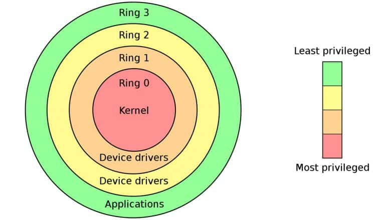

# Denuvo foi derrotado com o Hypervisor

Grupos hacker desenvolveram um método para derrotar o infame sistema antipirataria Denuvo "definitivamente". Tecnicamente é lindo, mas tem que ter coragem pra rodar... Vamos falar sobre!

- Denuvo é um sistema antipirataria ("antitamper" ou DRM) infame entre os gamers, não apenas por dificultar o acesso a versões alternativas dos jogos, mas também por fazê-lo de uma maneira extremamente invasiva e que muitas vezes introduz problemas de performance

<https://en.wikipedia.org/wiki/Denuvo>

- Uma curiosidade que eu descobri pesquisando: o primeiro jogo com Denuvo foi o FIFA 15 em Setembro de 2014...
- No mesmo ano já havia grupos trabalhando em quebrar a proteção e o Fifa 15 e o Dragon Age: Inquisition já tinha um crack em Dezembro de 2014
- Porém no caso do Dragon Age o jogo demorou quase um mês para ser crackeado, o que é vital porque a maioria das vendas acontece nos primeiros dias de lançamento do jogo

- Isso é importante: pirataria de jogos e medidas contra pirataria existem desde o início dos jogos como mercadoria, mas existe um balanço entre a incoveniência de usar uma solução dessas e o quanto isso realmente afeta a pirataria
  - O Denuvo para as publishers de jogos conseguia um bom balanço disso, isso é vital

- O modelo de negócios da Irdeto, responsável pelo Denuvo, é o licensiamento mensal por cada jogo. Ele é um custo extra que os publishers pagam para manter o jogo 'seguro dos piratas' por tempo o suficiente

- Em muito alto nível a maneira como o Denuvo funciona é tentando autenticar que o código que está rodando e o ambiente que ele está rodando não sofreram nenhuma modificação do ambiente esperado pelos desenvolvedores.
  - Por isso é relativamente invasivo
  - Muitas vezes acarreta danos à performance
  - Pode impedir o funcionamento de ferramentas externas e mods não relacionados à pirataria
  - Impede camadas de tradução e emulação como por exemplo o Wine e Proton (pros jogadores Linux)

- Até pouco tempo atrás, para rodar um jogo pirata, o Denuvo precisava ser 'extirpado' do código. Não era fácil apenas 'enganar' as verificações. Era necessário basicamente uma engenharia reversa e uma modificação do código original para que ele rodasse sem o Denuvo

- Essa nova solução é diferente por que ela atua num nível mais baixo do sistema operacional e consegue "contar mentiras" sobre a autenticidade do sistema para o Denuvo
  - Com ela jogos como o RE Requiem foram crackeados em apenas 1 hora
  - Novamente invertendo o balanço dessa guerra de segurança/cracking

- A Iredto já sinalizou que está ciente da técnica e que irá remediar ela nas novas versões:

<https://torrentfreak.com/game-pirates-beat-denuvo-with-hypervisor-bypasses-irdeto-promises-countermeasure/>

- Então por que precisa ter coragem pra rodar? É legitimamente perigoso rodar esse tipo de versão pois elas precisam das permissões de fazer basicamente tudo no seu hardware. É preciso desabilitar todas proteções na BIOS e confiar que o programa não vai fazer nada errado...

- Daí também vem a preocupação pros próximos passos do Denuvo, será que ele iria para um nível do Kernel do SO?
  - Sendo assim mais invasivo e mais próximo de um malware no seu computador?
  - Vocês devem lembrar que essa é a mesma polêmica que aconteceu com o Vanguard do LoL faz um tempinho.

- Algumas pessoas já estão dando a dica: "tenha um PC apenas para jogos e daí seus dados e contas ficam isolados de qualquer dano".
  - Não é tão fácil assim e o tipo de malware que dá pra instalar com essas permissões (um "bootkit" por exemplo) é muito pernicioso
  - Mas beleza, vai lá e instala, eu não sou seu pai

- A parte boa é que o Denuvo realmente é um câncer e se crackear os jogos com ele ficar fácil novamente pode ser que não valha mais a pena existir esse modelo de negócios do jeito que está
  - O resultado mais direto desse crack agora é que jogos de 2025 e 2024 que serão agora facilmente crackeáveis vão deixar de usar Denuvo porque não vale mais a pena pagar a licença :)

- E é sempre bom lembrar, uma indústria de jogos com preços localizados e um modelo de desenvolvimento e preços mais saudável é a melhor forma de combater a pirataria!
- ...mas com certeza não estamos num momento de crise e cada vez menos saudável kkkk
- Então embora eu não quero saber de instalar essas coisas no meu computador e ache que no geral isso só tende a extremar ainda mais as medidas tomadas pela indústria... eu admiro os hackers e ativistas que mantém a tocha da pirataria acesa. Vocês são foda.

### Referências

{{#embed https://www.youtube.com/watch?v=P1ZcUXknL8Y }}

{{#embed https://www.youtube.com/watch?v=t_jyCBu0nUA }}
