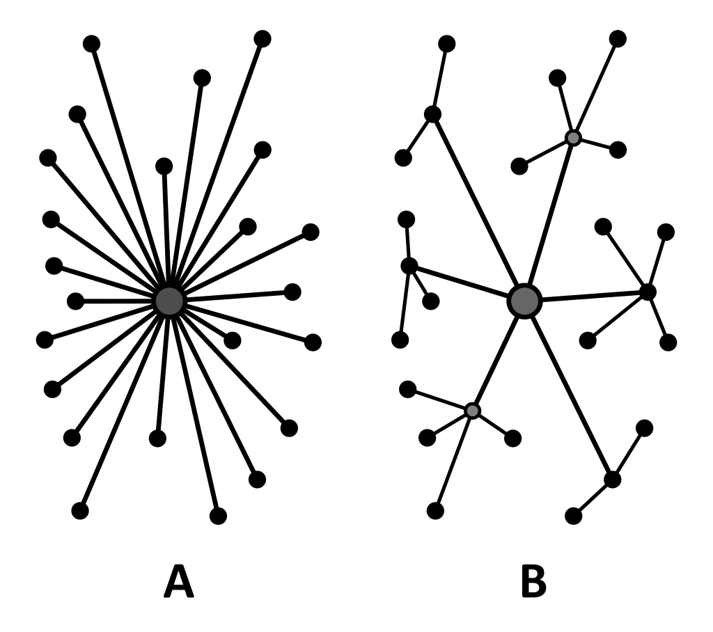
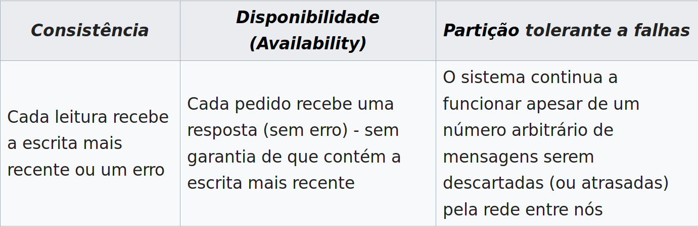
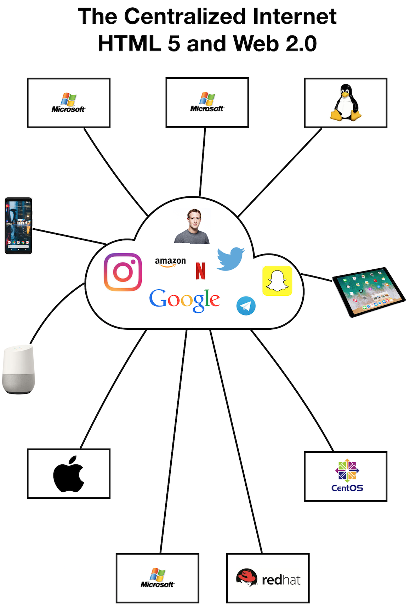

### Vamos falar sobre redes sociais descentralizadas

- Temos falado muito nas redes descentralizadas como a solução para diversos problemas que temos hoje na internet.
- Aqui a nossa opinião é positiva sobre esse tipo de iniciativa, porém eu tenho muita resistência em apresentar ela como uma panacea, mas quero conversar
- Tomem isso como primeira parte da conversa e no futuro podemos nos ater a aspectos mais técnicos ou mais práticos, como os protocolos específicos e casos reais de sua aplicação
- Vamos pegar como ponto de partida essa notícia:

<https://www.404media.co/hundreds-of-subreddits-are-considering-banning-all-links-to-x/>

#### Em resumo, o que são redes sociais descentralizadas?

- Pense em como a internet era planejada inicialmente, um espaço descentralizado, distribuído e sem garantias de acesso entre diferentes nodos:

- Um sistema descentralizado vai ter que obrigatoriamente seguir essa regra aqui que chamamos de **Teorema CAP**:

- Só que a gente sabe que na prática hoje a internet está funcionando assim:

- Mas, então o que a gente quer dizer hoje quando falamos de 'plataformas descentralizadas' ?
- Pense num provedor de email:
  - Cada um tem o seu endereço que está localizado em um servidor específico (gmail, hotmail, terra, proton, o seu próprio, etc...)
  - Esse servidor guarda todas as suas mensagens enviadas e recebidas e consegue se comunicar com todos outros servidores que falem o mesmo protocolo de email
  - Servidores diferentes podem oferecer regras e funcionalidades diferentes para seus usuários
- A ideia é traduzir esse conceito da web 1.0 para a web 2.0 que introduziu a maioria dos seus apps no modelo 'rede social' centralizada.
- Ao invés de ter a minha conta **@lfzawacki** num site do pássaro eu posso ter **lfzawacki@sitedopassaro.com** e ver/responder postagens de pessoas que estão no **sitedaborboleta.com**
- Porém cada site fica livre para adaptar as suas regras e funcionalidades desde que fale o mesmo protocolo, o que cria um esquema que chamamos de **federação**
- O conjunto dos aplicativos usando protocolos de descentralização federados as vezes é chamado de **fediverso**

#### Reflexões iniciais

##### Vantagens:

- Moderação e regras do servidor mais próximas da comunidade que o ocupa
- Portabilidade dos dados para diferentes plataformas
- Possibilidade de evolução e adaptação das ferramentas para realidades e necessidades específicas

###### Desvantagens

- Necessidade de manter as plataformas
  - Dilema do artesanal VS profissional e consequente centralização
- Custo monetário e humano para manter essas plataformas
- Privacidade dos dados

#### Reflexões políticas

- É inegável a necessidade de superar o modelo de rede social centralizado
  - Mas como esse modelo se estabeleceu até aqui?
- As plataformas descentralizadas hoje conseguem competir com as plataformas centralizadas
  - Eu acho que não
  - Mas por quê?
- As plataformas descentralizadas hoje tem as ferramentas necessárias para lidar com esse problema?
- A sociedade está no momento propício para que essas plataformas se multipliquem?
- Onde o nosso trabalho de organização seria melhor utilizado para fomentar essas condições?

### Quais plataformas federadas vocês usam e recomendam?

#### Deixem nos comentários

### Para assistir:

{{#embed https://www.youtube.com/watch?v=yZoASOyfvGQ}}
