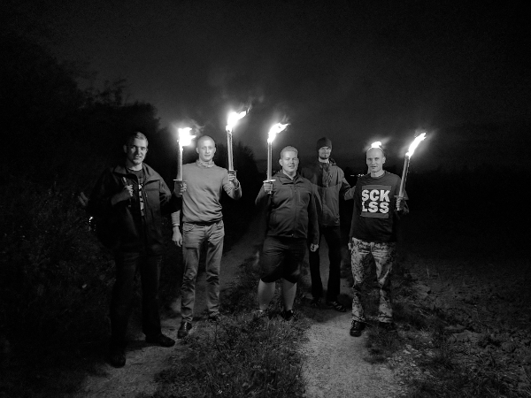

# A Ideologia de Extrema Direita na comunidade FLOSS

### Suckless

> Somos o lar de softwares de qualidade como dwm, dmenu, st e muitas outras ferramentas, com foco na simplicidade, clareza e frugalidade. Nossa filosofia é manter as coisas simples, mínimas e utilizáveis. Acreditamos que esta deveria se tornar a filosofia dominante no setor de TI. Infelizmente, a tendência para softwares complexos, propensos a erros e lentos parece prevalecer na indústria de software atual. Pretendemos provar o contrário com nossos projetos de software
>
> ....
>
> Projetar software simples e elegante é muito mais difícil do que permitir que recursos ad hoc ou excessivamente ambiciosos obscureçam o código ao longo do tempo. No entanto, é preciso pagar esse preço para obter confiabilidade e facilidade de manutenção. Além disso, o minimalismo resulta em objetivos razoáveis e alcançáveis. Nós nos esforçamos para manter o minimalismo e a clareza para levar o desenvolvimento à conclusão.

<https://suckless.org/conferences/2017/>




[https://tilde.team/~ben/suckmore/](https://tilde.team/~ben/suckmore/)

### O caso do LLVM

#### Email original

<https://lists.llvm.org/pipermail/llvm-dev/2018-May/122922.html>

#### Pronunciamento do LLVM

<https://nondot.org/sabre/2018-05-02-Rafael.html>

#### Entrevista com o desenvolvedor

<https://web.archive.org/web/20180626124600/https://quillette.com/2018/06/26/diversity-and-discrimination-in-open-source/>

> Um dos problemas com este tipo de ambiguidade cuidadosa é que vivemos numa era em que aqueles que alertam para os perigos do tribalismo (por exemplo: Jordan Peterson) ou do Islamismo (por exemplo: Maajid Nawaz) podem encontrar-se em sérios apuros como resultado. Podemos ter a certeza de que qualquer um destes indivíduos seria aceite numa comunidade em vez de ser excluído por ser “desrespeitoso”?
>
> Os projetos de código aberto já eram, na minha experiência, alguns dos ambientes mais acolhedores e inclusivos para se trabalhar. Mesmo que admitamos que é desejável um Código de Conduta explicitamente redigido, é essencial que o seu âmbito seja claramente definido. É, por exemplo, perfeitamente possível que defensores pró-vida e pró-escolha colaborem num projecto de software. Eles apenas precisam deixar suas opiniões sobre o aborto de lado, e isso não deve impedi-los de compartilhar livremente essas opiniões nas redes sociais, sem medo de represálias disciplinares. Desta forma, as regras podem ser simplificadas e rigorosas: os espaços disponibilizados pelo projeto são apenas para discussões relevantes para o projeto, e o que se passa fora do local de trabalho não é da nossa conta.
>
> Há alguns anos, a ideia de que se deve “trazer todo o seu ser para o trabalho” tem sido popular nos círculos de tecnologia. Mas agora parece que quando fazemos isto, o trabalho tenta impor o que esse “eu completo” deveria ser.  Isto não resultará num aumento da diversidade. Pelo contrário, produzirá uma atmosfera de conformidade sufocante.

{{#embed https://www.youtube.com/watch?v=QsHsQ_MOjzE}}

#### "Marxismo Cultural"

<https://lobste.rs/s/nf3xgg/i_am_leaving_llvm#c_ze5ccy>

> Compreendo o seu ponto de vista, mas devo dizer honestamente que o seu argumento infelizmente se alinha com a natureza destrutiva sempre excludente e auto-segregadora do marxismo cultural. Ao comermos juntos nas conferências, excluímos os anoréxicos que, de outra forma, poderiam estar dispostos a participar de tal conferência? Eu não bebo álcool e nunca bebi. Ainda assim, não foi um problema quando fomos a um Braukeller local e algumas pessoas beberam álcool e outras como eu não.
>
> O ponto fundamental, penso eu, é que nunca se pode afirmar plena e analiticamente que um determinado processo não é completamente afetado por outra coisa. Se mergulharmos nesses detalhes, seguiremos em frente e diremos que as diferentes escolhas de roupas, penteados, meios de viagem e meios de acomodação afetam o processo de codificação de forma inadequada. Isto pode ser levado cada vez mais longe, sem limites, pois todos sabemos sobre o efeito borboleta. Em algum momento, simplesmente não é mais mensurável.
>
> Se você me perguntar, isso é um exagero grosseiro do que eu disse. Há muitas pessoas que não participam das conferências, mas ainda trabalham conosco em projetos durante esse período. O que realmente importa é que nós, por ex. não ignore os patches dessas pessoas nem lhes dê menos relevância do que os de outras pessoas. Para pegar o exemplo: a caminhada à luz da tocha não afetou nenhuma decisão de codificação de maneira direta, mas realmente uniu ainda mais a equipe e foi uma lembrança muito boa desta conferência da qual eu e os outros gostamos muito, pelo que eu' ouvi. Além disso, durante a caminhada pudemos filosofar sobre alguns novos projetos, alguns dos quais se tornaram realidade. O ganho líquido deste evento foi, portanto, positivo.
>
> Na filosofia clássica, existem duas linhas principais de pensamento quando se trata de avaliar ações: Deontologia e Teleologia. A deontologia mede a própria ação e o seu valor ético, ignorando completamente o objetivo superior do processo. A teleologia é o oposto, avaliando as ações apenas pelos seus meios para atingir um objetivo, ignorando completamente o valor da ação em si. A melhor abordagem obviamente deve estar no meio. Contudo, há uma lição muito mais importante que pode ser tirada daqui: Ao avaliar uma decisão, é preciso perceber o que está sendo medido e o que não é importante para uma decisão. O que eu quis dizer é que para atingir a meta de perfeição do software, o gênero e outros fatores dos remetentes não importam. Portanto, embora nós aqui da Suckless tenhamos um objetivo, não somos teleólogos, pois apenas ignoramos os fatores que não importam para a codificação.
>
> É uma questão ética quais normas você aplica a uma decisão.
>
> Se olharmos para organizações como a Outreachy, podemos estar enganados ao pensar que são deontologistas, empenhados em melhorar processos. No entanto, após uma inspecção mais detalhada, torna-se claro que este não é o caso e que estão na verdade a trabalhar para um determinado objectivo, aumentando o número de pessoas trans e minoritárias nessas comunidades. Não importa como você pensa sobre esse objetivo, ele deixa uma coisa clara: quando você está trabalhando para atingir esse objetivo e também não ignora fatores irrelevantes em suas normas (e eles de fato o fazem por não ignorarem, por exemplo, raça e gênero), você rapidamente acabar discriminando as pessoas.
>
> Espero que isso esclareça um pouco, mas em uma frase curta, o que se pode tirar daqui é: Ao discutir questões éticas, é sempre importante deixar claro quais normas são aplicadas.

## Caso do Lennart

<https://x.com/pid_eins/status/1113738764797534208>

Laslo Hunhold / wolfsschanze

#### Bitreich


```
P.S. We are mining bitcoin using a hidden script. It is your fault, you
     decided to use the web on your own behalf. Maybe you find it.
```

### Hyprland

- Um compositor de janelas para Wayland

<https://drewdevault.com/2023/09/17/Hyprland-toxicity.html>

> Acho que [um Código de Conduta] é bastante discriminatório para pessoas que preferem uma comunidade próxima, hostil, homogênea, exclusiva e pouco saudável.

> Em primeiro lugar, por que eu me comprometeria a defender quaisquer valores? Parece que estou apenas me incomodando. […] Se eu quisesse moderar, passaria 90% do tempo lendo crianças discutindo sobre besteiras em vez de codificação.
>
> Se você não sabe como se comportar sem uma parede de texto explicando como se comportar online, então você não deveria estar online.
