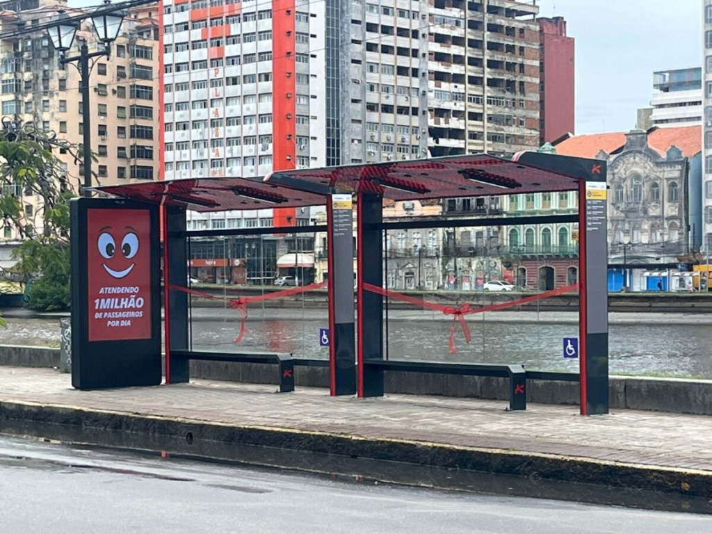

# Fetiche da Tecnologia 2

{{#embed https://www.youtube.com/watch?v=yIC5a1npELE }}

#### Exemplos:

- Inteligência Artificial
  - Dia sim e dia também no canal
  - "A AGI vai revolucionar o avanço da ciência"
  - Os modelos, por serem 'caixas pretas' são os que mais incorporam o misticismo por trás do conceito
- Criptomoedas, NFT, Metaverso, etc...

  

  

- Criptoanarquia / Cypherpunks
  - Hal Finney, mesmo sendo um ancap fez a crítica: "Eu não estou no Cíberespaço agora, eu estou na California"
  - "Confie na matemática, não nas pessoas"
- "A Inovação Tecnológica meo"
  - O Datacenter de Eldorado do Sul
- Investimento em 'inteligência' para segurança

  <https://www.intercept.com.br/2023/07/31/reconhecimento-facial-na-bahia-custearia-um-hospital-e-mil-ambulancias-com-uti/>

  {{#embed https://www.youtube.com/watch?v=lHtocbq47o4 }}

- Tecnologia para educação
  - 1 laptop per child
  - Acesso a computadores, tablets e internet nas escolas
  - [__https://educador.brasilescola.uol.com.br/noticias/escolas-publicas-do-rs-adotam-chromebooks-como-ferramenta-de-aprendizagem.htm__](https://educador.brasilescola.uol.com.br/noticias/escolas-publicas-do-rs-adotam-chromebooks-como-ferramenta-de-aprendizagem.htm)
- Paradas de ônibus gamer

- O mercado de TI que aparentemente é descolado dos outros (vagas infinitas, salários altíssimos, etc...)
- Só queremos participar da nossa comunidade de gamers/desenvolvedores sem nos envolver com política

Notem que na maioria dos exemplos existe um foco na tecnologia, uma inversão de causa e consequência, e uma remoção do que deveria ser o nosso foco.

Ao invisibilizar o que é necessário para construir a tecnologia e como ela interage com nosso dia a dia nos integramos 'sem alternativa' às dinamicas do extrativismo digital dos centros econômicos ou o 'colonialismo digital'.

> "... os territórios nacionais se transformam num espaço nacional da economia internacional e os sistemas de engenharia mais modernos, criados em cada país, são mais bem utilizados por firmas transnacionais que pela própria sociedade nacional." - Milton Santos, A natureza do espaço: técnica e tempo, razão e emoção (São Paulo, Edusp, 2002).
>
> <https://outraspalavras.net/outrosquinhentos/para-hackear-o-colonialismo-e-o-racismo-digital/>

Por exemplo dizer "essa ferramenta é neutra, depende do uso que fazemos" pode também nos levar a um erro já que tecnologias são criadas num contexto social e para um propósito específico. Ex.: agrotóxico

Se a tecnologia está removida da sociedade, pairando por cima das relações sociais, é possível investir em tecnologias de maneira "neutra" e "técnica". O erro, ou a mentira, no cerne desse pensamento é provavelmente o tema principal do canal Tecnologia e Classe
