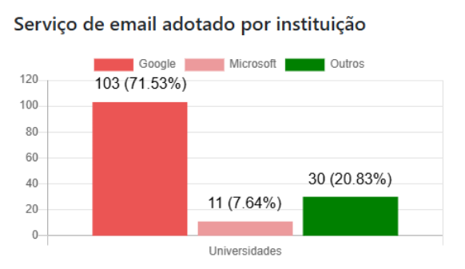

# FIOCRUZ perde 98% do espaço que tinha em nuvem da Microsoft

Uma mudança de contrato da nuvem da Microsoft é responsável pela FIOCRUZ perder 98% do espaço que tinha contratado. Soberania digital?

- Vocês devem lembrar da Fiocruz, a Fundação Oswaldo Cruz. Especialmente da época da pandemia. É uma instituição brasileira da área da saúde. 

<https://fiocruz.br/>

- Eles têm editora própria, instituição de ensino, pesquisa, laboratórios, estatísticas de saúde, combatem agrotóxicos e batem no agro com muita frequência e com muita pesquisa.
- É muito importante na história do Brasil, e é um dos dois únicos laboratórios de vacinas pra humanos do país (vacina pra bois tem mais de 30 fábricas).
- O volume de material digital que eles precisavam dependia de um contrato de 30 petabytes.
- Eles tinham um contrato com a Microsoft pra acessar esse tanto de armazenamento pro sharepoint, one drive, e-mails e tudo deles.
- O contrato da Fiocruz assinado em 2024 era com a Brasoftware no valor de 8,6 milhões ao ano. Desses milhões, 4,7 eram de licenças de serviços de educação da Microsoft.
- No próprio ano de 2024 a Microsoft mudou a política da empresa, provavelmente naquela leva quando o governo Trump foi eleito, e decidiram mudar esses contratos da educação
- Aí, no ano passado, esse valor do contrato pulou de R$ 8,6 milhões para R$ 11,6 milhões.
- Essa reportagem do Núcleo Jornalismo levantou que em 2024 o núcleo de TI da Fiocruz já tava preocupado com a dependência desses softwares e a urgência de fazer essas renovações contratuais

  [__https://nucleo.jor.br/reportagem/2026-03-19-mesmo-com-contrato-milionario-microsoft-reduziu-armazenamento-da-fiocruz-em-98/__](https://nucleo.jor.br/reportagem/2026-03-19-mesmo-com-contrato-milionario-microsoft-reduziu-armazenamento-da-fiocruz-em-98/) 

- Resumo da ópera: com essas mudanças e os preços caríssimos, o armazenamento deles foi de 30 petabytes pra 730 terabytes (redução de 98%)
- A Fiocruz não é a única afetada por essas políticas
- As universidades federais do Ceará, a rural de Pernambuco, a do Paraná, todas tiveram problemas com esses contratos com Microsoft e Google também

<https://www.digital.ufrpe.br/noticias/reducao-limite-ondrive>

<https://ufpr.br/agtic/2025/10/06/implementacao-de-novas-cotas-de-armazenamento-no-microsoft-365-a-partir-de-10-10-025-ufpr>

- Além das SEDUCs (secretarias de educação) de SP e GO
- Tem um site que chama Observatório da Educação Vigiada

  [__https://educacaovigiada.org.br/pt/mapeamento/americadosul/__](https://educacaovigiada.org.br/pt/mapeamento/americadosul/)

- Que mapeia a dependência dessas bigtechs no setor da educação universitária (e da pesquisa) na América Latina e África
- E nesse levantamento, 80% das universidades brasileiras dependem de armazenamento da Google ou Microsoft
- Só o google tá em 71% dos serviços de e-mail delas

- No ensino básico esse número cai pra 50% de dependência das GAFAM
- Mas tudo isso é reflexo de uma falta de estratégia de soberania nacional
- No ano passado o OP publicou um texto sobre como a Serpro tá dependendo de parceria com essas big techs estrangeiras pra construir a tal “nuvem soberana”

[__https://outraspalavras.net/tecnologiaemdisputa/serpro-brasil-esta-vendendo-sua-soberania-digital/__](https://outraspalavras.net/tecnologiaemdisputa/serpro-brasil-esta-vendendo-sua-soberania-digital/)

- E temos vídeo no canal também:

{{#embed https://www.youtube.com/watch?v=I199AmrsfQY }}

- O que só contribui pra situações semelhantes a essa da Fiocruz
- Todos os dados e as pesquisas da Fiocruz, sobre agro inclusive, sobre incidência de doenças, tudo já tava nas mãos das empresas estadunidenses
- E agora as próprias bases nacionais, supostamente soberanas, vão por esse caminho
- O que aconteceu foi também um processo de cercamento do capital monopolista
- Google e Microsoft ofereceram as ferramentas a um custo mais baixo de início, e uma vez que todos estão dependentes, eles controlam o fluxo de dados mas também os preços
- Aí caberia à estratégia do governo fazer com que houvesse disseminação de uma boa alternativa nacional
- E essa história toda também aponta pra crises e escassez de armazenamento que a gente já tem visto há um tempo
- E como uma parte tão grande dos servidores é controlada por um país em guerras eternas, cabe a eles escolher o que vai ou não vai caber na internet do futuro de acordo com os interesses deles mesmos
- E tudo tem apontado pra priorizar tecnologias e dados de guerra mesmo e, obviamente, colocar educação de país subalterno em segundo plano
- Ainda mais se essa educação for minimamente subversiva ao capital
- Então eu pergunto pra vocês: pra quem vai ser restrita a internet no futuro próximo?
