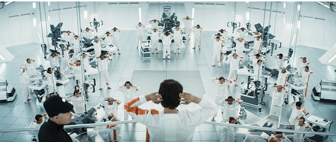

# O "futuro" do trabalho?

<https://www.404media.co/email/b7eb2339-2ea1-4a37-96cc-a360494c214c/?ref=daily-stories-newsletter>

- Vamos começar por esse vídeo de 'pitch' da empresa [Optifye.ai](http://Optifye.ai)

- Os fundadores Vivaan Baid e Kushal Mohta deixam claro que suas famílias são donas de fábricas e, desde jovens, estão acostumados a supervisionar linhas de montagem
- O plano de negócios é a venda de câmeras com tecnologia de visão computacional que integra com esses dashboards lindíssimos
- A YCombinator é uma acelerado de startups da Californiae investe na companhia e depois de postar esse vídeo e parabenizar os fundadores pelo lançamento sofreu muitas críticas e deletou o tweet

**Página no YCombinator:** <https://archive.is/Qu09c>

#### Isso não é uma novidade...

{{#embed https://www.youtube.com/watch?v=dHcxTmU6atk}}

- Essa é uma das duas maneiras de alcançar a 'exploração perfeita' do trabalho
  - Uberização: você só trabalha enquanto está realizando uma tarefa uberizada
  - Monitoramento: a sua performance é medida perfeitamente e você pode ser pago apenas pelo 'tempo efetivo' de trabalho
- Isso não lembrou vocês disso?

  
- Ou disso?

  
- Ou quem sabe disso?

  > Enquanto os trabalhadores dirigissem o processo de trabalho, Taylor sustentou, eles nunca realizariam “um dia de trabalho justo” — que ele definiu, naturalmente, como a quantidade máxima que eles poderiam executar sem lesão.

Desse texto: <https://jacobin.com.br/2023/07/o-que-um-classico-marxista-pode-nos-ensinar-sobre-ia/>

- Ou  talvez isso?

  > O capital ultrapassa não apenas os limites morais, mas até mesmo os limites físicos máximos da jornada de trabalho. Ele usurpa o tempo para o crescimento, desenvolvimento e manutenção saudável do corpo. Ele rouba o tempo necessário para o consumo de ar fresco e luz solar.

- Isso é um lembrete que a tecnologia não é inerentemente boa ou ruim, porém o avanço tecnológico "apartado" da luta de classes só pode acabar nisso.
