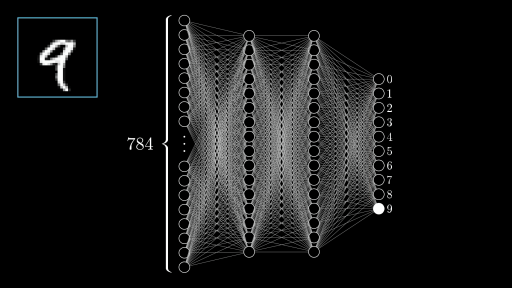

# A construção dos modelos de IA generativa

Nesta palestra para a Liga Acadêmica da Faculdade de Direito de Alagoas, eu discuto
como se deu a criação dos populares modelos de IA generativa e as problemáticas por
trás deles.

### Quem sou eu?

- Lucas Fialho Zawacki
  - Líder técnico na Mconf
  - Militante do coletivo Soberana
  - Host do canal Tecnologia e Classe
- Formado pela UFRGS em Ciência da Computação

#### Um brevíssimo panorama da pesquisa em IA:

##### 1\. O que é um computador?

- Eu gosto de pensar numa calculadora glorificada e muito rápida
- Por meio de inputs/outputs podemos representar/interpretar uma diversidade de problemas como números
- O que é computável? Muita gente tentou responder, e é difícil

##### 2\. O que é inteligência artifical?

- Definir "inteligência" sempre foi algo muito difícil, então geralmente temos algumas maneiras de entender:
  - Humanos são o parâmetro: Assumimos que humanos possuem inteligência e algo que exibe comportamento humano seria inteligente. **Teste de Turing**
  - Modelo de ser racional, **simbólico**: Assumimos que um ser racional com um conjunto de informações terá um determinado comportamento "correto". Nesse caso um ser inteligente age de uma maneira "racional"
- O campo da inteligência artificial começa a se desenvolver na década de 1950 e um evento pivotal é a Dartmouth Conference, onde se cunha o termo.

- O modelo simbólico se mostrou muito promissor nos primeiros anos, mas a explosão combinatória de proposições lógicas e a necessidade de muitos dados de alta qualidade (**expert data systems**) e contradições e nuances nesses dados deixou o campo empacado em meados de 1980

### IAs generativas

- Durante os anos 2000 começa a se popularizar o uso das técnicas de **Machine Learning** para a construção de inteligência artificial. O nosso algoritmo tem um estado inicial e um estado final desejado e deve calcular esse "caminho" sem uma receita pré-estabelecida
  - Deepmind, comprada pela Google começa a usar o **Reinforcement Learning** para jogar diversos melhor que humanos.
  - Esse tipo de aprendizado geralmente é implementado com o uso de **Redes Neurais**

  
  - Dados são usados para criar essas redes, porém não **lógica** ou **simbólicamente**, mas baseado na **probablidade**
  - Um modelo baseado nesse tipo de dados e redes de conexões pode ser usado para prever o comportamente de dados inexistentes na rede

- Por meio de muita matemática e processamento a gente consegue aplicar esse processo a palavras e começam a aparecer os primeiros modelos 'preditivos de texto'.
  - Cadeias de Markov
  - "Dada uma palavra qual é a próxima?"
  - "Dada uma lista de palavras qual é a próxima?"
  - e etc...

- Em 2017 pesquisadores da Google publicam o artigo **"Attention Is All You Need"**. Esse trabalho é crucial para a criação dos modelos GPT
  - Antes modelos lidavam com a geração de cadeias de palavras uma a uma, agora elas podem lidar com a frase inteira de uma vez só enfatizando e sentidos entre elas

- Esse tipo de lógica pode ser usado para construir outros tipos de modelos, como por exemplo para geração de imagens que usam o que chamamos de 'modelos de difusão'

- Esse tipo de técnica tem sido a mais popularmente usada para criar modelos generativos de todo tipo de conteúdo: texto, áudio, imagens, vídeos e etc...
- O aspecto mais importante do tipo de saídas geradas por esses modelos é que elas parecem 'geradas por humanos' ou 'naturais' ou 'convincentes' o suficiente e por isso hoje modelos de IA generativos são o martelo da área... e absolutamente tudo é um prego

### O modelo de negócio das empresas de IA

- Em 2015 a OpenAI começa como uma organização **sem fins lucrativos**. Seu foco principal era promover a pesquisa aberta em IA, com a ideia de compartilhar descobertas para beneficiar a humanidade.
  - Porém em 2019 eles criaram uma estrutura mista de financiamento privado com "capped-profits" para atrair um maior número de investimentos
- Em 2022 o ChatGPT é lançado e em 5 dias alcança 1 milhão de usuários e em 2 meses 100 milhões.
  - Grande disponibilidade de dados. Decorrência do que Shoshana Zuboff chama de capitalismo de vigilância
  - Avanços científicos e tecnológicos
  - Disponibilidade de hardware (GPUs)
  - Investimento de big techs e bilionários

- Porém além dos dados e do processamento necessário para codificar as relações entre eles em uma rede neural, é preciso algumas coisas mais, feitas com muito trabalho humano:
  - Correção, catalogação e etiquetação dos dados
  - Avaliação e alinhamento dos resultados

- Quando a Amazon foi fundada o modelo deles era a catalogação e a digitalização de dados de milhões de livros, que muitas vezes estavam incorretos. A solução foi a terceirazação desse trabalho para milhares de pessoas. Isso eventualmente se tornou a plataforma 'Mechanical Turk' e diversas outras
  - Todas essas plataformas foram instrumentais para a organização do trabalho na IA
  - Geralmente trabalho intermitente, 'gig work', mal remunerado e feito em países do sul global
  - Scale AI, Appen, Microsoft, Google, Amazon, Palantir
  - Muitas vezes os dados/processos que geramos/efetivamos como usuários/trabalhadores dentro das plataformas também são usados como parte desse processo
- Hoje a base para a maior parte dos 'assistentes de IA' são esses modelos generativos. Eles estão 'auto completando' uma conversa em que eles ajudam alguém.
- A adição de pré prompts, memória de conversas passadas, outros modelos (modelos multimodais) e ferramentas (acesso a internet, documentos, gráficos, outros programas, ...) cria um comportamento emergente que acaba por ser muito mais do que simplesmente um 'papagaio estatístico'

#### Mas que dados estão lá mesmo?

- O que nós sabemos é que esses modelos de IA treinaram em:
  - Todo texto da internet pública
  - Todos livros em domínio publico
  - Livros vendidos comercialmente (?)
  - Jornais e revistas (?)
  - Programas de TV, vídeos no YouTube (?)

##### Os datasets books3 e outras piratarias:

<https://www.wired.com/story/battle-over-books3/>

<https://www.businessinsider.com/anthropic-cut-pirated-millions-used-books-train-claude-copyright-2025-6/>

<https://arstechnica.com/tech-policy/2025/02/meta-torrented-over-81-7tb-of-pirated-books-to-train-ai-authors-say/>

#### O caso do LAION-5B

<https://cyber.fsi.stanford.edu/news/investigation-finds-ai-image-generation-models-trained-child-abuse>

<https://arstechnica.com/information-technology/2022/09/artist-finds-private-medical-record-photos-in-popular-ai-training-data-set/>

#### O processo da NYT X OpenAI

- O cerne do processo é dividido em 2 partes:
  - A OpenAI não tem permissão legal para usar os textos do New York Times para construção do seu modelo
  - O modelo é capaz de gerar trechos ou até artigos inteiros verbatim do que está presente no NYT (**regurgitação**)
- Nesse tipo de processo o que geralmente é invocado como defesa é a doutrina do 'fair use':
  - É usado apenas uma parte do conteúdo e não todo ele
  - É um trabalho transformativo e que não substitui o original
- Se perguntarem pra mim as empresas de IA estão prontas pra ignorar essa questão ad infinitum
- A maioria das editoras parecem ter em mente uma espécie de taxa ou trato para licensiamento do conteúdo

### Sobre IA e trabalho

- Repetidas vezes a ênfase nos problemas éticos da IA é posta no 'roubo' de dados
- É possível pensar também no 'roubo' de incontáveis horas de trabalho que foi usada para criar estes modelos
- A IA, como a automação do trabalho, cria uma dinâmica no nosso mercado de trabalho que tende à precarização do trabalho
  - "Mercado de Trabalho"
  - Mais trabalho, feito por menos pessoas
  - Menos trabalhadores são necessários, custo do trabalho desce
  - O custo do trabalho é o seu salário
- As ferramentas modificam nosso trabalho, deslocam o foco para outras esferas... o que a IA faz com a sua profissão?
- É possível fazer o seu trabalho hoje sem depender dessas ferramentas?
  - É desejável? (por seu chefe?)
  - É apenas questão de se adaptar?
  - Quem controla essas ferramentas?

**Recomendação de vídeo?**

{{#embed https://www.youtube.com/watch?v=3BFeJM480js }}

#### Sugestões para debate

- Se você entendeu melhor como essas ferramentas funcinam, isso muda como você enxerga elas?
- Como você usa essas ferramentas no seu dia a dia?
- Como podemos pensar a legislação dessas ferramentas?Vocês acreditam que haverão empecilhos legais para o uso desses modelos no futuro?
- Por que essas ferramentas vem primariamente dos EUA, China e um pouquinho da Europa?

### Referências

<https://www.3blue1brown.com/topics/neural-networks>

<https://ainowinstitute.org/publications/ai-generated-business#h-from-safe-ai-to-agi-nbsp-and-the-hype-led-business-model-genesis>

{{#embed https://www.youtube.com/watch?v=BQTXv5jm6s4 }}

{{#embed https://www.youtube.com/watch?v=1pgiu--4W3I }}

{{#embed https://www.youtube.com/watch?v=ZrIsqjfg1_I }}

{{#embed https://www.youtube.com/watch?v=9ubrRYssxCM }}

### Lista não exaustiva de processos sobre IA generativa.

<https://www.wired.com/story/ai-copyright-case-tracker/>

📚 **Textos e Livros**

* **Autores vs. OpenAI e Microsoft** – 2023
* **The New York Times vs. OpenAI e Microsoft** – 2023
* **Sarah Silverman vs. OpenAI e Meta** – 2023
* **The Intercept, Raw Story e AlterNet vs. OpenAI e Microsoft (DMCA)** – 2024

🖼️ **Imagens e Mídia**

* **Artistas vs. Stability AI, Midjourney e DeviantArt** – 2023
* **Getty Images vs. Stability AI** – 2023
* **Disney e Universal vs. Midjourney** – 2025

🎙️ **Voz e Direitos de Imagem**

* **Dubladores vs. Lovo Inc.** – 2024

🔐 **Segredos Comerciais e Marcas**

* **Perplexity Solved Solutions vs. Perplexity AI (marca)** – 2025
* **iyO Inc. vs. OpenAI, Jony Ive e ex-executivo** – 2025

💻 **Código e Software**

* **Desenvolvedores vs. GitHub Copilot (OpenAI & Microsoft)** – 2022

🎵 **Música e Produção Musical**

* **Gravadoras (RIAA) vs. Suno e Udio** – 2024
* **Editoras Musicais vs. Anthropic (Claude)** – 2023
* **Artistas Independentes vs. Suno e Udio (ação coletiva)** – 2025
