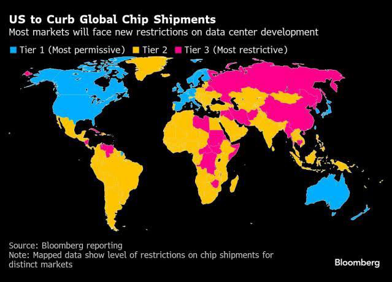
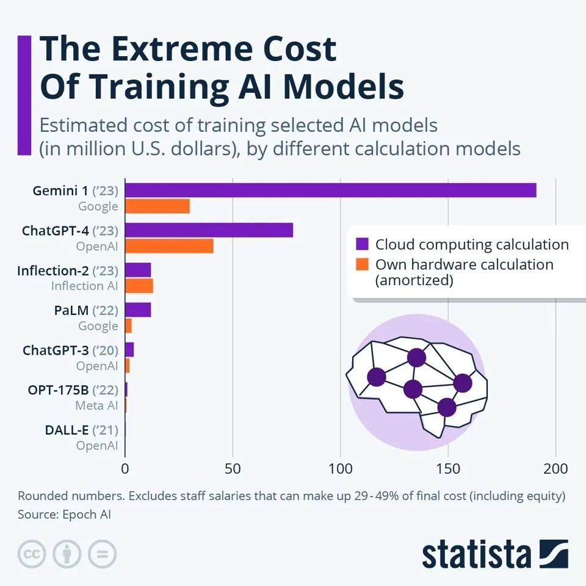
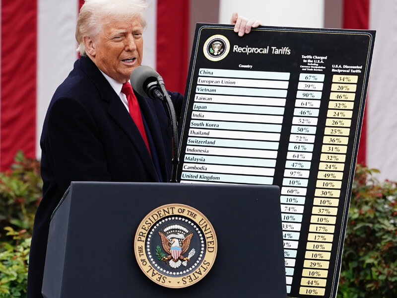
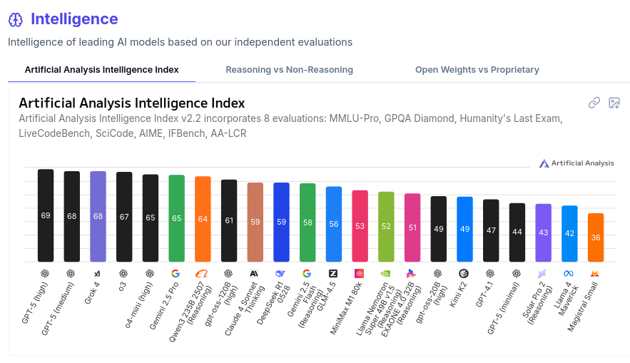
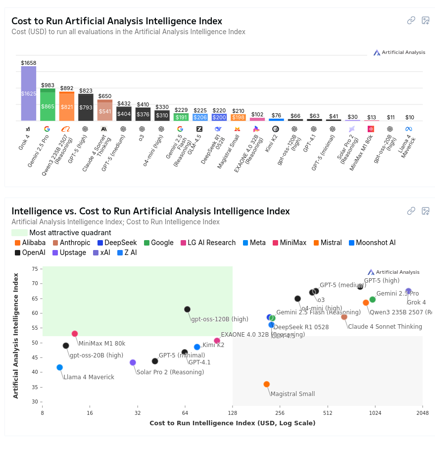

# A Geopolítica da IA 2025/02

Nesta palestra para os alunos do IFRS Canoas nós damos uma atualização sobre como anda a corrida pela IA entre EUA e China no segundo semestre de 2025.

### O que é um computador?

- Eu gosto de pensar numa calculadora glorificada e muito rápida
- Por meio de inputs/outputs podemos representar/interpretar uma diversidade de problemas como números
- O que é computável? Sei lá cara, todo dia isso KKKKKKKK

### O que é inteligência artifical?

- Definir "inteligência" sempre foi algo muito difícil, então geralmente temos algumas maneiras de entender:
  - Humanos são o parâmetro: Assumimos que humanos possuem inteligência e algo que exibe comportamento humano seria inteligente. **Teste de Turing**
  - Modelo de ser racional, **simbólico**: Assumimos que um ser racional com um conjunto de informações terá um determinado comportamento "correto". Nesse caso um ser inteligente age de uma maneira "racional"
- O campo da inteligência artificial começa a se desenvolver na década de 1950 e um evento pivotal é a Dartmouth Conference, onde se cunha o termo.

- O modelo simbólico se mostrou muito promissor nos primeiros anos, mas a explosão combinatória de proposições lógicas e a necessidade de muitos dados de alta qualidade (**expert data systems**) e contradições e nuances nesses dados deixou o campo empacado em meados de 1980

### IAs generativas

- Durante os anos 2000 começa a se popularizar o uso das técnicas de **Machine Learning** para a construção de inteligência artificial. O nosso algoritmo tem um estado inicial e um estado final desejado e deve calcular esse "caminho" sem uma receita pré-estabelecida
  - Deepmind, comprada pela Google começa a usar o **Reinforcement Learning** para jogar diversos melhor que humanos.
  - Esse tipo de aprendizado geralmente é implementado com o uso de **Redes Neurais**
  - Dados são usados para criar essas redes, porém não **lógica** ou **simbólicamente**, mas baseado na **probablidade**
  - Um modelo baseado nesse tipo de dados e redes de conexões pode ser usado para prever o comportamente de dados inexistentes na rede

- Em 2017 pesquisadores da Google publicam o artigo **"Attention Is All You Need"**. Esse trabalho é crucial para a criação dos modelos GPT

- Em 2015 a OpenAI começa como uma organização **sem fins lucrativos**. Seu foco principal era promover a pesquisa aberta em IA, com a ideia de compartilhar descobertas para beneficiar a humanidade.
  - Porém em 2019 eles criaram uma estrutura mista de financiamento privado com "capped-profits" para atrair um mair número de investimentos
- Em 2022 o ChatGPT é lançado e em 5 dias alcança 1 milhão de usuários e em 2 meses 100 milhões.
  - Grande disponibilidade de dados. Decorrência do que Shoshana Zuboff chama de capitalismo de vigilância
  - Avanços científicos e tecnológicos
  - Disponibilidade de hardware (GPUs)
  - Investimento de big techs e bilionários

**Esse vídeo aqui tem essa história em muito mais detalhes:**

{{#embed https://www.youtube.com/watch?v=BQTXv5jm6s4}}

**No meu canal nós temos essa palestra indo para o lado mais têcnico:**

{{#embed https://www.youtube.com/watch?v=iz9TbUdf8MQ}}

### IA ao estilo EUA

- A OpenAI inaugurou essa nova era do desenvolvimento de "IA".
  - Modelos generativos
  - Utilizando volumes enormes de dados
  - Cada vez mais hardware para processamento de treinamento e inferência.
  - Foco em modelos privados para vantagem competitiva
  - Pesquisas "abertas" porém liberadas com atraso
  - Investimento de dinheiro massivo e propriedade privada

- Existe essa visão que as tecnologias de IA são uma poderíssima ferramenta para o desenvolvimento tecnológico (parece com como a criptografia já foi vista) e a sua exportação é **perigosa**

- Então no governo Trump 1, Biden e Trump 2 baseado numa tendência de embargos dos EUA à China (Huwaei, DJI, Dahua, **TikTok**, veículos elétricos) também se formou o **Framework for Artificial Intelligence Diffusion**
  - Restrição de exportação de chips com uma quantidade de *compute* acima de um limiar
- A ideia era que o hardware acessível aos EUA e seus aliados estaria sempre 2 anos à frente dos seus **competidores**

### Mas isso não impediu o Deepseek...

- Um LLM, baseado em mixture of experts e com hablidade de 'raciocínio' e performance similar ou as vezes superior que os modelos Chat GPT o1 e Gemini
- Isso tudo ao mesmo tempo que é um modelo de código aberto. Isso quer dizer, os pesos resultado do treinamento. Porém também foi lançado um artigo explicando como ele funciona e foi treinado
- Disponível portanto para ser analisada, estudada e adaptada por outras empresas e entusiastas da área. Além de ser rodada localmente (como os modelos LLama e Mistral por exemplo)
- Criado por uma startup financeira chinesa que tinha diversas GPUs sobrando e queria achar um uso para elas

#### Tá custando quanto?

- O custo de processamento do modelo da Deepseek é muito menor. Mais rápido com o mesmo equipamento OU menos equipamento para a mesma performance
- Custo das chamadas de API para o serviço da Deepseek é 96% mais barato que os competidores, como por exemplo a OpenAI.
- O custo de treinamento teria sido de apenas **6 milhões de dólares**. Para comparação o ChatGPT 4 é estimado custar entre 41 a 78 milhões, embora o Sam Altman tenha dito, mais de 100 milhões.
- GPT-5 provavelmente custou muito mais, porém eu só encontrei dados sem fonte (de U$500mi a U$2bi então não dá pra levar muito a sério)
- Elon Musk anunciou um data center para treinamento do Grok na faixa de 4bi e com o Stargate anunciado a alguns dias pelo governo dos EUA prometeu 500bi para o setor de IA.
  - Muito se falou que esse custo de treinamento deveria estar sendo subsidiado ou que a China tem 'GPUs secretas', mas os modelos e a pesquisa estão aí para serem validados.

- Uma parte importantíssima do white paper do Deepseek é a explicação do treinamento de racicínio
  - Uso de dados sintéticos: outros modelos são apresentados com perguntas e soluções e constroem raciocínios para resolvê-los
- É explicado o método do destilamento de modelos. Um modelo 'professor' faz o fine tuning de um modelo 'aluno' apenas com dados de alta qualiade
  - Lançaram algumas destilações do deepseek r1 em modelos da qwen

    É um método que está sendo muito adotado agora e abre caminho para o 'destilar e amplificar'

{{#embed https://www.youtube.com/watch?v=MehfqW9lgYA}}

### Os EUA contra ataca

- Como todo mundo já deve ter ouvido falar, rolou aquela coisa do tarifaço do Trump

  

- O maior alvo das tarifas era a China e o plano era que rolassem tarifas recíprocas mesmo. A ideia era isolar a China dos seus parceiros comerciais
- A China trucou e aos poucos o Trump foi voltando atrás de cada uma das tarifas até o que temos agora
- Veio à baila o papo de terras raras, necessárias para a produção de componentes eletrônicos, os quais a China tem quase um monopólio do refinamento

### A diretiva para desenvolvimento da IA dos EUA

- Regulamentação de IA (ou NÃO regulamentação de IA). Nada de IAs 'woke' (leia-se 'não alinhada com os valores morais conservadores') e pressionar estados e países que tentarem regulamentar IA
- Expeditar a legislação ambiental pra construção de mais data centers. Garantir mais recursos naturais e energéticos para big techs
- Mais restrições contra a China e aceleração do ritmo do desenvolvimento. Corrida pela IA
- Contratos milionários para as big techs dos EUA
- Lá no finalzinho do documento: segurança dos modelos de IA, fomentar pesquisa e modelos abertos

{{#embed https://www.youtube.com/watch?v=BLV_ALEdOPk}}

### ChatGPT-5 e gpt-oss

<https://openai.com/index/introducing-gpt-oss/>

- O ChatGPT-5 foi decepcionante? Depende do que estamos prestando atenção.
  - Modos diferentes de racicínio (nenhum, médio, alto)
  - Supostamente mais segurança e respostas "seguras" para prompts perigosos
  - Melhor integração com o uso de ferramentas
  - Muito marketing, apresentação tipo Apple

- Junto com ele temos o primeiro modelo aberto desde 2019 (gpt-2) o gpt-oss
  - Pesos abertos e não software aberto. Não sabemos direito COMO ele foi feito, mas temos os pesos
- Este modelo é muito pequeno e eficiente e foi muito bem em todos os testes mais comuns. Porém ele parece ter muito menos 'conhecimento geral' do que outros modelos.
- Pesquisadores estão se perguntando se seria o gpt-oss um modelo estilo dos Phi-N da Microsoft?
  - Dados sintéticos e de alguns domínios específicos STEM. Permite ele ir bem nos testes, mas não entrega o ouro da OpenAI
  - Provavelmente não será útil para fine tuning e não terá problemas com direitos autorais
- Mas o Deepseek não parece estar parado. Desde a primeira vez que eu fiz essa palestra o Deepseek R1 teve 1 atualização que melhorou um pouco o modelo, mas não fez um grande estardalhaço
- Todo mundo está esperando a versão R2, mas ela foi atrasada:

<https://deep-seek.chat/news/deepseek-r2-roadmap/>

<https://www.reuters.com/world/china/deepseek-r2-launch-stalled-ceo-balks-progress-information-reports-2025-06-26/>

- Boatos de que ela foi atrasada para causar um maior impacto. Também se fala que pode ser mais barata para rodar e será baseada nas arquiteturas de GPU da Huawei. HUGE IF TRUE
- Não esquecer dos modelos qwen da Alibaba que tem performado muito bem e vem comendo pelas beiradas

Os benchmarks estão assim hoje (não levem tão a sério)

#### Vulnerabilidade da China na corrida

- A China está supostamente alguns meses ou anos atrás em desenvolvimento tecnológico do que os EUA
  - Muito difícil de acompanhar o que se passa (mistura de barreira da língua com tendenciosidade da nossa mídia)
- A China depende ainda das cadeias produtivas de chips controladas pelos EUA e aliados: TSMC (Taiwan), Coréia do Sul, Japão e Holanda
  - Mesmo para os Huawei Ascend 910C que usa chips da TSMC
- Existem projetos voltados à diminuição dessa dependência
  - **Ascend 910C**: Aceleradores de IA próprias (para substituir a dependência nos chips mais antigos da NVIDIA que eles tem acesso)
  - Projetos de rack compartilhado como **Huawei CloudMatrix 384**

#### Como juntar bilionários, big tech e "populismo"? R: China

- Os EUA tem um problema hoje e ele se chama **neoliberalismo**
- Desde a desregulamentação da economia e o desmonte das suas manufaturas o que se viu foi um fluxo de suas indústrias para além mar: China, Vietnã, Camboja, Singapura...
- Isso foi ruim para os Estado Unidos? Não e quem nos explica é a teoria marxista da dependência
  - Nós vendemos café in natura e compramos iPhone
  - Eles vendem iPhones e tomam o melhor café do mundo
- Só que eles podem até vender o iPhone, mas quem fabrica o iPhone é o Chinês que recebe numa moeda desvalorizada em relação ao dólar
  - A criação do "Designed in California / Made in China"
- Acontece que a China soube aproveitar essa situação a seu favor e fez uma transferência tecnológica "na marra" e agora o produto Chinês não é mais sinônimo de "cópia de baixa qualidade"
- Então a desindustrialização dos EUA é culpa de quem? Dos industriais que lucraram com a destruição da classe média estadunidense? Não, é convenientemente da China e dos imigrantes!
- Obviamente racismo, xenofobia, orientalismo são o temperinho que finaliza o sabor desse caldo
- Ao mesmo tempo que isso as big techs se acomodam ao lado do Trump em busca de vantagens e subsídios para seus produtos, se posicionando como 'as jóias da coroa' tecnológica dos EUA
- Isso se expressa no último vexame que foram as tarifas do Trump contra o Brasil. Eles falaram do Bolsonaro, mas grande parte dos relatórios que foram usados falavam do PIX, LGPD e regulamentação das redes sociais.
- A moralização da política e a guerra cultural servem para avançar as pautas da extrema direita.
  - Pela liberdade de expressão. Contra IA 'woke', pautas de gênero, teoria crítica racial e toda essa baboseira. Serve para impedir a regulamentação
  - O ambientalismo é colocado como 'contra o progresso' e atrasando os EUA que precisam desenvolver a sua indústria tecnológica: "build baby build"
  - "EUA primeiro" justifica o domínio deles sobre outros países (como nós da América Latina) e a exploração de nossos recursos naturais (e nossos DADOS)

- Essa é a fina corda bamba que equilibra uma coalisão de bilionários, big techs e trabalhadores na chapa de Trump e JD Vance

**Como os EUA usam a China de bode expiatório pra todos seus problemas:**

{{#embed https://www.youtube.com/watch?v=ywmpea6vvOE}}

### Coisas para a gente discutir

- Qual o papel do Brasil nessa disputa?
- Meio ambiente e datacenters no sul global (Eldorado do Sul)
- Relatório IA 2027
