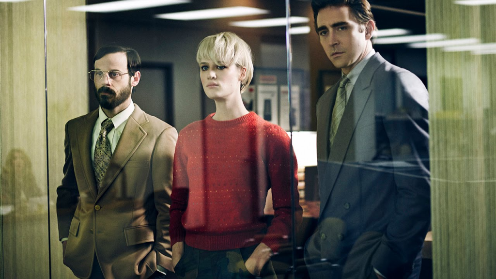

# Recomendação de série: Halt and Catch Fire

- Essa série é um novelão que se passa no início dos anos 80 em Dallas/Texas (e com o decorrer das temporadas avança até a década de 90 e se move para a California)

- É um 'workplace drama', onde nós seguimos o dia a dia de trabalho de um núcleo de 4-5 personagens e os seus romances, conflitos, sofrimentos e etc...
  - A série foi planejada para ocupar um nicho parecido com 'Mad Men' e faz bastante sentido
- Mas ok, porque eu estaria recomendando essa série pra vocês no canal de tecnologia e política? **A série é uma romantização do nascimento da indústria de computaçao nos EUA.** E é boa!
- É maestral a maneira como eles conseguem incorporar eventos reais como o clone do IBM PC pela Compaq, o surgimento dos provedores de internet, sistemas operacionais comerciais e com GUI, vírus (e antivirus) numa história cativante e que é um drama sobre a vida dos personagens
- Eu não sou especialista nesse tipo de produçao, mas fiquei imaginando se o formato de sitcom onde os personagens começam num lugar, passam por um conflito e acabam no mesmo lugar pra semana que vem pra fazerem tudo de novo, não seria um pequeno modelo do nosso dia a dia vendendo trabalho.
  - Essa série, parecido com outras séries de hospital e onde os personagens tem como pano de fundo o tique taque do relógio e me fez pensar como a vida pode ser uma corrida desesperada pra acabar sempre no mesmo lugar: amanhã eu tenho que trabalhar  

- Mas voltando à série, os personagens são profundamente falhos como pessoas e é realmente difícil 'amar' eles. Porém provavelmente isso que faz a parte 'novelão' ser tão interessante.
  - Na primeira temporada a gente segue o núcleo Gordon, Joe e Cam trabalhando num produto concorrente ao IBM PC
  - A duplinha Joe McMillan e Gordon lembra muito o Steve Jobs / Steve Wozniak
  - A Cameron Howe começa como uma espécie de mescla de super nerd dos compiuter, punk rock, rebelde e descolada que parece a protagonista de algum filme genérico sobre computadores, mas o crescimento é bem interessante. Me parece que se inspiraram na desenvolvedora de jogos Roberta Williams mais pra frente.
- Na real todos personagens parecem que começaram a ser escritos a partir de esterótipos. Gordon Clark é um engenheiro tímido e incompreendido e Joe McMillan é um típico 'homem de negócios', um psicopata americano, que faria qualquer coisa para ficar rico. Ou será?
- Porém a gente descobre que embora eles estejam sempre em conflito entre si e sejam fundalmentalmente infelizes: o que move esses personagens é o desejo de criar, ou inovar ("você constrói Gordon, não deixe eles tirarem isso de você").

- Isso nem sempre é tão glamuroso ou lucrativo como parece e durante a série a gente vê o jogo sujo das grandes corporações a cada passo engolindo o trabalho dos 'sonhadores' como Joe McMillan.
- Joe é legitimamente um psicopata e um narcisista, que faria qualquer coisa pra conseguir o que quer. Mas ele age como uma espécie de visionário que está sempre analisando as tendências do mercado e procurando onde poderia vir a nova grande 'disrupção', o que é divertido pra gente que sabe como as tecnologias evoluiram.
- O que é divertido nessa série é ver a história do desenvolvimento do hardware, depois software, sistemas operacionais, internet... contada de uma perspectiva de quem estava 'metendo a mão na massa' e não de quem estava ganhando muito dinheiro, esses parecem os vilões
- Não é uma obra prima do drama, nem uma denúncia ao sistema capitalista, mas é uma série bem acima da média sobre um assunto tão interessante e difícil de estudar. É um passado muito próximo que parece quase alieníngena porque a tecnologia da informática evoluiu tão rápido.

- Como bônus eu diria que uns 80% das partes que tocam em assuntos técnicos, demonstram alguma linguagem de programação e coisas assim estão corretas. Claramente eles fizeram o tema de casa.

- Como bônus 2 a trilha sonora é belíssima.
