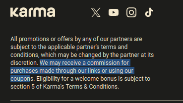

# Como a Honey roubou todo mundo

##### Tudo começou com um vídeo:

{{#embed https://www.youtube.com/watch?v=vc4yL3YTwWk}}

- O que é a Honey?
- O Youtuber **Megalag** fez uma investigação sobre o modelo de negócios da extensão de browser e descobriu o descreve como 'um esquema sinistro'
- Minha experiência com a Honey foi a de nunca achar nenhum cupom com ela e desinstalar por já estar desconfiado de que é apenas um esquema de coleta de dados. Porém o que esse vídeo demonstra faz muito mais sentido...
- Basicamente a Honey é acusado de prejudicar criadores de conteúdo:
  - Substituir a atribuição de links de afiliados pela sua se a extensão for usada para procurar um cupom (mesmo que não exista cupom). Assim roubando a comissão de quem originalmente referenciou o produto
  - Mesmo quando não exista cupom (e nenhum motivo para ativar o Honey) se você usa o cashback (Honey Gold / Paypal Rewards) ele rouba a comissão. No exemplo dele uma compra com comissão de U$35 roubada pelo Honey retorna pro usuário U$0.89
  - E mais: mesmo sem usar cupoms e cashback qualquer interação com a extensão do Honey gera a sobrescrita da atribuição
- Esse modelo de negócios é irônico porque a Honey gasta ostensivamente em propaganda da sua extensão entre criadores de conteúdo que também tem como fonte de renda links de afiliado. Porém ela rouba TODOS os links de afiliado do navegador usando, não apenas os dos criadores
- Ela faz isso por uma mistura de modificação da URL original e dos cookies que indicam o site original que te rerenciou essa venda. Um processo que é propositalmente obfuscado e análogo ao 'cookie stuffing'
  - Algo que é proibido pelos programas de afiliados e que é considerado 'fraude eletrônica' nos EUA
- O Honey também ganha dinheiro na outra ponta recomendando seus próprios cupoms prioritáriamente para usuários e firmando parcerias com lojas:
  - Por exemplo a Amazon poderia gerar um cupom HONEY10 para alguns produtos mesmo que existam cupons INFLUENCIADOR15 disponíveis e a extensão preferir esse
- Ele um podcast público da Honey com especialistas em vendas. Eles dizem que é assim que funciona. A vantagem da parceria é que a Honey pode recomendar menos cupons para os usuários
- Provando que o marketing que diz que você consegue as melhores ofertas é simplesmente mentira
- Megalag prometeu mais 2 vídeos sobre o assunto e na segunda parte parece implicar que o Honey estaria fraudando cupons de lojistas

#### Honey está sendo processada

{{#embed https://www.youtube.com/watch?v=4H4sScCB1cY}}

- A Honey hoje pertence e é operada pelo Paypal que comprou a compania por U$4 bilhões
- Talvez não seja a melhor estratégia do mundo tentar roubar dinheiro da classe que trabalha com divulgação de conteúdo hu3

#### Mas a Honey é a única extensão que faz isso?

- **PIE:** é uma nova extensão de browser com as mesmas funcionalidades, mais um sistema de adblock e liberação de ADs 'menos intrusivos' com recompensa de cashback
  - O nome parece tentar uma associação ao Pi Hole (sem relação)
  - Do criador da Honey
  - <https://www.pie.org/adblock>
- **Karma Now**
  - <https://www.karmanow.com/>

    
- **Capital One Shopping**
  - <https://www.capitalone.com/learn-grow/money-management/capital-one-shopping/>
- **Rakuten**
  - <https://www.rakuten.com/>
- **Retail Me Not**
  - <https://www.retailmenot.com/>
- **Slickdeals**
  - <https://slickdeals.net/>
- **Coupons.com**
  - <https://www.coupons.com/>

    
- **Méliuz**
  - <https://www.meliuz.com.br/>
- Outras no Brasil: **Zoom, Cuponomia, Picodi**

##### Será que os navegadores e lojas não vão querer fazer algo contra?

- Sim, porém as maiores lojas provavelmente tem contratos e acordos com essas extensões que não podemos imaginar
- Existe também uma possibilidade terrível que a Honey e similares possam usar sua base de usuários como chantagem contra lojas e outras plataformas

{{#embed https://www.youtube.com/watch?v=cN3tKgzb-dw}}

##### Concluindo:

- Quase tudo que ganha dinheiro na internet deve ser algum tipo de 'Honey'
- Muito se fala da merdificação em serviços de inscrição mas essa é uma evolução do modelo de negócios do intermediário
- A inovação agora é encontrar algum nicho lucrativo e se inserir forçadamente nele
- E podem ter certeza que ~~o crime~~ a inovação compensa

**Referências extras:**

<https://www.tecmundo.com.br/internet/401290-extensao-de-cupons-perde-3-milhoes-de-usuarios-com-acusacao-de-golpe-entenda-o-caso.htm>

<https://meiobit.com/465825/paypal-processo-golpe-extensao-honey/>

**Fundador da Honey falando sobre o PIE:**

{{#embed https://www.youtube.com/watch?v=S1qO7vn4Us8}}
