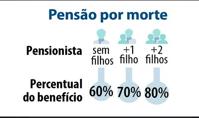
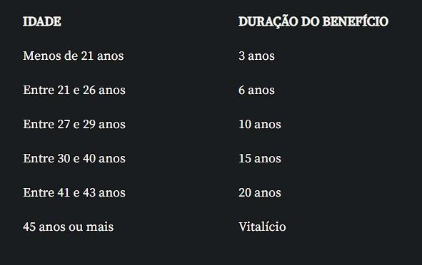
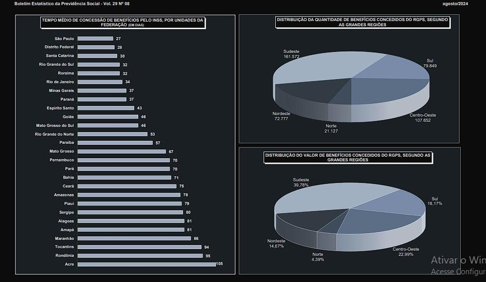
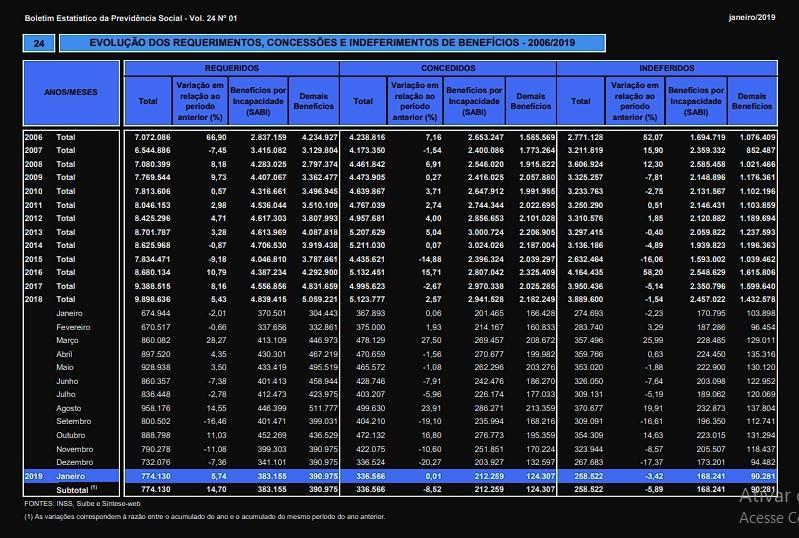
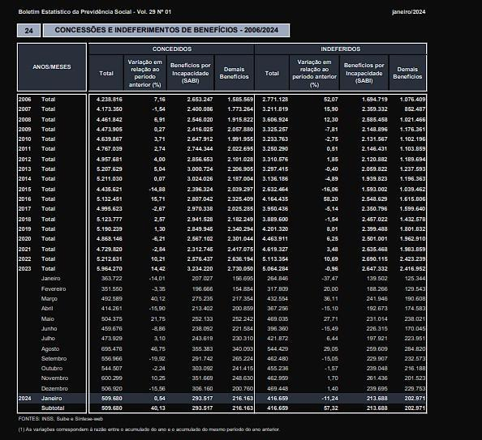

# Uso de IA no INSS

### Introdução

- Vamos falar sobre o impacto da Reforma da Previdência: a **EC 103/2019** e como ela se relaciona com o uso de Inteligência Artificial no INSS.
- Vamos falar de como isso afetou os números de pedidos de auxílio doênça e aposentadoria negados e o impacto na saúde física e mental da classe trabalhadora
- Constrastar da 'modernização' e 'corte de gastos' que um sistema tecnológico pode trazer para a administração pública com o aumento dos pedidos de revisão desses processos.
- É uma maneira de desmantelar a rede de seguridade social e roubar da nossa classe trabalhadora os direitos que supostamente estão na nossa constituição.
- Essa lógica neoliberal, com leis trabalhistas desmontadas e um moralismo na aplicação das regras não resolve o problema e acaba com a saúde e solidariedade da classe trabalhadora
- O problema da aposentadoria no capitalismo é insolúvel "matematicamente". A solução correta é: **simplesmente pagar.**

### Sobre a previdência social

- A Previdência Social é um direito fundamental. Mas mesmo sendo garantida pela “Constituição Cidadã”, faltam ferramentas para impedir ataques e desmontes sucessivos a esses direitos.
- A ideia inicial de usar inteligência artificial para avaliar benefícios previdenciários parece boa: resolver o acúmulo de pedidos e a falta de servidores. Mas por que faltam servidores? Na prática, isso acontece dentro de um contexto maior de sucateamento das estruturas públicas.
- O lobby de planos de previdência complementar aproveita esse cenário para parecer uma alternativa melhor, ainda que não seja acessível para a maior parte da população.
- A reforma **EC 103/2019** trouxe mudanças que cortaram benefícios e afetaram negativamente os trabalhadores do Regime Geral de Previdência Social (RGPS), como trabalhadores da iniciativa privada e MEIs.
- Antes, a pensão por morte correspondia a 100% do benefício do trabalhador. Agora, começa em 50%, com acréscimos de 10% por dependente – uma regra que desconsidera a proporcionalidade entre contribuição e benefício.

- O benefício vitalício só vale para quem tem mais de 44 anos. Abaixo disso, há limite de tempo, prejudicando especialmente os mais jovens.

- O princípio da proporcinalidade então, foi pra casa do c\*aralho
- Desde a Lei Eloy Chaves de 1923, o sistema foi criado para proteger os trabalhadores contra riscos futuros e incertos. Porém, as reformas recentes desvirtuam essa ideia original.
- Todas essas mudanças fazem parte de um projeto político neoliberal que prioriza eficiência e redução de gastos, mas sacrifica os direitos dos trabalhadores.
- A reforma reflete a precarização do trabalho e atinge diretamente quem mais precisa de proteção previdenciária, desmontando o caráter solidário e protetor do sistema.

### Inteligência Artifical no INNS

- Hoje a Inteligência Artificial do INSS já analisa mais de 95% dos pedidos de benefícios
- Sim, o tempo de espera diminuiu. Em 2019, a média era de 65 dias para analisar um pedido; em 2024, caiu para 50.
- Só que tem um problema grave: o número de benefícios negados subiu muito, de 258 mil para 416 mil no mesmo período!"
- O algoritmo que analisa os pedidos usa o CNIS, o Cadastro Nacional de Informações Sociais. Ele é como um histórico de trabalho do segurado. Mas a IA só enxerga **dados frios**.
- Ela ignora detalhes do caso concreto, como mudanças antigas na carteira de trabalho ou situações mistas, como quem trabalhou no campo e na cidade, a "aposentadoria híbrida"
- Na prática esse maior taxa de requerimentos negados cria um ciclo onde é necessário fazer um novo requerimento, procurar ajuda jurídica e desmantela a previdência social.

**TEMPO MÉDIO DE CONCESSÃO**

O tempo médio de concessão em janeiro de 2019 foi de 65 dias

O tempo médio de concessão em janeiro de 2024 foi de 50 dias.

**INDEFERIMENTO**

Em janeiro de 2024, foram indeferidos 416,7 mil benefícios;

Em janeiro de 2019, foram indeferidos 258,5 mil benefícios.

### A saúde da classe trabalhadora

- A Reforma Previdenciária alterou o cálculo do benefício auxílio doença, substituindo a média das 80% maiores contribuições por 100% da média de todos os salários, o que reduziu os valores pagos e prejudicou os trabalhadores.
- O auxílio-doença, fundamental para trabalhadores afastados por problemas de saúde, não reflete mais a realidade das contribuições, agravando a situação de quem já está vulnerável.
- A inclusão do burnout como doença ocupacional em 2022 trouxe aumento de requerimentos, mas também de indeferimentos, por conta da dificuldade em comprovar condições laborais e o impacto psicológico sobre o trabalhador.
- O crescimento nos pedidos de benefícios reflete o esgotamento físico e mental causado por condições de trabalho cada vez mais precárias, intensificadas pela lógica neoliberal e o enfraquecimento das proteções sociais.
- As mudanças são parte de um processo maior que fragiliza os direitos fundamentais, reduz valores pagos e dificulta o acesso aos benefícios, comprometendo a proteção garantida pela Constituição.

#### Postagem do INSS sobre o novo sistema

<https://www.gov.br/inss/pt-br/noticias/comeca-fase-de-testes-de-inteligencia-artificial-no-meu-inss>

#### Entrevista do presidente do INSS falando sobre o 'corte de gasto'

{{#embed https://www.youtube.com/watch?v=YYRMQxvbLgU }}

#### Apenas curiosidade, mas uma palestra do INSS falando sobre uso de IA no serviço público

{{#embed https://www.youtube.com/watch?v=2tcSBbnBEr0 }}
