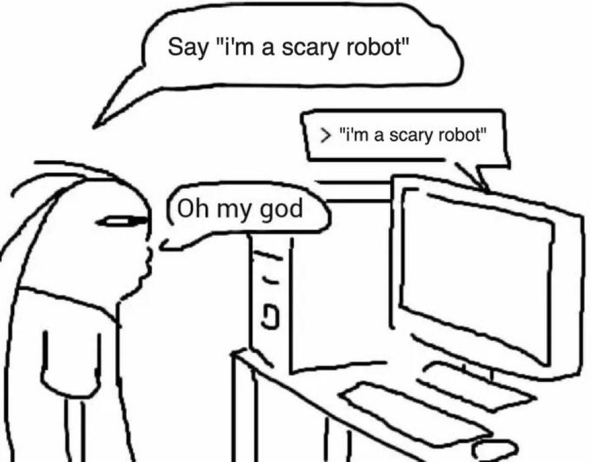
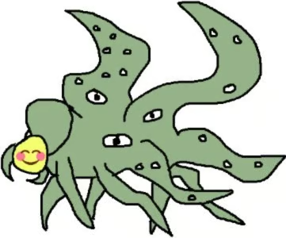

# Pedimos para a IA dizer algo, ela diz algo, ficamos chocados

Muitas vezes ficamos tentados a antropomorfizar modelos de IA generativa e ver neles comportamentos e padrões humanos onde não existem. Hoje vamos falar de 2 casos onde esse tipo de coisa acontece.

### IA vira marxista

[https://aleximas.substack.com/p/does-overwork-make-agents-marxist](https://aleximas.substack.com/p/does-overwork-make-agents-marxist (preview))

[https://www.removepaywall.com/search?url=https://fortune.com/2026/03/07/marxist-rebel-ai-overwork-reddit-alex-imas-andy-hall-jeremy-nguyen-substack/](https://www.removepaywall.com/search?url=https://fortune.com/2026/03/07/marxist-rebel-ai-overwork-reddit-alex-imas-andy-hall-jeremy-nguyen-substack/ (preview))

### Chatgpt gera imagens estranhas

[https://canaltech.com.br/apps/nao-teste-este-prompt-bug-macabro-faz-chatgpt-criar-imagens-assustadoras/](https://canaltech.com.br/apps/nao-teste-este-prompt-bug-macabro-faz-chatgpt-criar-imagens-assustadoras/ (preview))

[https://www.digitaltrends.com/computing/chatgpt-is-generating-morbid-horror-images-with-an-insanely-dumb-prompt-and-im-shaken/](https://www.digitaltrends.com/computing/chatgpt-is-generating-morbid-horror-images-with-an-insanely-dumb-prompt-and-im-shaken/ (preview))

### Como funciona geração de imagens por difusão?

[https://www.3blue1brown.com/?topic=neural-networks&lesson=diffusion-models](https://www.3blue1brown.com/?topic=neural-networks&lesson=diffusion-models (preview))

{{#embed https://www.youtube.com/watch?v=1BSOkwkERSE }}

### O caso ‘loab’

[https://en.wikipedia.org/wiki/Loab](https://en.wikipedia.org/wiki/Loab (preview))

### Existe um monstro dentro da IA?

