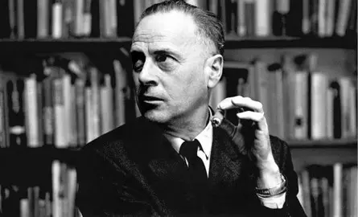

# A Ideologia Californiana

<https://baixacultura.org/a-ideologia-californiana/>

* Richard Barbook e Andy Cameron (in memoriam) “Não mentir sobre o futuro é impossível, e pode-se mentir sobre ele à vontade”

> Mais uma vez, a implacável caminhada do capitalismo rumo à diversificação e intensificação das forças criativas do trabalho humano está prestes a transformar qualitativamente o modo como trabalhamos, interagimos e a vida de uma maneira geral.

* Parece que nos encontramos nesse momento novamente.

* Uma aliança entre hackers, escritores, capitalista e artistas sob um ideologia heterôgenea. A Ideologia Californiana (referência à Ideologia Alemã do Marx)

* Boemia cultural (hippie) com o vale do silício (yuppies)

> Na utopia digital, todos vão ser ligados e também ricos. Não surpreendentemente, esta visão otimista do futuro foi entusiasticamente abraçada por nerds de computador, estudantes desertores, capitalistas inovadores, ativistas sociais, acadêmicos liga- dos às últimas tendências, burocratas futuristas e políticos oportunistas por todos os EUA

* New Left VS New Right

> Rompendo com a política estreita do pós-guerra, lançaram campanhas contra o militarismo, o racismo, a discriminação sexual, a homofobia, o consumismo inconsciente e contra a poluição. Em lugar da tradicional hierarquia rígida da esquerda, criaram estruturas coletivas e democráticas que supostamente prefiguravam a sociedade libertária do futuro. Acima de tudo, a Nova Esquerda californiana combinou luta política com rebelião cultural.

* Liberais no sentido americano da palavra, após vinte anos de uma economia favorável

* Já a direita enxergou nas redes o individualismo libertário, o sentimento anti-governo (também de certa forma presente na esquerda)

* Ágora digital

* Mercado digital

* Mercado das Idéias

* Ambos são movimentos profundamente estadunidenses e focados no determinismo tecnológico, num tecnoutopismo e fetichismo da tecnologia

## Marshall McLuhan

Herbert Marshall McLuhan foi um destacado educador, intelectual, filósofo e teórico da comunicação canadense, conhecido por vislumbrar a Internet quase trinta anos antes de ser inventada. Ficou também famoso por sua máxima de que **O meio é a mensagem** e por ter cunhado o termo **aldeia global**.

## Classe Virtual

> Por um lado, estes artesãos hi-tech não apenas tendem a ser bem pagos, mas também possuem considerável autonomia sobre seu ritmo de trabalho e local de emprego. Como resultado, a fronteira cultural entre o hippie e o “homem organização” tornou-se bastante vaga. Porém, por outro lado, estes trabalhadores estão presos pelos termos de seus contratos e não têm garantia de emprego continuado. Sem o tempo livre dos hippies, o trabalho em si tornou-se o principal caminho de autossatisfação para boa parte da “classe virtual”

> A Ideologia Californiana oferece uma maneira de se enten- der a realidade vivida por estes artesãos da alta tecnologia. Por um lado, estes trabalhadores essenciais são parte privilegiada da mão de obra. Por outro, são herdeiros das ideias radicais dos ativistas da mídia comunitária. A Ideologia Californiana, assim, simultanea- mente reflete as disciplinas da economia de mercado e as liberda- des do artesanato hippie. Esse híbrido bizarro só é possível através de uma crença quase universal no determinismo tecnológico.

## Mais reflexões

* Democracia Jeffersoniana

* O mito do livre mercado e Newt Gringrich (Amigo e Inimigo)

* Livre mercado da tecnologia VS investimento estatal

* Jardins Fechados / Escravos robôs

* Para alguém existir sem o trabalho, alguém precisa ser escravisado... quem é?

* Tomas Jefferson e seus escravos e bugigangas

* O que o autor propõe?

* Investimento estatal

* Exemplo da França

* Regulamentação

* Estar ciente da possibilidade da formação de 'guetos' tecnológicos
