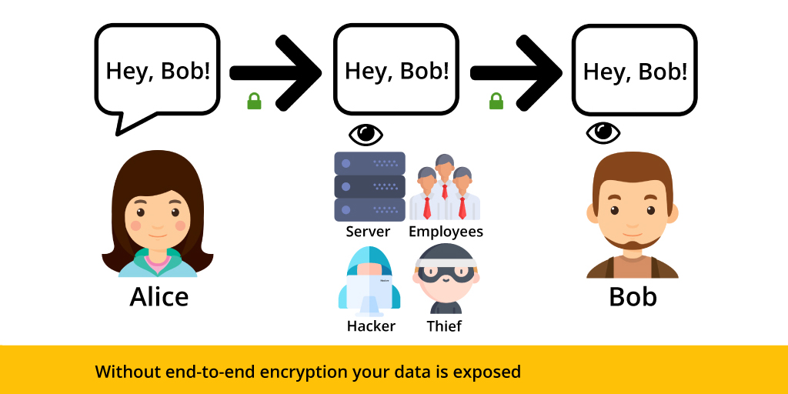
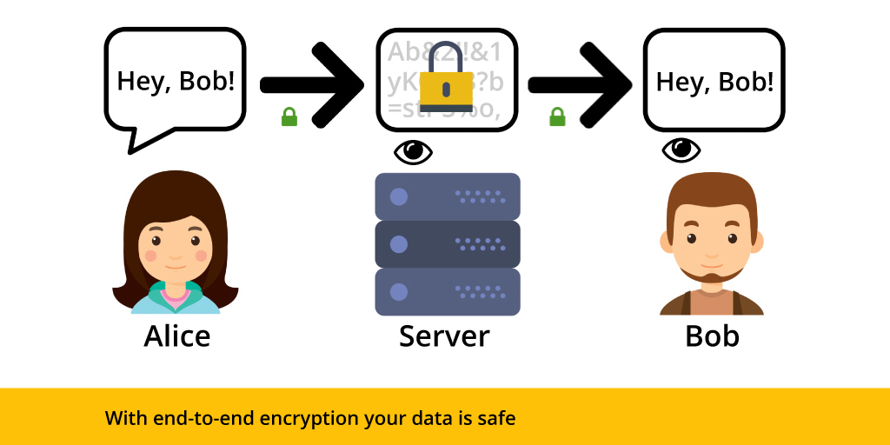

# Instagram, Signal e escolhas sobre a privacidade

As vezes a privacidade e segurança dos nossos dados é só uma ‘vibe’ porque a gente tem a impressão que está criptografando tudo certinho, mas os nossos dados  estão vazando do outro lado. Hoje vamos falar sobre esse assunto no contexto do Signal e do Instagram.

- Em 8 de Maio de 2026 o Instagram irá descontinuar as mensagens encriptadas de ponta a ponta dentro do aplicativo

[https://proton.me/blog/instagram-end-to-end-encryption](https://proton.me/blog/instagram-end-to-end-encryption (preview))

- Na realidade essa é uma funcionalidade propositalmente escondida que realmente, quase ninguém usava. Inclusive contas ‘profissionais’ não tinham acesso a ela

[https://help.instagram.com/3490194014566528](https://help.instagram.com/3490194014566528 (preview))

- O motivo da Meta foi que “tinha pouca adoção”, mas isso é bobagem porque eles literalmente tem o poder de condicionar ou não o uso da criptografia via a sua interface

- Eu gostaria de perguntar pra vocês quantas pessoas usam o instagram como uma plataforma de chat e quantas vezes vocês já usaram os chats encriptados? É uma opção que você precisa selecionar clicando no nome da pessoa

- Por que acabar com isso agora? Maior controle e monitoramento das conversas dentro das plataformas (lembrar da condenação da Meta) e ao mesmo tempo maior facilidade de coletar os dados de usuários
- A Meta tem o WhatsApp e o Messenger que são plataformas com criptografia de ponta a ponta\*, porém a galinha dos ovos de ouro é o setor de propaganda e perfilamento de usuários, então quem sugeriu colocar encriptação nas mensagens do Instagram deve ter sido demitido. Mas eu admiro muito o kingo/kinga

\*: Provavelmente a Meta tem algum tipo de backdoor nesses softwares que permite a quebra da criptografia

### Signal e as notificações

#### Como funciona criptografia de ponta a ponta?

[https://blog.etesync.com/end-to-end-encryption-what-it-is-and-why-it-is-needed/](https://blog.etesync.com/end-to-end-encryption-what-it-is-and-why-it-is-needed/ (preview))

Sem E2EE

Com E2EE

- Isso é a mesma maneira que o Signal e o Whatsapp funcionam (na realidade o Signal é a versão aberta do WhatsApp feita por um dos criadores originais do Zap)
- Porém eu queria usar esse vídeo pra gente falar de uma maneira muito comum de se derrotar a criptografia. Extrair os dados diretamente do dispositivo dos usuários

- Saiu recentemente esse furo da 404 Media que descreveu um caso onde o FBI usou o conteúdo das ‘push notifications’ que ficou num iphone para ler as mensagens de Signal trocadas pro um suspeito

[https://www.wired.com/story/security-news-this-week-your-push-notifications-arent-safe-from-the-fbi/](https://www.wired.com/story/security-news-this-week-your-push-notifications-arent-safe-from-the-fbi/ (preview))

[https://www.404media.co/fbi-extracts-suspects-deleted-signal-messages-saved-in-iphone-notification-database-2/](https://www.404media.co/fbi-extracts-suspects-deleted-signal-messages-saved-in-iphone-notification-database-2/ (preview))

- Ou seja, a notificação que é mandada ‘voluntariamente’ pelo app derrotou a criptografia do Signal, porque ela fica guardada não encriptada dentro do celular

- Importante lembrar também que ‘push notifications’ funcionam dessa maneira:
  - aplicativo → servidor Google/Apple → dispositivo

- Não é algo que eu tecnicamente estudei muito a fundo, mas funciona desse jeito para que se possa gerenciar, por ex., notificações em múltiplos aplicativos. Eu imagino que Apple e Google poderiam coletar o conteúdo dessas mensagens também

- Existe uma solução a nível individual que é no seu aplicativo procurar as configurações de notificação e pedir para notificação não incluir nome nem conteúdo da mensagem. Signal e todos outros mensageiros tem essa opção

- Porém isso mostra que a privacidade e segurança funciona a muitos níveis e o elo mais fraco é sempre por onde os dados vão vazar (e tá cheio de elos fracos)

- Nós inclusive já comentamos que a palestra da Meredith Withttaker, CEO do Signal, na Defcon do ano passado foi sobre como os agentes de IA dos sistemas operacionais são um grande risco pra nossa privacidade

{{#embed https://www.youtube.com/watch?v=2DIUQljEI8c }}
